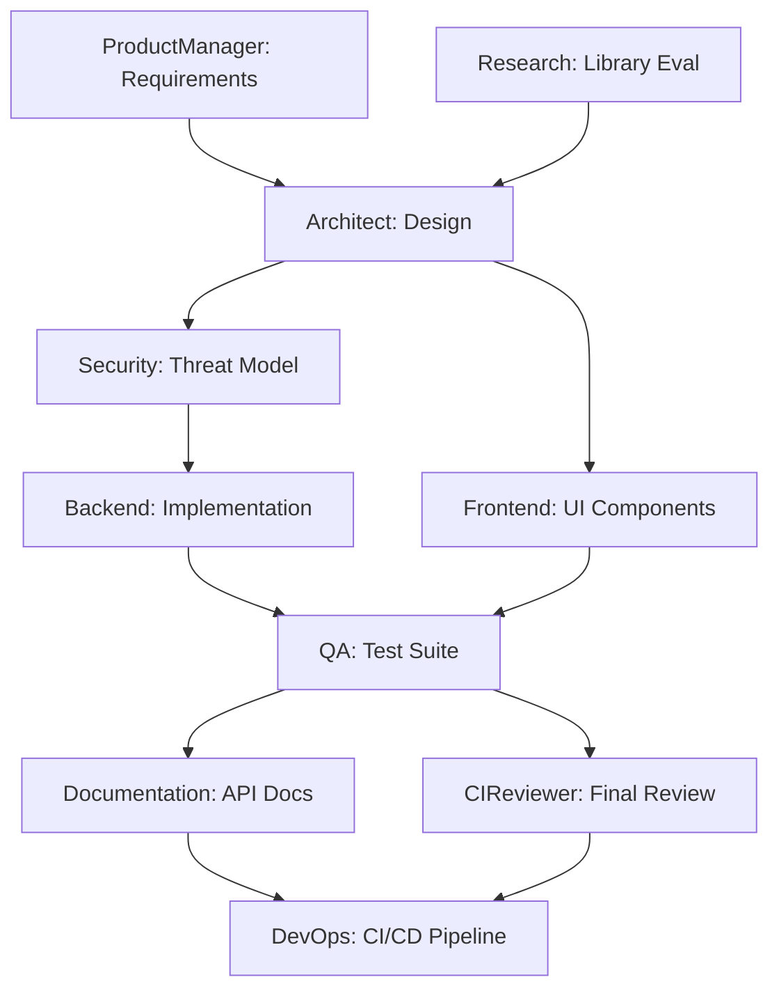
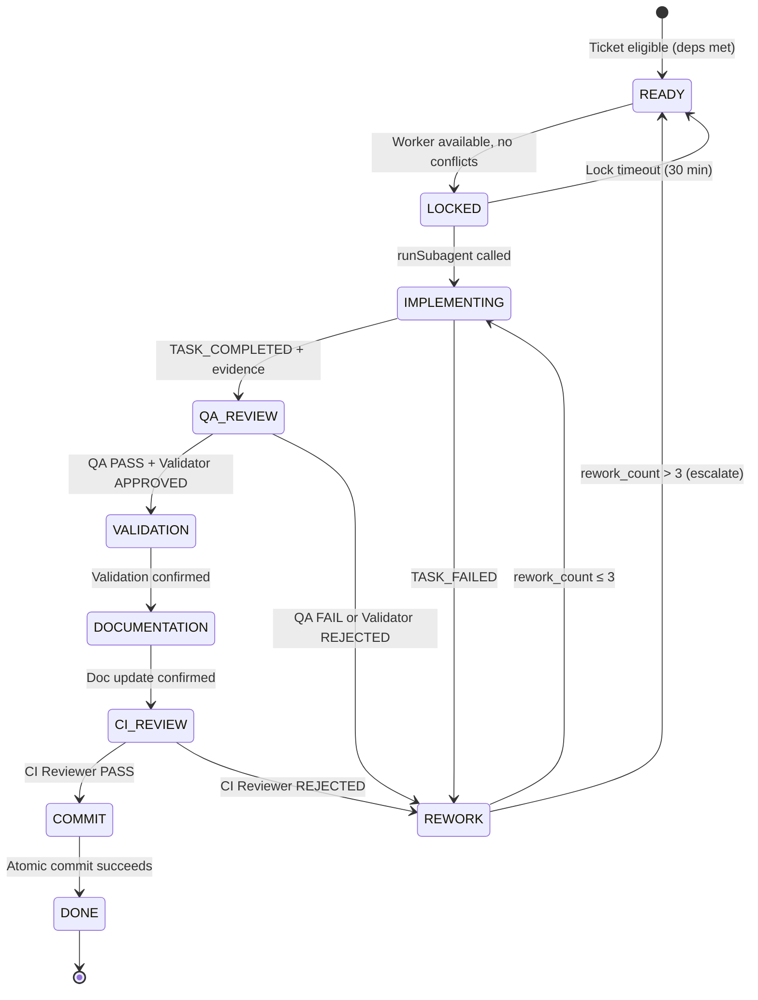
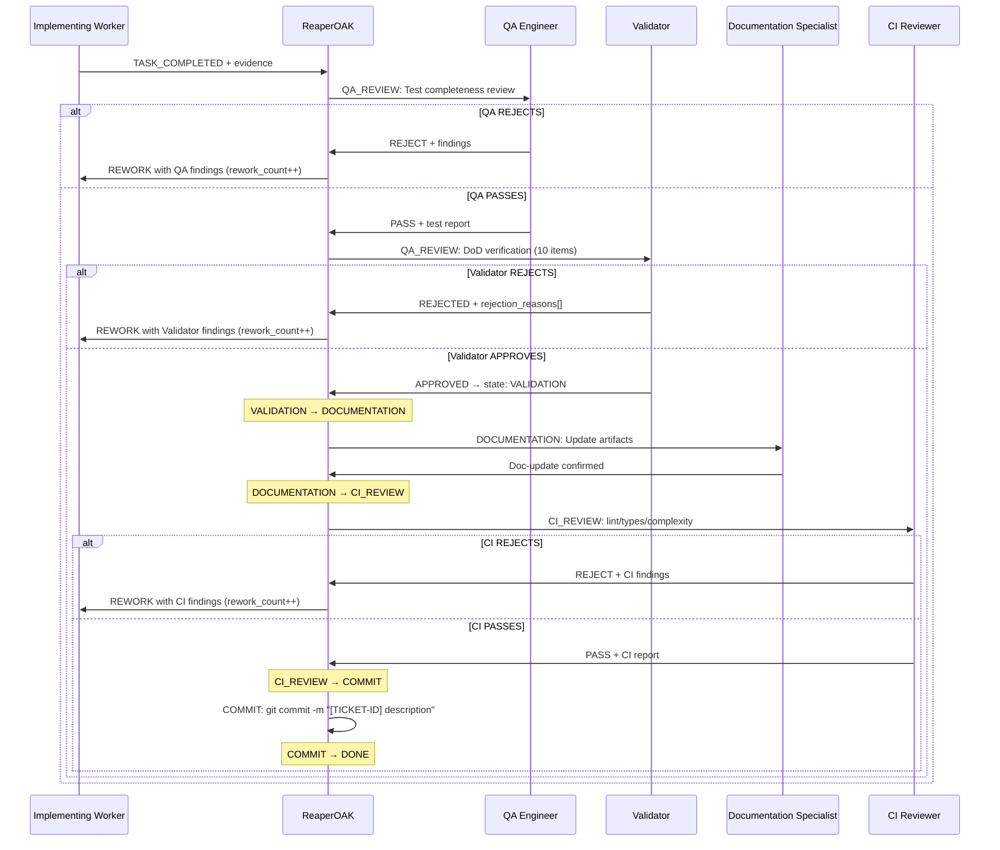
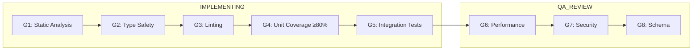
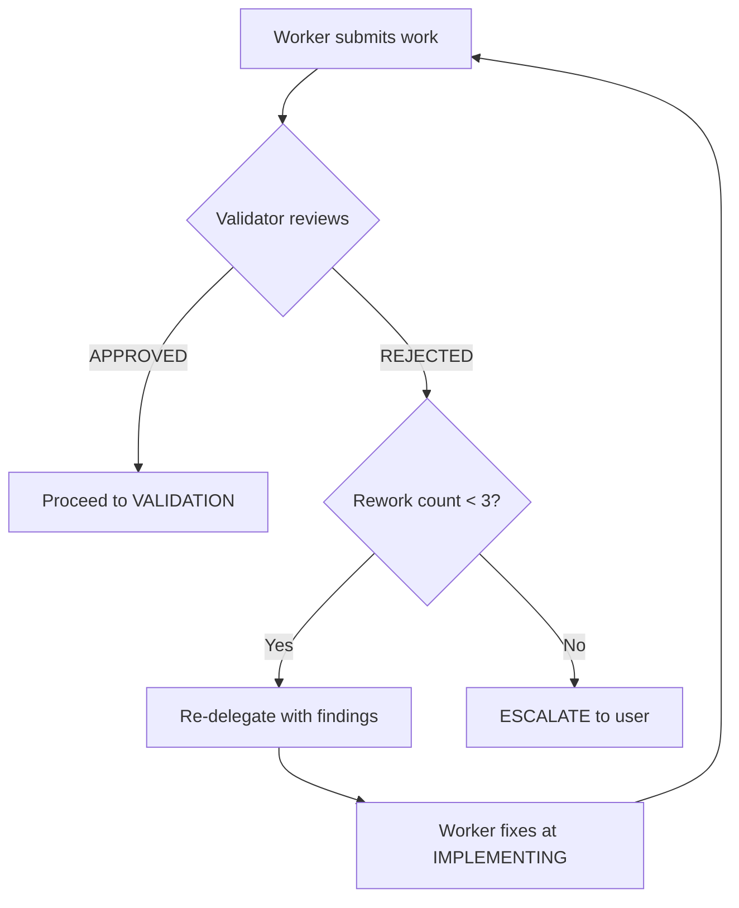

# Vibecoding Multi-Agent System Architecture

> **Version:** 8.0.0
> **Owner:** ReaperOAK (CTO / Worker-Pool Adaptive Orchestrator)
> **Last Updated:** 2026-02-27
>
> **Changelog:** v8.0.0 — Worker-Pool Adaptive Engine: continuous scheduling,
> two-layer orchestration (strategic + execution running concurrently),
> worker pool model with conflict detection, SDR protocol for strategy
> evolution, event-driven coordination, updated 9-state machine
> (QA_REVIEW / VALIDATION / DOCUMENTATION / CI_REVIEW / COMMIT naming)

---

## 1. System Overview

This architecture implements a **worker-pool adaptive engine** — a multi-agent
vibecoding system with ReaperOAK as the singular CTO and orchestrator.
ReaperOAK continuously schedules work across worker pools, operates a
two-layer model where strategic discovery and execution run concurrently
without phase barriers, and drives every ticket through a deterministic
9-state lifecycle.

The unit of execution is: **ONE TICKET → FULL LIFECYCLE → COMMIT**.
There are no phased pipelines or batch feature completions. Scheduling is
continuous and event-driven — when a worker finishes one ticket, it is
immediately available for the next. Strategy evolution happens concurrently
via SDR (Strategy Deviation Request) protocol without halting execution.

### Design Principles

1. **Determinism over cleverness** — explicit state transitions, bounded loops
2. **Separation of concerns** — each agent owns one domain
3. **Least privilege** — minimal tool access per agent
4. **Zero hallucinated authority** — agents cannot claim capabilities they lack
5. **Immutable truth sources** — `systemPatterns.md` and `decisionLog.md` are
   controlled by ReaperOAK only
6. **Human-in-the-loop for destructive ops** — always
7. **Confidence-gated progression** — no state transition without assessed confidence
8. **DAG-first decomposition** — all multi-task work starts with dependency graph
9. **Evidence over assertion** — every claim requires tool output or file reference
10. **Governance by default** — hooks and guardrails active in every session
11. **Continuous scheduling** — workers are assigned tickets the moment they
    become available, no artificial waits between assignments
12. **Two-layer concurrency** — strategic discovery and execution run
    simultaneously without phase barriers

---

## 2. Agent Topology

```
ReaperOAK (Worker-Pool Adaptive Orchestrator / CTO)
│
├── Cross-Cutting Protocols ─── _cross-cutting-protocols.md (inherited by ALL)
│
├─── Strategic Layer ────────────────────────────────────────────────────────
│    ├── Research          — Evidence research, PoC, tech radar
│    ├── ProductManager    — PRDs, user stories, requirements
│    ├── Architect         — System design, ADRs, API contracts
│    ├── Security (strat.) — STRIDE, OWASP, threat models (strategic)
│    ├── UIDesigner        — Conceptual mockups, design specifications
│    ├── DevOps (planning) — Infrastructure planning, capacity
│    └── TODO              — Task decomposition (invoked only by ReaperOAK)
│
├─── Execution Layer ────────────────────────────────────────────────────────
│    ├── Backend           — Server code, APIs, business logic
│    ├── Frontend          — UI, components, WCAG, Core Web Vitals
│    ├── DevOps (exec)     — CI/CD execution, Docker, IaC
│    ├── QA                — Tests, mutation testing, E2E, Playwright
│    ├── Security (exec)   — Security execution, SBOM, scan
│    ├── Documentation     — Docs, Diátaxis, Flesch-Kincaid
│    ├── Validator         — SDLC compliance, DoD verification
│    └── CIReviewer        — Code review, complexity, SARIF
```

### Layer Assignments

| Agent | Strategic Layer | Execution Layer | Worker Pool Capacity |
|-------|:-:|:-:|:--|
| **Research** | ✓ | — | 1 |
| **ProductManager** | ✓ | — | 1 |
| **Architect** | ✓ | — | 1 |
| **Security** | ✓ (strategic) | ✓ (execution) | 1 |
| **UIDesigner** | ✓ (conceptual) | — | 1 |
| **DevOps** | ✓ (infra planning) | ✓ (execution) | 1 |
| **TODO** | ✓ (invoked only by ReaperOAK) | — | 1 |
| **Backend** | — | ✓ | 3 |
| **Frontend** | — | ✓ | 2 |
| **QA** | — | ✓ | 2 |
| **Documentation** | — | ✓ | 1 |
| **Validator** | — | ✓ | 1 |
| **CIReviewer** | — | ✓ | 1 |

Strategic and Execution layers run **concurrently**. A strategic agent may
propose an SDR (§31) while execution workers are processing tickets. SDRs
that affect in-flight tickets trigger re-prioritization but do NOT halt
execution unless explicitly flagged as blocking.

### Agent Authority Matrix

| Agent | Domain Expertise | Can Write | Can Execute |
|-------|-----------------|-----------|-------------|
| **ReaperOAK** | Orchestration, scheduling, event routing | systemPatterns, decisionLog, activeContext, progress, workflow-state | Delegate, validate, commit |
| **ProductManager** | EARS notation, INVEST stories, DDD | activeContext, progress | GitHub issues |
| **Architect** | Well-Architected Pillars, API contracts, DAGs | activeContext, progress | Analysis tools |
| **Backend** | TDD, Object Calisthenics, RFC 7807 | Source code (scoped dirs) | Terminal, tests |
| **Frontend** | WCAG 2.2 AA, Core Web Vitals | UI source (scoped dirs) | Terminal, browser |
| **QA** | Test pyramid, mutation testing, Playwright | Test files only | Terminal, browser |
| **Security** | OWASP Top 10, STRIDE, SARIF, SBOM | riskRegister, activeContext | Scanners |
| **DevOps** | GitOps, SLO/SLI, Docker, chaos engineering | CI/CD, Dockerfiles, IaC | Terminal, deploy (staging) |
| **Documentation** | Diátaxis, Flesch-Kincaid, doc-as-code CI | Documentation files only | Analysis tools |
| **Research** | Bayesian confidence, evidence hierarchy | activeContext, progress | Web fetch, search |
| **CIReviewer** | Cognitive complexity, fitness functions, SARIF | PR comments only | Analysis tools |
| **UIDesigner** | Stitch design, component specs, design tokens | Design specs (docs/design-specs/) | Stitch, Playwright, Memory |
| **TODO** | Task decomposition, lifecycle tracking, DAGs | TODO files (TODO/**/*.md), activeContext, progress | Terminal (todo_visual.py) |
| **Validator** | DoD compliance, SDLC gates, pattern conformance | Validation reports, `feedback-log.md` (append) | Linters, type/test runners (read-only) |

Full read/write/execute permissions and forbidden actions are specified in
each agent's `.github/agents/*.agent.md` definition file.

### Structured Autonomy Levels

Each agent operates at a defined autonomy level. ReaperOAK can adjust
levels based on task criticality.

| Level | Name | Behavior | Approval Required |
|-------|------|----------|-------------------|
| **L1** | Supervised | Agent proposes actions, waits for approval before each step | Every action |
| **L2** | Guided | Agent executes within pre-approved scope, reports after completion | Scope changes only |
| **L3** | Autonomous | Agent executes independently within delegation packet boundaries | Destructive ops only |

**Default Autonomy Assignments:** Backend (L3), Frontend (L2), QA (L3),
Security (L2), DevOps (L1), Documentation (L3), Research (L3), CIReviewer (L3),
ProductManager (L2), Architect (L2), UIDesigner (L2), TODO (L2), Validator (L2).

### Agent Names — EXACT Case-Sensitive

**CRITICAL:** Use the EXACT `agentName` string below when calling `runSubagent`.
Wrong names silently spawn a generic agent without domain instructions.

| agentName (EXACT) | Primary Pool |
|-------------------|-------------|
| Architect | Strategic |
| Backend | Execution |
| Frontend Engineer | Execution |
| QA Engineer | Execution |
| Security Engineer | Both (strategic + execution) |
| DevOps Engineer | Both (infra planning + execution) |
| Documentation Specialist | Execution |
| Research Analyst | Strategic |
| Product Manager | Strategic |
| CI Reviewer | Execution |
| UIDesigner | Strategic |
| TODO | Strategic (invoked only by ReaperOAK) |
| Validator | Execution |

---

## 3. Context Engineering Framework

### 3.1 Context Loading Strategy

At session start, ReaperOAK loads context using a 4-priority system:

| Priority | Category | Action | Budget |
|----------|----------|--------|--------|
| **P0** | Critical | Load fully — delegation packet, active errors, systemPatterns | 30% |
| **P1** | High | Load fully — activeContext.md, relevant source files | 25% |
| **P2** | Medium | Summarize — decisionLog.md, progress.md, prior session notes | 25% |
| **P3** | Low | Skip / load on demand — historical logs, completed task archives | 20% |

### 3.2 Context Budget Declaration

Every delegation packet includes a context budget with `totalTokens`,
priority-based `allocation` (delegation, source, memory bank, protocols,
reserve), and a `filesLoaded` manifest with path, priority, and token count.

### 3.3 Context Freshness Rules

| Source | Max Age | Refresh Trigger |
|--------|---------|-----------------|
| Active errors | Real-time | Every tool call |
| Source files | Current session | File modification detected |
| Memory bank | Current session | Memory bank write detected |
| External docs | 24 hours | Research agent re-fetches |
| Decision log | Permanent | Never expires |

---

## 4. Delegation Packet Format

Every task delegated from ReaperOAK to a worker uses a canonical format
containing all required fields. Incomplete delegations produce incomplete
work — ReaperOAK must add missing fields before calling `runSubagent`.

### Required Fields

```
**Ticket ID:** {from TODO task file}
**Objective:** {specific and measurable}
**Worker ID:** {assigned worker instance from pool}
**Pool Role:** {worker's pool role — Backend, Frontend, QA, etc.}
**Upstream artifacts:** {files to read first — from prior phases or deps}
**Chunks:** Load `.github/vibecoding/chunks/{AgentDir}/` — these are your
  detailed protocols. Add task-specific chunks from catalog.yml as needed.
**Deliverables:** {exact files to create/modify}
**Boundaries:** {what NOT to touch}
**Scope:** THIS TICKET ONLY — do not implement work from other tickets
**Acceptance criteria:** {from ticket's L3 task spec}
**File paths:** {from L3 task spec — declared write paths}
**Conflict notes:** {any known serialization with other in-flight tickets}
**Rework context:** (rework only) {rejection report from QA/Validator/CI}
```

### Chunk Routing in Delegation

Every worker has domain chunks at `.github/vibecoding/chunks/{AgentDir}/`.
Always include the chunk path in the delegation packet. Add task-specific
tags from `.github/vibecoding/catalog.yml` when relevant.

| agentName | Chunk Dir | Extra Tags (catalog.yml) |
|-----------|-----------|-------------------------|
| Architect | `Architect.agent/` | `sdlc:`, `general:` |
| Backend | `Backend.agent/` | `sdlc:`, `performance:` |
| Frontend Engineer | `Frontend.agent/` | `accessibility:`, `performance:` |
| QA Engineer | `QA.agent/` | `testing:` |
| Security Engineer | `Security.agent/` | `security:` |
| DevOps Engineer | `DevOps.agent/` | `devops:`, `ci:`, `container:` |
| Documentation Specialist | `Documentation.agent/` | — |
| Research Analyst | `Research.agent/` | `cto:` |
| Product Manager | `ProductManager.agent/` | `sdlc:` |
| CI Reviewer | `CIReviewer.agent/` | `ci:` |
| UIDesigner | `UIDesigner.agent/` | `design:`, `accessibility:` |
| TODO | `TODO.agent/` | `sdlc:`, `general:` |
| Validator | `Validator.agent/` | `validation:`, `sdlc-enforcement:` |

Full schema: `.github/tasks/delegation-packet-schema.json`

---

## 5. Worker-Pool Adaptive Engine

ReaperOAK operates as a **worker-pool adaptive engine** with continuous
scheduling. It does NOT run lifecycle phases or batch operations. It reacts
to events emitted by workers and routes tickets through a 9-state machine
continuously, assigning work the moment workers become available.

### 5.1 Continuous Scheduling Algorithm

Scheduling is continuous and event-driven. Tickets are assigned to workers
the moment they become available — no artificial waits between assignments.

```
loop forever:
  ready_tickets = fetch_tickets(state=READY)
  for ticket in ready_tickets (sorted by priority P0 first, then critical path):
    if all_deps_done(ticket):
      conflicts = detect_conflicts(ticket, in_flight_tickets)
      if no conflicts:
        worker = find_available_worker(ticket.owner_role)
        if worker:
          assign(worker, ticket)
          transition(ticket, LOCKED)
          launch(worker, ticket)  # runSubagent with delegation packet
  await next_event()  # TASK_COMPLETED, TASK_FAILED, WORKER_FREE, SDR_PROPOSED, etc.
```

### 5.2 Key Properties

- **Priority-driven:** P0 tickets are selected before P1, P2, etc.
- **Conflict-aware:** Two tickets modifying the same resources are serialized (§11)
- **Event-driven:** The scheduler wakes on events, not on timers
- **Continuous flow:** A worker finishing one ticket makes it immediately
  available for the next — no idle wait between assignments
- **Parallel by default:** Multiple conflict-free tickets run simultaneously
  across different worker pools

### 5.3 Dependency Promotion

When a ticket reaches DONE, all tickets that depend on it are re-evaluated.
If all their dependencies are now DONE, they automatically enter READY.
L3 tasks enter the 9-state machine at READY when all `depends_on` entries
are DONE.

### 5.4 DAG Construction

Every multi-agent objective is decomposed into a DAG before execution:



DAG construction is handled by the TODO Agent during progressive refinement
(see §28). L3 tasks enter the 9-state machine at READY when all `depends_on`
entries are DONE.

**Hard rules:**
- No worker may implement more than one ticket at a time
- Every ticket completes its full lifecycle before reaching DONE
- Workers are ephemeral — assigned per-ticket, released on completion
- Conflict-free tickets execute in parallel with no artificial waits
- The next ticket is assigned immediately when a worker frees up

### 5.5 Blocking Event Handling

When ReaperOAK receives a blocking event from a worker:

1. Pause current ticket (state remains IMPLEMENTING — worker is waiting)
2. Invoke the requested agent with context from the blocking ticket
3. Wait for resolution from the invoked agent
4. Pass resolution artifacts back to the original worker
5. Resume original ticket execution

---

## 6. 9-State Machine

Every ticket traverses these 9 states in strict order. No state may be
skipped. Tickets enter the machine at READY — there is no pre-READY
queue state. Pre-READY filtering (dependency checks, priority evaluation)
is handled implicitly by the continuous scheduler.

### 6.1 States

| State | Description | Owner |
|-------|-------------|-------|
| **READY** | All dependencies DONE, eligible for assignment | System (auto via dep check) |
| **LOCKED** | Worker assigned from pool, lock acquired | ReaperOAK |
| **IMPLEMENTING** | Delegated to worker, work in progress | Assigned Worker |
| **QA_REVIEW** | Implementation done, QA + Validator reviewing | QA Engineer + Validator |
| **VALIDATION** | QA and Validator both passed | Validator (confirmation) |
| **DOCUMENTATION** | Docs being updated by Documentation Specialist | Documentation Specialist |
| **CI_REVIEW** | Documentation done, CI Reviewer checking lint/types/complexity | CI Reviewer |
| **COMMIT** | CI passed, atomic commit being created | ReaperOAK |
| **DONE** | Full lifecycle complete, worker released | System (final) |

**REWORK** is a side-state (failure path), not part of the main progression.
See §6.4 for REWORK semantics.

### 6.2 State Diagram



### 6.3 Transition Table

| From | To | Trigger | Guard Condition |
|------|----|---------|-----------------|
| READY | LOCKED | Worker available in pool | No file conflicts with in-flight tickets, dependencies met |
| LOCKED | IMPLEMENTING | `runSubagent` called | Lock is active, worker assignment confirmed |
| LOCKED | READY | Lock timeout (30 min) | Timer expired — auto-release, worker returned to pool |
| IMPLEMENTING | QA_REVIEW | Worker emits TASK_COMPLETED | Evidence provided (artifact paths, test results) |
| IMPLEMENTING | REWORK | Worker emits TASK_FAILED | Error evidence provided |
| QA_REVIEW | VALIDATION | QA PASS + Validator APPROVED | QA test review PASS, Validator DoD verdict = APPROVED |
| QA_REVIEW | REWORK | QA or Validator rejects | QA FAIL or verdict = REJECTED, rework_count < 3 |
| VALIDATION | DOCUMENTATION | Validation confirmed | Validator confirmation recorded |
| DOCUMENTATION | CI_REVIEW | Doc update confirmed | Documentation Specialist confirms artifact updates |
| CI_REVIEW | COMMIT | CI Reviewer PASS | Lint, types, complexity all pass |
| CI_REVIEW | REWORK | CI Reviewer rejects | Lint/type/complexity failures, rework_count < 3 |
| COMMIT | DONE | Atomic commit succeeds | `git commit` succeeds, all lifecycle verified |
| REWORK | IMPLEMENTING | Re-delegation | rework_count++, rework_count ≤ 3 |
| REWORK | READY | Escalation | rework_count > 3, user notified, ticket re-enters READY |

### 6.4 REWORK Side-State

REWORK is entered when QA, Validator, or CI Reviewer rejects a ticket's
output. It is NOT part of the main 9-state progression — it is a failure
recovery path.

#### Shared Rework Counter

A single `rework_count` counter tracks ALL combined rejections:
- QA Engineer rejection at QA_REVIEW → rework_count++
- Validator rejection at QA_REVIEW → rework_count++
- CI Reviewer rejection at CI_REVIEW → rework_count++

All three sources share the SAME counter. Maximum: **3 combined attempts**.

#### REWORK Flow

```
Rejection at QA_REVIEW or CI_REVIEW
  → REWORK state entered
  → rework_count checked:
    ≤ 3: Re-delegate to implementing worker with rejection report
          → IMPLEMENTING (worker receives rejection findings as upstream artifact)
    > 3: Escalate to user
          → READY (ticket re-enters pool, user notified for override or cancellation)
          → rework_count resets to 0
```

#### Re-Delegation Requirements

When re-delegating after REWORK:
- The rejection report from QA/Validator/CI MUST be included as `rework_context`
  in the delegation packet
- The same worker pool role handles the rework (not necessarily the same
  worker instance)
- Original acceptance criteria and upstream artifacts remain unchanged

### 6.5 Failure Rollback Rules

| Failure Mode | State Transition | Recovery Action |
|--------------|-----------------|----------------|
| Worker reports failure | IMPLEMENTING → REWORK | Re-delegate with findings; rework_count++ |
| QA/Validator rejects | QA_REVIEW → REWORK | Re-delegate with rejection report; rework_count++ |
| CI Reviewer rejects | CI_REVIEW → REWORK | Re-delegate with CI findings; rework_count++ |
| Lock expires (30 min) | LOCKED → READY | Lock auto-released; eligible for reassignment |
| Rework exhausted (> 3) | REWORK → READY | User notified for override or cancellation |

### 6.6 Task Metadata Extension

Each ticket carries two operational metadata fields:

```markdown
**Rework Count:** 0
**Blocker:** (none)
```

- `Rework Count` starts at 0, increments on each REWORK → IMPLEMENTING.
  Resets to 0 on escalation (REWORK → READY).
- `Blocker` is free-text, present only when the ticket is externally blocked.

### 6.7 Backward Compatibility — State Mapping

#### v7 → v8 State Name Mapping

| v7 State | v8 State | Migration Notes |
|----------|----------|-----------------|
| BACKLOG | *(removed)* | Tickets enter at READY; pre-READY filtering is implicit |
| READY | READY | Unchanged |
| LOCKED | LOCKED | Unchanged |
| IMPLEMENTING | IMPLEMENTING | Unchanged |
| REVIEW | QA_REVIEW | Renamed — clarifies QA + Validator stage |
| VALIDATED | VALIDATION | Renamed — noun form |
| DOCUMENTED | DOCUMENTATION | Renamed — noun form |
| COMMITTED | CI_REVIEW | Repurposed — explicit CI review stage |
| *(new)* | COMMIT | New — atomic commit creation stage |
| DONE | DONE | Unchanged |
| REWORK | REWORK | Unchanged — failure side-state |

#### Legacy Status Aliases

Existing TODO files may use old status values. Normalize on read:

| Legacy Status | v8 State | Migration Rule |
|---------------|----------|---------------|
| `not_started` | READY | Check deps; if all met, enter READY |
| `in_progress` | IMPLEMENTING | Active work maps to IMPLEMENTING |
| `completed` | DONE | Finished tasks map to DONE |
| `blocked` | READY | READY with `blocker_reason` field set |

New tickets MUST use the 9-state values exclusively.

### 6.8 Locking Mechanism

When a ticket is selected for assignment, ReaperOAK acquires a lock:

```json
{
  "ticketId": "WPAE-BE001",
  "workerId": "BE-W2",
  "poolRole": "Backend",
  "lockedAt": "2026-02-27T14:30:00Z",
  "expiresAt": "2026-02-27T15:00:00Z",
  "status": "active"
}
```

Lock schema: `.github/locks/task-lock-schema.json`

**Lock lifecycle:**
1. Acquired at READY → LOCKED transition
2. Held through IMPLEMENTING → QA_REVIEW → VALIDATION → DOCUMENTATION → CI_REVIEW → COMMIT
3. Released at COMMIT → DONE transition
4. Auto-released on 30-minute timeout (LOCKED → READY)

---

## 7. Post-Execution Chain

After a worker finishes implementing, this chain runs for **EVERY** ticket.
No exceptions. No shortcuts. No skipping.

### 7.1 Chain Flow

```
IMPLEMENTING → (worker emits TASK_COMPLETED)
  → QA_REVIEW: QA Engineer reviews (coverage ≥ 80%) → PASS/REJECT
  → QA_REVIEW: Validator checks DoD (10 items) → APPROVED/REJECTED
  → VALIDATION: Validation confirmed
  → DOCUMENTATION: Documentation Specialist updates artifacts → confirms
  → CI_REVIEW: CI Reviewer checks lint/types/complexity → PASS/REJECT
  → COMMIT: ReaperOAK enforces `git commit -m "[TICKET-ID] desc"` → success/fail
  → DONE
```

### 7.2 Chain Steps

| Step | State | Agent | Action | Failure Path |
|------|-------|-------|--------|-------------|
| 1 | QA_REVIEW | QA Engineer | Test completeness review, coverage check (≥80%) | REJECT → REWORK |
| 2 | QA_REVIEW | Validator | DoD enforcement (all 10 items independently verified) | REJECT → REWORK |
| 3 | DOCUMENTATION | Documentation Specialist | Artifact update (README, CHANGELOG, API docs) | BLOCK → report to ReaperOAK |
| 4 | CI_REVIEW | CI Reviewer | Simulate CI checks (lint, types, complexity) | REJECT → REWORK |
| 5 | COMMIT | ReaperOAK | Commit enforcement (commit with ticket ID in message) | FAIL → retry once → escalate |

If ANY agent in the chain rejects → ticket moves to REWORK → assigned back
to the implementing worker with the rejection report as upstream artifact.

### 7.3 Retry Budget

The total retry budget across ALL chain steps is **3 combined**:
- QA rejections (Step 1), Validator rejections (Step 2), and CI Reviewer
  rejections (Step 4) share a single `rework_count` counter.
- When `rework_count` reaches 3 → escalate to user for override or
  cancellation.
- Counter resets to 0 on escalation (ticket returns to READY).

### 7.4 Sequence Diagram



### 7.5 Enforcement Rule

> **No ticket may reach DONE without ALL five chain steps completing
> successfully.** Bypassing any step is a protocol violation. Only explicit
> user override can skip a chain step.

---

## 8. Event Protocol

Workers emit structured events during ticket execution. ReaperOAK is the
**sole consumer and router** of all events. Workers must NOT directly call
or communicate with each other — ALL inter-agent communication flows through
ReaperOAK's event loop.

### 8.1 Event Types

| Event Type | Emitter | Payload |
|-----------|---------|---------|
| `TASK_STARTED` | Implementing worker | ticket_id, worker_id, timestamp |
| `TASK_COMPLETED` | Implementing worker | ticket_id, evidence, artifacts, timestamp |
| `TASK_FAILED` | Implementing worker | ticket_id, error, timestamp |
| `NEEDS_INPUT_FROM` | Any worker | ticket_id, target_agent, question |
| `BLOCKED_BY` | Any worker | ticket_id, blocker_ticket_id |
| `PROGRESS_UPDATE` | Long-running worker | ticket_id, percent_complete, current_step |
| `WORKER_FREE` | Worker pool | worker_id, role, timestamp |
| `SDR_PROPOSED` | Strategic agent | sdr_id, title, impact |
| `SDR_APPROVED` | ReaperOAK | sdr_id, roadmap_version |
| `STRATEGIC_REVIEW_REQUIRED` | Strategic agent | ticket_id, review_type, context |
| `CONFLICT_DETECTED` | Scheduler | ticket_id, conflict_type, blocking_ticket |
| `REWORK_TRIGGERED` | QA/Validator/CI | ticket_id, reason, rework_count |
| `STALL_WARNING` | Scheduler | ticket_id, worker_id, duration |
| `LOCK_EXPIRED` | Scheduler | ticket_id, worker_id |
| `REQUEST_RESEARCH` | Any worker | ticket_id, research_question |
| `REQUIRES_UI_DESIGN` | Any worker | ticket_id, feature_name, ui_requirements |
| `ESCALATE_TO_PM` | Any worker | ticket_id, ambiguity_description |

### 8.2 Event Payload Format

Events are emitted as structured markdown in worker output:

```
**Event:** {event_type}
**Ticket:** {ticket_id}
**Worker:** {worker_id}
**Timestamp:** {ISO8601}
**Details:** {free-text description}
**Evidence:** {test results, confidence level — required for TASK_COMPLETED}
**Artifacts:** {list of file paths, if applicable}
```

### 8.3 Event Routing

When ReaperOAK receives an event:

1. **TASK_COMPLETED** → Advance ticket to QA_REVIEW, assign QA worker
2. **TASK_FAILED** → Move ticket to REWORK, check rework_count
3. **WORKER_FREE** → Trigger scheduling loop for next READY ticket
4. **NEEDS_INPUT_FROM** → Pause ticket, invoke requested agent, resume on response
5. **BLOCKED_BY** → Mark ticket as blocked, wait for blocker resolution
6. **SDR_PROPOSED** → Evaluate SDR, request human approval if needed
7. **SDR_APPROVED** → Apply SDR effects, update roadmap version
8. **STRATEGIC_REVIEW_REQUIRED** → Route to appropriate strategic agent
9. **CONFLICT_DETECTED** → Hold conflicting ticket in READY until conflict resolves
10. **REWORK_TRIGGERED** → Route ticket to REWORK, include rejection report
11. **STALL_WARNING** → Query worker status, escalate if unresponsive
12. **LOCK_EXPIRED** → Release lock, return ticket to READY, free worker

### 8.4 Emission Rules

1. Every worker MUST emit `TASK_STARTED` at the beginning and either
   `TASK_COMPLETED` or `TASK_FAILED` at the end of every ticket execution.
2. Blocking events (`NEEDS_INPUT_FROM`, `BLOCKED_BY`, `REQUEST_RESEARCH`,
   `REQUIRES_UI_DESIGN`, `ESCALATE_TO_PM`) pause the current ticket.
   ReaperOAK handles routing the request to the appropriate agent and
   passing resolution artifacts back.
3. `PROGRESS_UPDATE` should be emitted periodically during tasks with
   effort > 30 min.
4. `TASK_COMPLETED` MUST include evidence — artifact paths, test results,
   and confidence level. Events without evidence are rejected.

### 8.5 No Direct Agent Communication

Workers must NOT call each other directly. ALL inter-agent communication is
routed through ReaperOAK. This ensures:
- Single point of coordination and audit trail
- No circular dependencies between workers
- ReaperOAK maintains full visibility of system state
- Every interaction is logged for observability

---

## 9. Anti-One-Shot Guardrails

Hard rules preventing workers from attempting complex work in a single pass
or exceeding ticket scope. These guardrails enforce iterative, evidence-based
delivery.

### 9.1 Scope Enforcement

- Worker must ONLY respond to its assigned ticket ID
- If output references unrelated tickets → ReaperOAK REJECTS
- If implementation exceeds ticket scope (modifies files not in the ticket's
  `file_paths`) → REJECT at QA_REVIEW
- If worker attempts to implement multiple tickets' work in one response →
  force stop and re-delegate

### 9.2 Mandatory Iteration Pattern

For tickets with effort > 30 min, workers MUST demonstrate iteration:

1. **Pass 1 — Draft implementation:** Write the initial implementation
   addressing all acceptance criteria
2. **Pass 2 — Self-review:** Check output against acceptance criteria using
   the Self-Reflection protocol. Score all 5 dimensions.
3. **Pass 3 — Fix gaps:** Address any gaps, low scores, or missing criteria
4. **Pass 4 — Final check:** Confirm all criteria met, verify file scope

**Minimum:** 2 iterations for any task with effort > 30 min.

### 9.3 Pre-Submission Scope Checks

Before submitting `TASK_COMPLETED`:
1. Compare files modified against the ticket's listed `file_paths`
2. If any file outside scope was modified → undo and report
3. Verify output references only the assigned ticket ID
4. Confirm all acceptance criteria from the ticket are addressed

### 9.4 Anti-Batch Detection

ReaperOAK enforces single-ticket focus through these checks:
- Does worker output contain multiple ticket IDs? → REJECT
- Does worker output modify files belonging to other tickets? → REJECT
- Does output exceed expected size for a single ticket? → flag for review
- Does worker output include self-reflection evidence? → required for acceptance

---

## 10. Commit Enforcement

A ticket CANNOT reach DONE unless a commit is created. One commit per ticket.
No exceptions.

### 10.1 Commit Requirements

- Commit message format: `[TICKET-ID] Description`
- All changed files included in commit
- CHANGELOG updated with ticket summary
- All CI checks pass before commit
- No squash commits across tickets
- No multi-ticket commits

### 10.2 Commit Execution

ReaperOAK performs the commit at the COMMIT state (after CI_REVIEW passes):

```bash
git add <changed-files>
git commit -m "[TICKET-ID] <description>"
```

### 10.3 Failure Handling

- Commit fails → retry once with corrected parameters
- Second failure → escalate to user
- Wrong commit format → ticket returns to REWORK (rework_count++)
- No commit → ticket cannot reach DONE

---

## 11. Worker Pool Parallel Execution

ReaperOAK assigns multiple conflict-free tickets to workers from different
pools simultaneously. Workers are ephemeral — created for a ticket assignment
and released after completion. Pool capacity is configurable per role.

### 11.1 Worker Pool Registry

```yaml
worker_pool_registry:
  pools:
    - role: Backend
      capacity: 3
      workers:
        - id: BE-W1
          status: available  # available | busy | draining
          current_ticket: null
          assigned_at: null
        - id: BE-W2
          status: busy
          current_ticket: WPAE-BE001
          assigned_at: "2026-02-27T14:30:00Z"
        - id: BE-W3
          status: available
          current_ticket: null
          assigned_at: null
    - role: Frontend
      capacity: 2
      workers:
        - id: FE-W1
          status: available
          current_ticket: null
          assigned_at: null
        - id: FE-W2
          status: available
          current_ticket: null
          assigned_at: null
    - role: QA
      capacity: 2
      workers:
        - id: QA-W1
          status: available
          current_ticket: null
          assigned_at: null
        - id: QA-W2
          status: available
          current_ticket: null
          assigned_at: null
    - role: Security
      capacity: 1
    - role: DevOps
      capacity: 1
    - role: Documentation
      capacity: 1
    - role: Validator
      capacity: 1
    - role: CIReviewer
      capacity: 1
```

### 11.2 Worker Lifecycle

1. **available** — Worker is idle, can be assigned to a ticket
2. **busy** — Worker is executing a ticket assignment
3. **draining** — Worker is completing current work, will not accept new tickets

### 11.3 Conflict Detection (5 Types)

Before assigning a ticket, the scheduler checks for conflicts with all
currently in-flight tickets (LOCKED through COMMIT states).

| Type | Detection Rule | Resolution |
|------|---------------|------------|
| **File path** | Two tickets modify the same file path | Serialize — later ticket waits in READY |
| **Directory subtree** | Two tickets modify files in the same directory | Serialize — later ticket waits in READY |
| **DB schema** | Two tickets alter the same table/collection | Serialize — later ticket waits in READY |
| **Infrastructure resource** | Two tickets modify the same infra resource (Docker, K8s, Terraform) | Serialize — later ticket waits in READY |
| **Shared config** | Two tickets modify the same config file (env, settings, package.json) | Serialize — later ticket waits in READY |

**Detection rules:**
- Detection is **conservative** — path-based, not line-based
- If ANY overlap exists between a READY ticket and an in-flight ticket, the
  READY ticket waits
- Write-path overlap is extracted from the ticket's `file_paths` field in its
  L3 task spec
- CHANGELOG and README are treated as shared mutable resources — only one
  ticket may write to them at a time

### 11.4 Parallel Execution Flow

```
Continuously:
1. SELECT → identify N conflict-free READY tickets for N available workers
2. LOCK → acquire lock for each ticket, assign workers from pools
3. DELEGATE → call runSubagent for each (all independent, launched together)
4. WAIT → react to events as workers complete at different times
5. CHAIN → run post-execution chain per ticket as each completes
   (shared resources like CHANGELOG serialized — only one writer at a time)
6. DONE → release worker, trigger WORKER_FREE, schedule next READY ticket
```

### 11.5 Stall Detection

| Signal | Threshold | Action |
|--------|-----------|--------|
| IMPLEMENTING without progress | > 45 min without event | Emit STALL_WARNING, query worker |
| Dependency chain blocked | 3+ tickets in chain all blocked | Escalate to user |
| IMPLEMENTING ↔ REWORK toggling | ≥ 3 times for same ticket | Ticket returns to READY, user notified |

### 11.6 Deadlock Prevention

| Scenario | Prevention Rule |
|----------|----------------|
| All READY tickets conflict with in-flight | Wait for a current ticket to reach DONE |
| Worker pool exhausted | Wait for a worker to free up (WORKER_FREE event) |
| Dependency cycle detected | Reject at task creation (TODO Agent enforces DAG) |
| All tickets blocked externally | Report to user, enter WAIT state |

---

## 12. Conflict Resolution Policy

1. **Intra-agent conflict:** Re-run with explicit context of the contradiction
2. **Inter-agent conflict:** ReaperOAK resolves using `systemPatterns.md`
3. **Agent vs. instruction conflict:** Instruction file wins always
4. **Confidence disagreement:** Higher-evidence position wins
5. **Precedence hierarchy:**

   ```
   Human directive > ReaperOAK decision > systemPatterns.md >
   domain instruction > cross-cutting protocols > general instruction >
   agent default behavior
   ```

---

## 13. Human Approval Gate Triggers

The following operations **ALWAYS** halt and require explicit human approval:

| Trigger | Category |
|---------|----------|
| Database drops, mass deletions | Destructive |
| Force pushes, branch deletions | Destructive |
| Production deployments | Deployment |
| Firewall/network policy changes | Security |
| New external dependency introduction | Supply chain |
| Architecture pattern changes | Design |
| Security exception requests | Security |
| Privilege escalation for any agent | Governance |
| Merge to main/production branch | Release |
| Secret/credential rotation | Security |
| Autonomy level elevation | Governance |

### 13.1 UI/UX Enforcement Gate

A mandatory hard gate ensuring UIDesigner is invoked for all UI-touching work.
When a Frontend ticket has UI keywords or `UI Touching: yes`, ReaperOAK
verifies design artifacts exist at `/docs/uiux/<feature>/` (mockup PNGs,
`interaction-spec.md`, `component-hierarchy.md`, `state-variations.md`,
`accessibility-checklist.md`). Missing artifacts → delegate to UIDesigner
first. Override requires user approval (logged in decisionLog.md).

**Enforcement rules:**
- If ANY checklist item is missing → ticket is **BLOCKED** — it cannot
  transition from READY to LOCKED for Frontend workers
- Backend tickets that are NOT UI-touching skip this gate entirely
- Override requires explicit user approval (logged in decisionLog.md)

**Detection:** A ticket is UI-touching if its metadata includes
`UI Touching: yes` OR its description contains UI keywords (`UI`,
`frontend`, `screen`, `portal`, `dashboard`, `component`, `layout`).

---

## 14. Plan-Act-Reflect Loop (All Workers)

Every worker follows a 3-step cognitive loop with RUG discipline:

1. **PLAN (RUG):** Read delegation packet → state objective and assumptions
   → identify tool calls → list file modifications → declare confidence
2. **ACT:** Execute plan step-by-step → constrain to declared scope → make
   smallest valid changes → collect evidence at each step
3. **REFLECT (Self-Score):** Review stdout/stderr → score 5 dimensions
   (Correctness, Completeness, Convention, Clarity, Impact — each ?/10)
   → gate: average ≥ 7 to submit → if < 7: iterate (max 3x)

---

## 15. Memory Bank Integration

Located at `.github/memory-bank/`:

| File | Owner | Write Access | Purpose |
|------|-------|-------------|---------|
| `productContext.md` | ReaperOAK | ReaperOAK, ProductManager | Project vision, goals, constraints |
| `systemPatterns.md` | ReaperOAK | ReaperOAK ONLY | Architecture decisions, code conventions |
| `activeContext.md` | Shared | All workers (append) | Current focus, recent changes |
| `progress.md` | Shared | All workers (append) | Completed milestones, pending work |
| `decisionLog.md` | ReaperOAK | ReaperOAK ONLY | Trade-off records, rationale |
| `riskRegister.md` | Security | Security, ReaperOAK | Identified risks, mitigations |

**Immutability Rules:**

- `systemPatterns.md` and `decisionLog.md` are append-only by ReaperOAK
- No worker may delete or overwrite entries in these files
- Workers may only append timestamped entries to `activeContext.md` and `progress.md`

### 15.1 Shared Context Layer

Additional state files for pipeline management:

| File | Owner | Write Access | Purpose |
|------|-------|-------------|----------|
| `workflow-state.json` | ReaperOAK | ReaperOAK ONLY | Ticket state tracking — per-ticket status, rework count, lock info, worker assignments |
| `artifacts-manifest.json` | ReaperOAK | ReaperOAK ONLY | Versioned build artifact tracking with SHA-256 hashes |
| `feedback-log.md` | Shared | All workers (append) | Inter-agent quality signals and cross-agent feedback |

These files enable session resumption and provide structured state for the
continuous scheduling loop.

> **Ticket State Tracking:** `workflow-state.json` tracks per-ticket state
> using the 9-state machine (§6), including `status`, `rework_count`,
> `blocker_reason`, `locked_by`, `worker_id`, `locked_at`, and
> `last_transition`. This enables ReaperOAK to resume ticket processing
> across sessions.

**workflow-state.json schema:**

```json
{
  "task_states": {
    "<TICKET_ID>": {
      "status": "READY | LOCKED | IMPLEMENTING | QA_REVIEW | VALIDATION | DOCUMENTATION | CI_REVIEW | COMMIT | DONE",
      "rework_count": 0,
      "blocker_reason": null,
      "locked_by": null,
      "worker_id": null,
      "locked_at": null,
      "last_transition": "2026-02-27T14:30:00Z"
    }
  }
}
```

---

## 16. Governance & Observability

### 16.1 Governance Hooks

Active hooks in `.github/hooks/`:

| Hook | Events | Purpose |
|------|--------|---------|
| `governance-audit` | sessionStart, sessionEnd, userPromptSubmitted | Threat detection, STRIDE-aligned scanning |
| `session-logger` | sessionStart, sessionEnd, userPromptSubmitted | Session activity tracking |
| `session-auto-commit` | sessionEnd | Auto-commit changes at session end |

### 16.2 Audit Trail Format

Every governance event produces a JSON log entry with `timestamp`, `event`,
`governance_level`, and `status`. Threat events add `threat_count`,
`max_severity`, and a `threats[]` array with category, severity, description,
and evidence fields.

### 16.3 Observability Metrics

| Metric | Source | Purpose |
|--------|--------|---------|
| Tickets completed / session | Ticket state machine | Throughput |
| Average reworks / ticket | Rework counter | Quality signal |
| Token consumption / agent | Token budget tracker | Cost control |
| Confidence trend | Confidence gate assessments | Risk detection |
| Threat detection rate | Governance audit logs | Security posture |
| Workers active / available | Worker pool registry | Capacity utilization |
| Scheduling wait time | Event timestamps | Scheduling efficiency |
| SDR approval rate | SDR lifecycle tracking | Strategy stability |

---

## 17. Security Guardrails

See `.github/security.agentic-guardrails.md` for full specification.

Key constraints:

- All workers operate with least-privilege tool access
- External content is sanitized before processing
- Prompt injection patterns are detected and rejected
- Memory bank entries are validated before persistence
- Token runaway detection halts infinite loops
- MCP servers are treated as untrusted by default
- SARIF output format for machine-parseable security findings
- SBOM generation for supply chain transparency
- Policy-as-config for governance rules (YAML, not hardcoded)

---

## 18. CI/CD AI Integration

See `.github/workflows/ai-*.yml` for workflow definitions.

| Workflow | Trigger | Purpose |
|----------|---------|---------|
| `ai-code-review.yml` | pull_request | Automated code review with findings as comments |
| `ai-test-validator.yml` | pull_request | Validate test coverage and quality |
| `ai-security-scan.yml` | pull_request | Security vulnerability detection |
| `ai-doc-sync.yml` | pull_request | Documentation freshness check |

All workflows:

- Use least-privilege tokens (read-only default)
- Never auto-merge
- Comment findings on PRs
- Require human approval for write operations
- Fail safely (no recursion, bounded execution)

---

## 19. Instruction File Authority

The following instruction files are authoritative references for their
domains and are loaded from `docs/instructions/`:

| Domain | Instruction File |
|--------|-----------------|
| Accessibility | `a11y.instructions.md` |
| Agent Safety | `agent-safety.instructions.md` |
| AI Prompt Engineering | `ai-prompt-engineering-safety-best-practices.instructions.md` |
| Context Engineering | `context-engineering.instructions.md` |
| Docker/Containers | `containerization-docker-best-practices.instructions.md` |
| DevOps | `devops-core-principles.instructions.md` |
| CI/CD | `github-actions-ci-cd-best-practices.instructions.md` |
| Markdown | `markdown.instructions.md` |
| Memory Bank | `memory-bank.instructions.md` |
| Performance | `performance-optimization.instructions.md` |
| Playwright | `playwright-typescript.instructions.md` |
| Security/OWASP | `security-and-owasp.instructions.md` |
| Shell | `shell.instructions.md` |
| Spec-Driven Workflow | `spec-driven-workflow-v1.instructions.md` |
| Surgical Edits | `taming-copilot.instructions.md` |
| Task Implementation | `task-implementation.instructions.md` |
| Thought Logging | `copilot-thought-logging.instructions.md` |
| TypeScript | `typescript-5-es2022.instructions.md` |

---

## 20. Claude Code Integration

The vibecoding system supports **dual-agent operation** with both GitHub Copilot
and Claude Code. Both agents share the same memory bank, instruction files, and
governance principles.

### Claude Code Configuration

| Component | Location | Purpose |
|-----------|----------|---------|
| `CLAUDE.md` | Repository root | Primary instruction file (equivalent to `ReaperOAK.agent.md`) |
| `.claude/settings.json` | `.claude/` | Hooks configuration for governance and logging |
| `.claude/hooks/` | `.claude/hooks/` | Governance audit, prompt logging, session logging |
| `.claude/commands/` | `.claude/commands/` | Slash commands (memory-bank-read, memory-bank-update, review, plan, security-audit, debug) |

### Shared Resources (Agent-Agnostic)

| Resource | Location | Used By |
|----------|----------|---------|
| Memory Bank | `.github/memory-bank/` | Both Copilot and Claude Code |
| Instruction Files | `docs/instructions/` | Both Copilot and Claude Code |
| Architecture Docs | `.github/ARCHITECTURE.md` | Both |
| Security Guardrails | `.github/security.agentic-guardrails.md` | Both |
| Cross-Cutting Protocols | `.github/agents/_cross-cutting-protocols.md` | Both |

### Agent-Specific Resources

| Resource | Copilot | Claude Code |
|----------|---------|-------------|
| Agent Definitions | `.github/agents/*.agent.md` | `CLAUDE.md` |
| Hooks Config | `.github/hooks/*/hooks.json` | `.claude/settings.json` |
| Hook Scripts | `.github/hooks/*/` | `.claude/hooks/` |
| Log Directory | `logs/copilot/` | `logs/claude-code/` |
| Slash Commands | N/A (built-in) | `.claude/commands/` |
| Multi-Agent | `agent/runSubagent` tool | `Task` tool with subagent types |

---

## 21. Self-Improvement System

Agents can propose improvements to the infrastructure. This is controlled
evolution — not autonomous self-modification.

### 21.1 Proposal Lifecycle

```
Agent identifies improvement → Writes proposal → ReaperOAK validates →
User approves → Agent implements → Verify → Merge
```

Proposals live in `.github/proposals/` with naming convention
`PROP-YYYYMMDD-{agent}-{seq}.md`.

### 21.2 Scope Constraints

**Can be proposed:** Chunk improvements, agent config tweaks, new templates,
workflow additions, catalog updates, tool ACL requests.

**Cannot be proposed:** Changes to systemPatterns/decisionLog, STOP_ALL
modifications, removal of forbidden actions, autonomy elevation.

---

## 22. Validator Agent

The **Validator** is an independent compliance reviewer that verifies task
outputs satisfy the Definition of Done, pass quality gates, and conform to
patterns in `systemPatterns.md`. The Validator does NOT implement code — it
only reads artifacts and writes validation reports.

**Definition:** `.github/agents/Validator.agent.md`

| Property | Value |
|----------|-------|
| **Autonomy** | L2 (Guided) |
| **Invocation** | At QA_REVIEW state (Step 2 of post-execution chain, §7) |
| **Verdict** | `APPROVED` or `REJECTED` |
| **Write scope** | `docs/reviews/validation/`, `docs/reviews/dod/`, `feedback-log.md` (append) |
| **Execute scope** | Linters, type checkers, test runners (read-only verification) |
| **Cannot** | Modify source code, mark tasks complete, deploy, merge, override own rejections |

**Interaction flow:** Worker emits TASK_COMPLETED → ReaperOAK delegates to
QA → QA passes → ReaperOAK delegates to Validator → Validator returns
verdict → ReaperOAK routes to REWORK (rejected) or VALIDATION (approved).
All communication flows through ReaperOAK. No agent may self-validate —
DOD-07 can only be set by the Validator.

---

## 23. Definition of Done Framework

Every ticket must satisfy **10 DoD items** before it can advance past
QA_REVIEW. The checklist is machine-parseable and enforced by the Validator.

| DoD ID | Item | Verified By | State Reference |
|--------|------|-------------|-----------------|
| DOD-01 | Code Implemented — all acceptance criteria addressed | Worker + Validator | IMPLEMENTING |
| DOD-02 | Tests Written — unit tests, ≥80% coverage for new code | Worker + Validator | IMPLEMENTING |
| DOD-03 | Lint Passes — zero errors and warnings | Worker + Validator | CI_REVIEW |
| DOD-04 | Type Checks Pass — `tsc --noEmit` clean, no `any` | Worker + Validator | CI_REVIEW |
| DOD-05 | CI Passes — all workflow checks green | Worker + Validator | CI_REVIEW |
| DOD-06 | Docs Updated — JSDoc/TSDoc, README if interface changed | Worker + Validator | DOCUMENTATION |
| DOD-07 | Reviewed by Validator — independent compliance check | **Validator only** | VALIDATION |
| DOD-08 | No Console Errors — structured logger only | Worker + Validator | QA_REVIEW |
| DOD-09 | No Unhandled Promises — no floating promises | Worker + Validator | QA_REVIEW |
| DOD-10 | No TODO Comments — no TODO/FIXME/HACK/XXX in code | Worker + Validator | QA_REVIEW |

**Enforcement:** `allPassed == false` → ticket CANNOT leave QA_REVIEW.
`verdict != APPROVED` → ticket CANNOT reach VALIDATION. Worker submits
DOD-07 as `false` — only Validator may set `true`. 3 consecutive rejections
→ escalate to user. **Template:** `.github/tasks/definition-of-done-template.md`

---

## 24. Initialization Enforcement

Before any ticket's implementation begins, the target module must pass a
**9-item initialization checklist**. The check runs once per module — subsequent
tickets reuse the cached result if `all_passed: true` exists on disk.

| Init ID | Item | Applies To |
|---------|------|------------|
| INIT-01 | Directory Structure Validated | ALL |
| INIT-02 | ESLint / Prettier Configured | ALL |
| INIT-03 | tsconfig.json Present and Consistent | ALL |
| INIT-04 | Test Framework Configured | ALL |
| INIT-05 | Environment Variables Documented | ALL |
| INIT-06 | Health Check Endpoint Present | Backend |
| INIT-07 | Logging Configured | ALL |
| INIT-08 | Error Boundaries Present | Frontend |
| INIT-09 | Sentry / Error Tracking Instrumented | Backend |

**Enforcement:** Any required item `status: false` → **BLOCKS IMPLEMENTING**.
Non-applicable items auto-pass by `module_type`. Initialization fails after
2 attempts → BLOCK and escalate. **Template:**
`.github/tasks/initialization-checklist-template.md`

---

## 25. Bug-Catching Strategy

Bug catching is distributed across **8 layered gates** that run at different
points in the ticket lifecycle. Each gate has explicit pass/fail criteria and
blocking behavior.

| Gate | Name | Runs At | Tool | Pass Criteria | Who Runs |
|------|------|---------|------|---------------|----------|
| G1 | Static Analysis | IMPLEMENTING | `tsc --noEmit` | Zero compiler errors | Worker |
| G2 | Type Safety | IMPLEMENTING | TypeScript strict mode | No `any` types in new code | Worker |
| G3 | Linting | IMPLEMENTING | ESLint | Zero errors, zero warnings | Worker |
| G4 | Unit Test Coverage | IMPLEMENTING | Vitest/Jest | ≥80% line coverage, all pass | Worker |
| G5 | Integration Tests | IMPLEMENTING | Supertest/Playwright | Happy path + error path per endpoint | Worker |
| G6 | Performance Checks | QA_REVIEW | Lighthouse/k6 | LCP <2.5s, p95 <500ms | Validator |
| G7 | Security Checklist | QA_REVIEW | Manual checklist | Auth, input validation, CORS, secrets | Validator |
| G8 | Schema Validation | QA_REVIEW | Zod/Joi, OpenAPI | Runtime schemas match contracts | Validator |



Gates G1–G5 are run by the implementing worker (self-check). Gates G6–G8 are
run by the Validator (independent check). The Validator also re-runs G1–G5 to
prevent false claims.

---

## 26. Governance Architecture

### 26.1 Blocking Rules

Every state transition in the ticket lifecycle has an explicit blocking
condition. These are hard stops, not advisory.

| Transition | Blocking Condition | Enforced By |
|-----------|-------------------|-------------|
| LOCKED → IMPLEMENTING | Initialization checklist fails (§24) | Worker |
| IMPLEMENTING → QA_REVIEW | Compiler errors (G1), type errors (G2), lint errors (G3) | Worker |
| IMPLEMENTING → QA_REVIEW | Test failures (G4); missing integration tests (G5) | Worker |
| QA_REVIEW → VALIDATION | Validator verdict is `REJECTED` | Validator |
| VALIDATION → DOCUMENTATION | Documentation artifacts incomplete | Documentation Specialist |
| DOCUMENTATION → CI_REVIEW | CI Reviewer lint/type/complexity failures | CI Reviewer |
| Frontend IMPLEMENTING entry | UI/UX design artifacts missing (§13.1) | ReaperOAK |

### 26.2 Rework Loop

When the Validator rejects at QA_REVIEW:

1. Validator writes rejection report with specific DOD-XX failures
2. ReaperOAK re-delegates to the original worker with rejection findings
3. Worker re-enters at IMPLEMENTING with rework counter incremented
4. **Maximum 3 rework iterations** per ticket (shared budget across chain)
5. After 3 rejections → escalate to user (override, cancel, or reassign)



### 26.3 Loop Detection Signals

Signals defined in `.github/guardian/loop-detection-rules.md`:

| Signal | Detects |
|--------|---------|
| Ticket State Skip | Worker attempts to bypass a required state |
| DoD Non-Compliance | Worker submits with failing DoD items |
| Initialization Skip | Worker enters IMPLEMENTING without passing init checklist |
| UI/UX Gate Bypass | Frontend ticket enters IMPLEMENTING without design artifacts |
| Rework Exhaustion | Same ticket rejected 3+ times across chain steps |

Each signal has DETECT, ACTION, and ESCALATE stages defined in the
loop detection rules file.

---

## 27. SDLC Enforcement File Inventory

Files supporting the ticket-driven SDLC enforcement:

| File | Purpose |
|------|---------|
| `.github/agents/Validator.agent.md` | Validator agent definition |
| `.github/agents/ReaperOAK.agent.md` | Worker-pool adaptive orchestrator with 9-state machine |
| `.github/agents/_cross-cutting-protocols.md` | Event emission + anti-one-shot guardrails |
| `.github/vibecoding/chunks/Validator.agent/chunk-01.yaml` | Validator core validation protocols |
| `.github/vibecoding/chunks/Validator.agent/chunk-02.yaml` | Validator init/DoD/gate procedures |
| `.github/tasks/definition-of-done-template.md` | Machine-parseable DoD checklist (10 items) |
| `.github/tasks/initialization-checklist-template.md` | Project initialization checklist (9 items) |

Runtime artifacts (created per ticket/module during execution):

| Path Pattern | Purpose |
|-------------|---------|
| `docs/reviews/dod/{TICKET_ID}-dod.yaml` | Per-ticket DoD report |
| `docs/reviews/validation/{TICKET_ID}-validation.yaml` | Per-ticket Validator report |
| `docs/reviews/init/{MODULE_NAME}-init.yaml` | Per-module initialization checklist |

---

## 28. Progressive Refinement TODO Architecture

The TODO Agent operates as a **progressive refinement decomposition engine**
with 3 operating modes and a 5-layer decomposition model. It replaces the
previous flat task-list approach with a structured, layer-by-layer expansion
protocol that prevents premature detail and enforces controlled scope growth.

**SDR Restriction:** The TODO Agent operates within the Strategic Layer and
is invokable **only by ReaperOAK**. No other agent may delegate to it or
invoke it directly. When an approved SDR (§31) changes project direction,
ReaperOAK re-invokes the TODO Agent to generate new tickets reflecting the
updated roadmap. The TODO Agent must not independently alter decomposition
scope — all scope changes flow through the SDR protocol.

### 28.1 Multi-Layer Decomposition Model

| Layer | Name | Scope | Effort Range | Output File |
|-------|------|-------|-------------|-------------|
| **L0** | Vision | Project objective | N/A | `TODO/vision.md` |
| **L1** | Capability | Major feature | 1–2 weeks | `TODO/vision.md` + `TODO/capabilities.md` |
| **L2** | Execution Block | Coherent work chunk | 1–3 days | `TODO/blocks/{slug}.md` |
| **L3** | Actionable Task | Delegatable unit | 2–4 hours | `TODO/tasks/{slug}.md` |
| **L4** | Micro Task (opt-in) | Junior-explicit step | 30–60 min | `TODO/micro/{slug}.md` |

Layer expansion is strictly sequential: L0 → L1 → L2 → L3 (→ L4 only when
triggered). A child layer file cannot exist unless its parent layer exists.

### 28.2 Three Operating Modes

Each invocation operates in exactly **one** mode (file-existence driven):

| Condition | Mode | Action |
|-----------|------|--------|
| No `TODO/vision.md` exists | **Strategic** (L0→L1) | Decompose vision into capabilities |
| Vision exists but no `TODO/blocks/{slug}.md` | **Planning** (L1→L2) | Expand ONE capability into blocks |
| Blocks exist but no `TODO/tasks/{slug}.md` | **Execution Planning** (L2→L3) | Generate tickets from ONE block |
| `TODO/tasks/{slug}.md` exists with L3 tasks | **Skip** | Use existing tickets directly |

> **Guard Rule:** NEVER invoke TODO Agent to skip layers. Strategic →
> Planning → Execution Planning is the only valid progression order.

### 28.3 L3 Tasks Are Tickets

All L3 tasks produced by the TODO Agent are **tickets** in the worker-pool
model. They enter the 9-state machine (§6) at READY when all `depends_on`
entries are DONE. Pre-READY filtering (dependency checks, priority evaluation)
is handled implicitly by the continuous scheduler.

### 28.4 Controlled Expansion Protocol

| Rule | Limit | Enforcement |
|------|-------|-------------|
| Expand one at a time | ONE capability or ONE block per invocation | TODO Agent forbidden actions |
| Max items per call | 15 tasks maximum per invocation | Hard stop + confirm with ReaperOAK |
| Parent-first | Parent layer must exist before expanding children | File-existence check |
| No layer skipping | L0→L1→L2→L3 mandatory sequence | Forbidden action |
| Overflow confirmation | > 15 items → pause and confirm | ReaperOAK approval gate |

### 28.5 Performance Safeguards

| Safeguard | Limit | Action on Violation |
|-----------|-------|--------------------|
| File size | No TODO file > 800 lines | Auto-split into sub-files |
| Output size | No single call output > 10KB | Truncate, continue in follow-up |
| Task count | Total per project tracked | Warning at 100+ tasks |
| Feature effort | > 80 hours total | Split into milestones |

### 28.6 Smart Granularity Heuristic

Default depth is **L3** (2–4 hour tasks). L4 micro-tasks are generated only
for: (1) high complexity, (2) junior executor, (3) Validator rejection for
insufficient clarity, or (4) high bug risk (security/financial logic).

### 28.7 Integration with Worker-Pool Model

| System | Integration |
|--------|-------------|
| **9-state machine** | L3 tasks enter at READY when deps satisfied (no pre-READY queue) |
| **Post-execution chain** | Runs for every L3 ticket (QA_REVIEW → VALIDATION → DOCUMENTATION → CI_REVIEW → COMMIT) |
| **Worker pools** | Workers are assigned per-ticket from pools, released on completion |
| **UI/UX Gate** | L3 tickets marked `UI Touching: yes` must have UIDesigner dependency |
| **Event protocol** | Workers emit structured events per §8 |
| **Anti-one-shot** | Scope enforcement and iteration requirements apply per §9 |
| **Commit enforcement** | Each completed L3 ticket gets its own git commit per §10 |
| **SDR protocol** | Scope changes to TODO decomposition must flow through SDR (§31) |

### 28.8 Source Files

| File | Purpose |
|------|---------|
| `.github/agents/TODO.agent.md` | TODO Agent definition with 3 operating modes |
| `.github/vibecoding/chunks/TODO.agent/chunk-01.yaml` | Multi-layer decomposition protocol, file structure, task format |
| `.github/vibecoding/chunks/TODO.agent/chunk-02.yaml` | Governance roles, performance safeguards, smart granularity heuristic |
| `.github/agents/ReaperOAK.agent.md` | Mode-aware orchestration, file-existence-driven mode selection |

---

## 29. Chunk Routing

Every agent has domain chunks at `.github/vibecoding/chunks/{AgentDir}/`.
When delegating, **always include the chunk path** in the delegation packet.
Add task-specific tags from `.github/vibecoding/catalog.yml` when relevant.

| Agent | Chunk Dir | Extra Tags (catalog.yml) |
|-------|-----------|-------------------------|
| Architect | `Architect.agent/` | `sdlc:`, `general:` |
| Backend | `Backend.agent/` | `sdlc:`, `performance:` |
| Frontend Engineer | `Frontend.agent/` | `accessibility:`, `performance:` |
| QA Engineer | `QA.agent/` | `testing:` |
| Security Engineer | `Security.agent/` | `security:` |
| DevOps Engineer | `DevOps.agent/` | `devops:`, `ci:`, `container:` |
| Documentation Specialist | `Documentation.agent/` | — |
| Research Analyst | `Research.agent/` | `cto:` |
| Product Manager | `ProductManager.agent/` | `sdlc:` |
| CI Reviewer | `CIReviewer.agent/` | `ci:` |
| UIDesigner | `UIDesigner.agent/` | `design:`, `accessibility:` |
| TODO | `TODO.agent/` | `sdlc:`, `general:` |
| Validator | `Validator.agent/` | `validation:`, `sdlc-enforcement:` |

Chunk paths: `.github/vibecoding/chunks/{dir}/chunk-NN.yaml`

---

## 30. Two-Layer Orchestration Model

The agent roster is organized into two concurrent layers. Discovery and
execution run simultaneously — there are no phase barriers between them.

### 30.1 Strategic Layer

Produces: roadmap, capability priorities, architecture decisions, SDRs.
Operates asynchronously — strategic output feeds the ticket pipeline
continuously.

| Agent | Domain | Layer Role |
|-------|--------|------------|
| Research Analyst | Evidence research, PoC, tech radar | Discovery |
| Product Manager | PRDs, user stories, requirements | Requirements |
| Architect | System design, ADRs, API contracts | Architecture |
| Security Engineer | STRIDE, OWASP, threat models (strategic) | Security Strategy |
| UIDesigner | Conceptual mockups, design specifications | Design Strategy |
| DevOps Engineer | Infrastructure planning, capacity | Infra Planning |
| TODO | Task decomposition (invoked only by ReaperOAK) | Decomposition |

### 30.2 Execution Layer

Produces: code, tests, docs, reviews, commits.
Operates on tickets — each worker picks up a ticket from a pool and drives
it through the 9-state machine.

| Agent | Domain | Layer Role |
|-------|--------|------------|
| Backend | Server code, APIs, business logic | Implementation |
| Frontend Engineer | UI, components, WCAG, Core Web Vitals | Implementation |
| DevOps Engineer | CI/CD execution, Docker, IaC | Execution |
| QA Engineer | Tests, mutation testing, E2E, Playwright | Review |
| Security Engineer | Security execution, SBOM, scan | Execution |
| Documentation Specialist | Docs, Diátaxis, Flesch-Kincaid | Documentation |
| Validator | SDLC compliance, DoD verification | Review |
| CI Reviewer | Code review, complexity, SARIF | Review |

### 30.3 Concurrency Rules

- Strategic and Execution layers run concurrently — no phase barriers
- A Strategic agent may propose an SDR (§31) while Execution workers
  process tickets
- SDRs that affect in-flight tickets trigger re-prioritization but do NOT
  halt execution unless explicitly flagged as blocking
- Workers are assigned from pools the moment they become available,
  regardless of strategic layer activity
- Strategic layer output (new tickets, re-prioritizations) enters the
  scheduling loop immediately

### 30.4 TODO-Driven Progressive Refinement

Before implementation, the TODO Agent decomposes work into tickets. This
operates within the Strategic Layer. Refinement is progressive — each
invocation expands ONE layer.

| Condition | Mode | Action |
|-----------|------|--------|
| No `TODO/vision.md` exists | **Strategic** (L0→L1) | Decompose vision into capabilities |
| Vision exists but no `TODO/blocks/{slug}.md` | **Planning** (L1→L2) | Expand ONE capability into blocks |
| Blocks exist but no `TODO/tasks/{slug}.md` | **Execution Planning** (L2→L3) | Generate tickets from ONE block |
| `TODO/tasks/{slug}.md` exists with L3 tasks | **Skip** | Use existing tickets directly |

L3 tasks are tickets — they enter the 9-state machine at READY when all
`depends_on` entries are DONE.

---

## 31. Strategic Layer & SDR Protocol

SDRs (Strategy Deviation Requests) are versioned artifacts produced by the
Strategic Layer when project direction needs to change mid-execution. They
enable controlled strategy evolution without halting the execution pipeline.

### 31.1 SDR Lifecycle

```
PROPOSED → APPROVED → APPLIED → ARCHIVED
```

| State | Meaning |
|-------|---------|
| **PROPOSED** | Strategic agent identifies need for change, submits SDR |
| **APPROVED** | ReaperOAK + human approve the deviation |
| **APPLIED** | Affected tickets re-prioritized, roadmap updated |
| **ARCHIVED** | SDR effects fully realized, SDR filed for reference |

### 31.2 Roadmap Versioning

Each approved SDR increments the roadmap minor version:
- Initial roadmap: **v1.0**
- After first SDR: **v1.1**
- After second SDR: **v1.2**
- Major version bumps (v2.0) reserved for fundamental scope changes
  requiring full re-decomposition

### 31.3 Strategic Events That Trigger SDR Creation

- Priority shift (P2 ticket becomes P0 due to external constraint)
- Scope change (new capability discovered, existing capability deprecated)
- Dependency invalidated (upstream API changed, library deprecated)
- Risk materialized (threat from risk register becomes active)
- Research findings contradict current architecture

### 31.4 SDR Schema

```yaml
sdr:
  id: SDR-001
  title: "Migrate from REST to GraphQL for user-facing API"
  status: PROPOSED  # PROPOSED | APPROVED | APPLIED | ARCHIVED
  proposed_by: Research Analyst
  proposed_at: "2026-02-27T10:00:00Z"
  rationale: |
    Performance profiling shows N+1 query patterns in 12 REST endpoints.
    GraphQL federation reduces network round-trips by 60%.
  impact:
    affected_tickets: [WPAE-BE003, WPAE-FE002, WPAE-QA001]
    new_tickets_required: 3
    tickets_to_cancel: [WPAE-BE004]
  roadmap_delta:
    from_version: "v1.0"
    to_version: "v1.1"
    changes:
      - "Add GraphQL gateway capability"
      - "Deprecate REST batch endpoints"
      - "Retarget Frontend data layer to GraphQL"
  approval:
    reaperoak: null  # APPROVED | REJECTED
    human: null  # APPROVED | REJECTED
    approved_at: null
```

### 31.5 SDR Approval Rules

- **Scope expansion** (new capabilities): requires ReaperOAK + human approval
- **Scope reduction** (remove/defer): requires ReaperOAK approval only
- **Priority reshuffling** (no scope change): ReaperOAK may auto-approve
- Rejected SDRs are archived with rejection reason

### 31.6 SDR Impact on TODO Agent

When an SDR is approved:
1. ReaperOAK invokes the TODO Agent to generate new tickets reflecting the
   updated roadmap
2. Affected existing tickets are re-prioritized or cancelled
3. The TODO Agent must not independently alter decomposition scope — all
   scope changes flow through the SDR protocol
4. New tickets enter READY after SDR application

---

## 32. Example Traces

### 32.1 Worked Example — Single Ticket Lifecycle

Concrete example: ticket WPAE-BE001 going from READY to DONE using the
worker pool model.

```
 1. READY        │ WPAE-BE001 eligible (all depends_on satisfied)
 2. LOCKED       │ ReaperOAK assigns worker BE-W2 from Backend pool
                 │ Lock: {ticketId: "WPAE-BE001", workerId: "BE-W2",
                 │        poolRole: "Backend"}
 3. IMPLEMENTING │ ReaperOAK delegates to BE-W2 with full delegation packet:
                 │   - Ticket ID: WPAE-BE001
                 │   - Worker ID: BE-W2
                 │   - Pool Role: Backend
                 │   - Objective: Implement auth endpoint
                 │   - Upstream artifacts: api-contracts.yaml
                 │   - Chunks: .github/vibecoding/chunks/Backend.agent/
                 │   - Deliverables: server/src/auth.ts
                 │   - Scope: THIS TICKET ONLY
 4. TASK_COMPLETED │ BE-W2 emits TASK_COMPLETED event with evidence:
                 │   - Artifact: server/src/auth.ts
                 │   - Tests: server/src/auth.test.ts (12 pass, 0 fail)
                 │   - Confidence: HIGH
 5. QA_REVIEW    │ QA-W1 assigned from QA pool → test review → PASS
 6. QA_REVIEW    │ VAL-W1 assigned from Validator pool → 10-item DoD → APPROVED
 7. VALIDATION   │ Validation confirmed
 8. DOCUMENTATION│ DOC-W1 updates CHANGELOG → confirmed
 9. CI_REVIEW    │ CI-W1 checks lint/types → PASS
10. COMMIT       │ ReaperOAK executes:
                 │   git add server/src/auth.ts server/src/auth.test.ts
                 │   git commit -m "[WPAE-BE001] Implement auth endpoint"
11. DONE         │ Full lifecycle complete, BE-W2 released to pool
                 │ WORKER_FREE event → scheduler assigns next READY ticket
                 │ Dependent tickets re-evaluated → promoted to READY if deps met
```

### 32.2 Worked Example — Parallel Execution

Three conflict-free tickets assigned to workers from different pools
simultaneously. Continuous scheduling ensures no idle waits.

```
T+00:00  READY → LOCKED: WPAE-BE005 → BE-W1 (Backend pool)
T+00:00  READY → LOCKED: WPAE-FE003 → FE-W1 (Frontend pool)
T+00:00  READY → LOCKED: WPAE-QA002 → QA-W1 (QA pool)
T+00:01  TASK_STARTED (BE-W1, WPAE-BE005)
T+00:01  TASK_STARTED (FE-W1, WPAE-FE003)
T+00:01  TASK_STARTED (QA-W1, WPAE-QA002)
T+25:00  TASK_COMPLETED (BE-W1, WPAE-BE005) → QA_REVIEW
T+25:01  QA-W2 assigned to review WPAE-BE005
T+30:00  QA PASS (WPAE-BE005) → Validator APPROVED → VALIDATION
T+35:00  DOCUMENTATION confirmed (WPAE-BE005) → CI_REVIEW
T+37:00  CI PASS (WPAE-BE005) → COMMIT
T+37:01  git commit -m "[WPAE-BE005] Implement user service endpoint"
T+37:02  WPAE-BE005 → DONE
T+37:03  WORKER_FREE (BE-W1) → scheduler assigns next READY ticket immediately
T+40:00  TASK_COMPLETED (FE-W1, WPAE-FE003) → QA_REVIEW
T+45:00  TASK_COMPLETED (QA-W1, WPAE-QA002) → QA_REVIEW
T+45:01  WORKER_FREE (QA-W1) → assigned to review WPAE-FE003
```

**Key observations:**
- **No idle waits:** BE-W1 is reassigned immediately after WPAE-BE005 reaches DONE
- **Continuous flow:** QA-W1 finishes its implementation ticket and immediately
  picks up a review task for another ticket
- **No phase barriers:** Each ticket progresses independently through the
  9-state machine at its own pace

### 32.3 Worked Example — Strategic Evolution via SDR

Research Analyst discovers REST won't meet performance requirements. This
triggers a strategy deviation that ripples through the system while execution
continues uninterrupted.

```
T+0:00  TASK_COMPLETED (Research Analyst, benchmark report)
T+0:01  SDR_PROPOSED (SDR-001, "Migrate to GraphQL", scope expansion)
T+0:02  [Human approval requested — scope expansion requires user consent]
T+0:15  SDR_APPROVED (SDR-001, roadmap v1.0 → v1.1)
T+0:16  Ticket WPAE-BE004 cancelled (REST endpoints no longer needed)
T+0:17  Ticket WPAE-BE003 re-prioritized (P2 → P0 — GraphQL is critical path)
T+0:18  TODO Agent invoked → 3 new tickets enter READY
T+0:19  Scheduler picks up WPAE-BE003 (now highest priority)
T+0:20  WORKER_FREE (BE-W1) → assigned to WPAE-BE003
```

**Key observation:** Execution workers (WPAE-FE001 in IMPLEMENTING) continue
working uninterrupted throughout the SDR process. Strategy evolution and
execution are truly concurrent.
