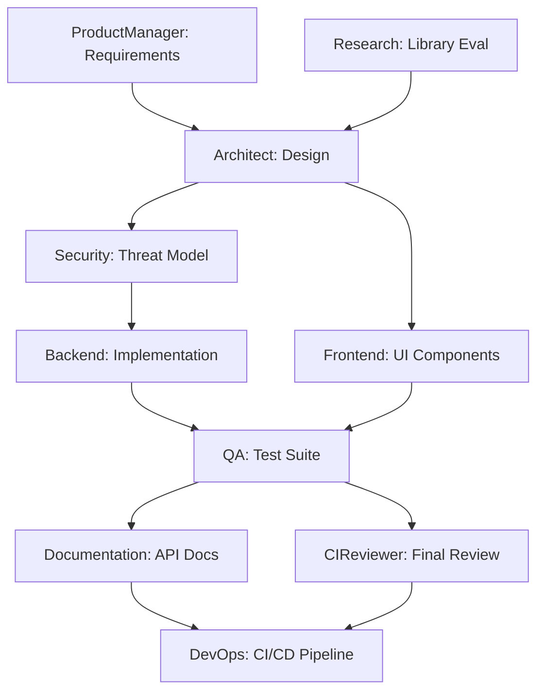
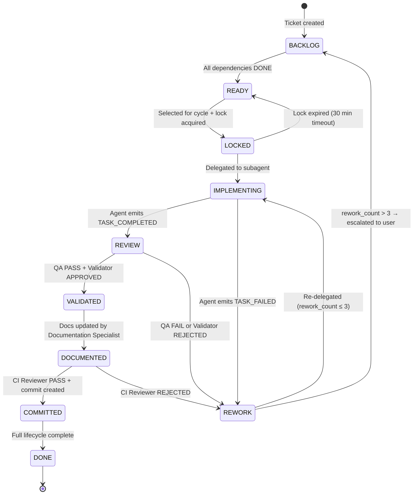
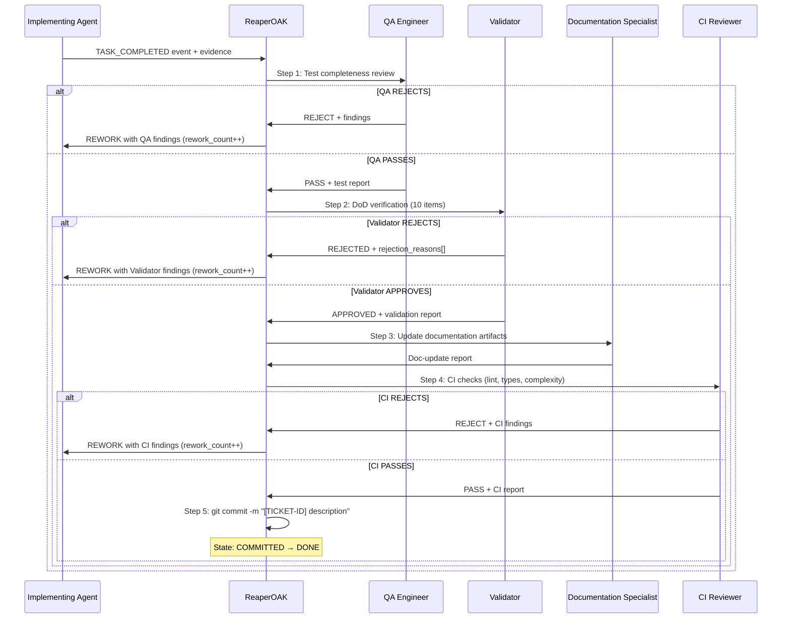
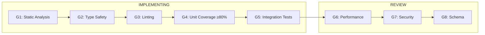
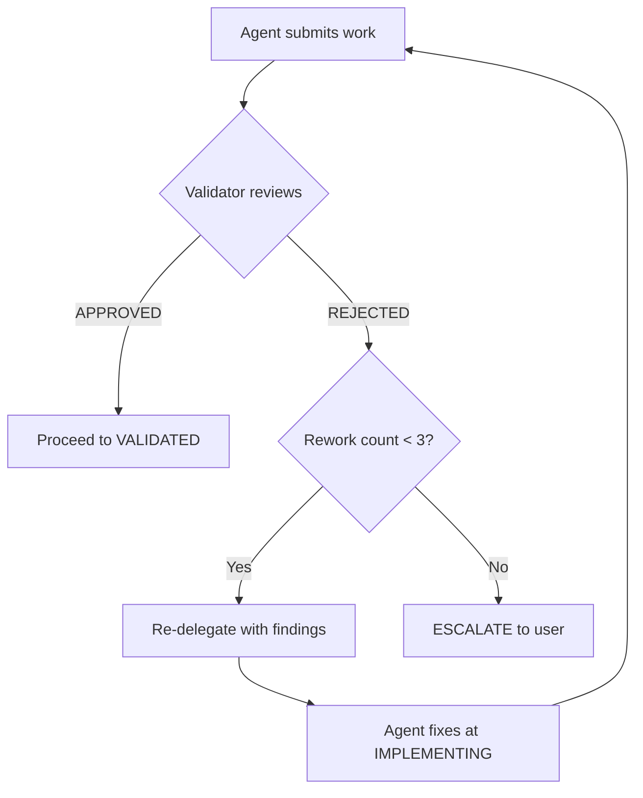

# Vibecoding Multi-Agent System Architecture

> **Version:** 7.0.0
> **Owner:** ReaperOAK (CTO / Supervisor Orchestrator)
> **Last Updated:** 2026-02-27
>
> **Changelog:** v7.0.0 — Ticket-Driven Event-Based Architecture: 9-state
> ticket machine, mandatory post-execution chain, event emission protocol,
> anti-one-shot guardrails, commit enforcement per ticket

---

## 1. System Overview

This architecture implements a **Supervisor Pattern** multi-agent vibecoding
system with ReaperOAK as the singular CTO and orchestrator. All subagents
operate within bounded scopes, follow Plan-Act-Reflect loops with RUG
discipline, and route destructive operations through human approval gates.

The unit of execution is: **ONE TICKET → FULL SDLC LOOP → COMMIT**.
There is no phased pipeline. There is no batch feature completion. ReaperOAK
reacts to events emitted by agents and routes tickets through a 9-state
machine.

### Design Principles

1. **Determinism over cleverness** — explicit state transitions, bounded loops
2. **Separation of concerns** — each agent owns one domain
3. **Least privilege** — minimal tool access per agent
4. **Zero hallucinated authority** — agents cannot claim capabilities they lack
5. **Immutable truth sources** — `systemPatterns.md` and `decisionLog.md` are
   controlled by ReaperOAK only
6. **Human-in-the-loop for destructive ops** — always
7. **Confidence-gated progression** — no state transition without assessed confidence
8. **DAG-first decomposition** — all multi-task work starts with dependency graph
9. **Evidence over assertion** — every claim requires tool output or file reference
10. **Governance by default** — hooks and guardrails active in every session
11. **Single-ticket focus** — one agent, one ticket, full lifecycle, then next

---

## 2. Agent Topology

```
ReaperOAK (Supervisor / CTO)
│
├── Cross-Cutting Protocols ─── _cross-cutting-protocols.md (inherited by ALL)
│
├── ProductManager    — EARS requirements, INVEST stories, DDD context mapping
├── Architect         — Well-Architected design, DAG decomposition, ADRs
├── Backend           — TDD, Object Calisthenics, RFC 7807, spec-driven dev
├── Frontend          — WCAG 2.2 AA, Core Web Vitals, Component Calisthenics
├── QA                — Test pyramid, mutation testing, property-based testing
├── Security          — STRIDE, OWASP Top 10, SARIF, SBOM, policy-as-config
├── DevOps            — GitOps, SLO/SLI, chaos engineering, policy-as-code
├── Documentation     — Diátaxis, Flesch-Kincaid scoring, doc-as-code CI
├── Research          — Bayesian confidence, evidence hierarchy, PoC standards
├── CIReviewer        — Cognitive complexity, fitness functions, SARIF reports
├── UIDesigner        — Google Stitch designs, component specs, design tokens
├── TODO              — Task decomposition, lifecycle tracking, TODO file management
└── Validator         — Independent SDLC compliance, DoD enforcement, quality gate verification
```

### Agent Authority Matrix

| Agent | Domain Expertise | Can Write | Can Execute |
|-------|-----------------|-----------|-------------|
| **ReaperOAK** | Orchestration, ticket routing, event handling | systemPatterns, decisionLog, activeContext, progress | Delegate, validate, commit |
| **ProductManager** | EARS notation, INVEST stories, DDD | activeContext, progress | GitHub issues |
| **Architect** | Well-Architected Pillars, API contracts, DAGs | activeContext, progress | Analysis tools |
| **Backend** | TDD, Object Calisthenics, RFC 7807 | Source code (scoped dirs) | Terminal, tests |
| **Frontend** | WCAG 2.2 AA, Core Web Vitals | UI source (scoped dirs) | Terminal, browser |
| **QA** | Test pyramid, mutation testing, Playwright | Test files only | Terminal, browser |
| **Security** | OWASP Top 10, STRIDE, SARIF, SBOM | riskRegister, activeContext | Scanners |
| **DevOps** | GitOps, SLO/SLI, Docker, chaos engineering | CI/CD, Dockerfiles, IaC | Terminal, deploy (staging) |
| **Documentation** | Diátaxis, Flesch-Kincaid, doc-as-code CI | Documentation files only | Analysis tools |
| **Research** | Bayesian confidence, evidence hierarchy | activeContext, progress | Web fetch, search |
| **CIReviewer** | Cognitive complexity, fitness functions, SARIF | PR comments only | Analysis tools |
| **UIDesigner** | Stitch design, component specs, design tokens | Design specs (docs/design-specs/) | Stitch, Playwright, Memory |
| **TODO** | Task decomposition, lifecycle tracking, DAGs | TODO files (TODO/**/*.md), activeContext, progress | Terminal (todo_visual.py) |
| **Validator** | DoD compliance, SDLC gates, pattern conformance | Validation reports, `feedback-log.md` (append) | Linters, type/test runners (read-only) |

Full read/write/execute permissions and forbidden actions are specified in
each agent's `.github/agents/*.agent.md` definition file.

### Structured Autonomy Levels

Each agent operates at a defined autonomy level. ReaperOAK can adjust
levels based on task criticality.

| Level | Name | Behavior | Approval Required |
|-------|------|----------|-------------------|
| **L1** | Supervised | Agent proposes actions, waits for approval before each step | Every action |
| **L2** | Guided | Agent executes within pre-approved scope, reports after completion | Scope changes only |
| **L3** | Autonomous | Agent executes independently within delegation packet boundaries | Destructive ops only |

**Default Autonomy Assignments:** Backend (L2), Frontend (L2), QA (L3),
Security (L2), DevOps (L1), Documentation (L3), Research (L3), CIReviewer (L3),
ProductManager (L2), Architect (L2), UIDesigner (L2), TODO (L2), Validator (L2).

---

## 3. Context Engineering Framework

### 3.1 Context Loading Strategy

At session start, ReaperOAK loads context using a 4-priority system:

| Priority | Category | Action | Budget |
|----------|----------|--------|--------|
| **P0** | Critical | Load fully — delegation packet, active errors, systemPatterns | 30% |
| **P1** | High | Load fully — activeContext.md, relevant source files | 25% |
| **P2** | Medium | Summarize — decisionLog.md, progress.md, prior session notes | 25% |
| **P3** | Low | Skip / load on demand — historical logs, completed task archives | 20% |

### 3.2 Context Budget Declaration

Every delegation packet includes a context budget with `totalTokens`,
priority-based `allocation` (delegation, source, memory bank, protocols,
reserve), and a `filesLoaded` manifest with path, priority, and token count.

### 3.3 Context Freshness Rules

| Source | Max Age | Refresh Trigger |
|--------|---------|-----------------|
| Active errors | Real-time | Every tool call |
| Source files | Current session | File modification detected |
| Memory bank | Current session | Memory bank write detected |
| External docs | 24 hours | Research agent re-fetches |
| Decision log | Permanent | Never expires |

---

## 4. Delegation Packet Format

Every task delegated from ReaperOAK to a subagent uses a canonical YAML
format containing: `taskId`, `delegatedBy`, `assignedTo`, `autonomyLevel`,
`objective`, `successCriteria[]`, `scopeBoundaries` (included/excluded),
`forbiddenActions[]`, `requiredOutputFormat`, `evidenceExpectations[]`,
`contextBudget`, `confidenceThreshold`, `priority`, `dependencies[]`,
`timeoutBudget`, and `crossCuttingProtocols`.

Full schema: `.github/tasks/delegation-packet-schema.json`

---

## 5. Ticket-Driven Orchestration Model

ReaperOAK operates as a **ticket-driven event orchestrator**. It does NOT
run lifecycle phases or batch operations. It reacts to events emitted by
agents and routes tickets through a 9-state machine, one at a time.

### 5.1 Event Loop

```
LOOP:
  1. SELECT exactly ONE READY ticket (or multiple conflict-free for parallel)
  2. LOCK ticket to specific agent → state: LOCKED
  3. DELEGATE to implementing agent → state: IMPLEMENTING
  4. WAIT for completion event or blocking event
  5. If BLOCKING EVENT → invoke requested agent → resume when resolved
  6. If COMPLETION EVENT → run post-execution chain (§7)
  7. After chain passes → enforce commit (§10) → state: COMMITTED → DONE
  8. UNLOCK → select next ticket
```

ReaperOAK must NEVER call multiple lifecycle phases at once. It reacts to
events one at a time per ticket. Each iteration processes exactly one event
for one ticket.

**Hard rules:**
- No agent may implement more than one ticket per cycle
- No batch feature completion allowed
- No "finish remaining TODO" — each ticket is atomic
- Every ticket completes its full lifecycle before being marked DONE
- ReaperOAK selects the next ticket only after the current cycle completes
  (or when running conflict-free parallel cycles — see §11)

### 5.2 DAG Construction

Every multi-agent objective is decomposed into a DAG before execution:



DAG construction is handled by the TODO Agent during progressive refinement
(see §28). L3 tasks enter the ticket state machine at BACKLOG and are
promoted to READY when all `depends_on` entries are DONE.

### 5.3 Discovery vs Execution Separation

Discovery and execution are distinct phases that must not be mixed within
the same cycle.

**Discovery agents** (read-only — produce artifacts, no code):
- Research Analyst, Product Manager, Architect, Security Engineer, UIDesigner

**Execution agents** (write — implement from tickets):
- Backend, Frontend Engineer, DevOps Engineer, QA Engineer

After discovery completes, the TODO Agent generates tickets from artifacts.
Discovery and execution agents must NOT operate in the same cycle.

### 5.4 Blocking Event Handling

When ReaperOAK receives a blocking event from an implementing agent:

1. Pause current ticket (state remains IMPLEMENTING — agent is waiting)
2. Invoke the requested agent with context from the blocking ticket
3. Wait for resolution from the invoked agent
4. Pass resolution artifacts back to the original implementing agent
5. Resume original ticket execution

---

## 6. Ticket State Machine — 9 States

Every ticket traverses these states in strict order. No state may be
skipped. Invalid transitions (e.g., BACKLOG → IMPLEMENTING) are **rejected**.

### 6.1 States

| State | Description | Owner |
|-------|-------------|-------|
| **BACKLOG** | Ticket exists, dependencies not met | System (auto) |
| **READY** | All deps DONE, eligible for selection | System (auto via dep check) |
| **LOCKED** | Selected for cycle, lock acquired | ReaperOAK |
| **IMPLEMENTING** | Delegated to agent, work in progress | Implementing Agent |
| **REVIEW** | Implementation done, QA + Validator reviewing | QA + Validator |
| **VALIDATED** | All reviews pass, docs being updated | Documentation Specialist |
| **DOCUMENTED** | Docs updated, CI review pending | CI Reviewer |
| **COMMITTED** | CI passes, commit created | ReaperOAK |
| **DONE** | Full lifecycle complete | System (final) |

### 6.2 State Transition Diagram



### 6.3 Transition Rules

| From | To | Trigger | Guard Condition |
|------|-----|---------|----------------|
| BACKLOG | READY | Dependency check | All `depends_on` tasks have status = DONE |
| READY | LOCKED | Cycle SELECT phase | No file conflicts, agent not locked, priority selected |
| LOCKED | IMPLEMENTING | `runSubagent` called | Lock is active, agent assignment confirmed |
| LOCKED | READY | Timer expires | Lock timeout reached (30 min) — auto-release |
| IMPLEMENTING | REVIEW | Agent emits TASK_COMPLETED | Evidence provided (artifact paths, test results) |
| IMPLEMENTING | REWORK | Agent emits TASK_FAILED | Error evidence provided |
| REVIEW | VALIDATED | QA + Validator pass | QA test review PASS, Validator DoD verdict = APPROVED |
| REVIEW | REWORK | QA or Validator fail | QA FAIL or verdict = REJECTED, rework_count < 3 |
| VALIDATED | DOCUMENTED | Doc update confirmed | Documentation Specialist confirms artifact updates |
| DOCUMENTED | COMMITTED | CI + commit pass | CI Reviewer PASS, `git commit` succeeds |
| DOCUMENTED | REWORK | CI Reviewer rejects | Lint/type/complexity failures, rework_count < 3 |
| COMMITTED | DONE | Final confirmation | All lifecycle steps verified |
| REWORK | IMPLEMENTING | Re-delegation | rework_count incremented, < 3 |
| REWORK | BACKLOG | Escalation | rework_count >= 3, user notified |

### 6.4 Failure Rollback Rules

| Failure Mode | State Transition | Recovery Action |
|--------------|-----------------|----------------|
| Agent reports failure | IMPLEMENTING → REWORK | Re-delegate with findings; rework_count++ |
| QA/Validator rejects | REVIEW → REWORK | Re-delegate with rejection report; rework_count++ |
| CI Reviewer rejects | DOCUMENTED → REWORK | Re-delegate with CI findings; rework_count++ |
| Lock expires (30 min) | LOCKED → READY | Lock auto-released; eligible next cycle |
| Cycle timeout (2h) | Active → READY | All locks released; escalate to user |
| Rework exhausted (≥3) | REWORK → BACKLOG | User notified for override or cancellation |

### 6.5 Backward Compatibility — State Mapping

Existing TODO files may use old status values. Normalize on read:

| Old Status | New State | Migration Rule |
|------------|-----------|---------------|
| `not_started` | BACKLOG | Check deps to promote to READY |
| `in_progress` | IMPLEMENTING | Active work maps to IMPLEMENTING |
| `completed` | DONE | Finished tasks map to DONE |
| `blocked` | BACKLOG | BACKLOG with `blocker_reason` field set |
| `PENDING` | BACKLOG | Old state machine equivalent |
| `IN_PROGRESS` | IMPLEMENTING | Old state machine equivalent |
| `REVIEW` | REVIEW | Same semantics |
| `MERGED` | DONE | Old final state |
| `MARK_COMPLETE` | COMMITTED → DONE | Old completion gate |

New tickets MUST use the 9-state values exclusively.

### 6.6 Task Metadata Extension

Each ticket gains two operational metadata fields:

```markdown
**Rework Count:** 0
**Blocker:** (none)
```

- `Rework Count` starts at 0, increments on each REWORK → IMPLEMENTING.
  Resets to 0 on escalation (REWORK → BACKLOG).
- `Blocker` is free-text, present only in BACKLOG when externally blocked.

### 6.7 Locking Mechanism

When a ticket is selected for a cycle, ReaperOAK acquires a lock:

```json
{
  "ticketId": "TDSA-BE001",
  "lockedBy": "Backend",
  "lockedAt": "2026-02-27T14:30:00Z",
  "expiresAt": "2026-02-27T15:00:00Z",
  "cycleId": "cycle-2026-02-27T14:30-001",
  "status": "active"
}
```

Lock schema: `.github/locks/task-lock-schema.json`

**Lock lifecycle:**
1. Acquired at READY → LOCKED transition
2. Held through IMPLEMENTING → REVIEW → VALIDATED → DOCUMENTED → COMMITTED
3. Released at COMMITTED → DONE transition
4. Auto-released on 30-minute timeout (LOCKED → READY)
5. Auto-released on cycle timeout (2h — all locks released, escalate to user)

---

## 7. Post-Execution Chain

After an implementing agent finishes, this chain runs for **EVERY** ticket.
No exceptions. No shortcuts. No skipping.

### 7.1 Chain Steps

| Step | Agent | Action | Failure Path |
|------|-------|--------|-------------|
| 1 | QA Engineer | Test completeness review, coverage check (≥80%) | REJECT → REWORK |
| 2 | Validator | DoD enforcement (all 10 items independently verified) | REJECT → REWORK |
| 3 | Documentation Specialist | Artifact update (README, CHANGELOG, API docs) | BLOCK → report to ReaperOAK |
| 4 | CI Reviewer | Simulate CI checks (lint, types, complexity) | REJECT → REWORK |
| 5 | ReaperOAK | Commit enforcement (commit with ticket ID in message) | FAIL → retry once → escalate |

If ANY agent in the chain rejects → ticket moves to REWORK → assigned back
to the implementing agent with the rejection report as upstream artifact.

### 7.2 Retry Budget

The total retry budget across ALL chain steps is **3 combined**:
- QA rejections (Step 1), Validator rejections (Step 2), and CI Reviewer
  rejections (Step 4) share a single `rework_count` counter.
- When `rework_count` reaches 3 → escalate to user for override or
  cancellation.
- Counter resets to 0 on escalation (ticket returns to BACKLOG).

### 7.3 Sequence Diagram



### 7.4 Enforcement Rule

> **No ticket may reach DONE without ALL five chain steps completing
> successfully.** Bypassing any step is a protocol violation. Only explicit
> user override can skip a chain step.

---

## 8. Event Emission Protocol

Agents emit structured events during ticket execution. ReaperOAK is the
**sole consumer and router** of all events. Agents must NOT directly call
or communicate with each other — ALL inter-agent communication flows through
ReaperOAK's event loop.

### 8.1 Event Types

| Event Type | When Emitted | Payload |
|-----------|-------------|---------|
| `TASK_STARTED` | Agent begins work on assigned ticket | ticket_id, agent_name, timestamp |
| `TASK_COMPLETED` | Agent finishes with evidence | ticket_id, agent_name, timestamp, evidence (artifact paths, test results, confidence) |
| `TASK_FAILED` | Agent cannot complete | ticket_id, agent_name, timestamp, error_details, suggested_action |
| `NEEDS_INPUT_FROM` | Agent needs output from another agent type | ticket_id, agent_name, target_agent, context, question |
| `BLOCKED_BY` | Agent is blocked by external dependency | ticket_id, agent_name, blocker_description, blocker_type |
| `PROGRESS_UPDATE` | Periodic status during long tasks | ticket_id, agent_name, timestamp, percent_complete, current_step |
| `REQUEST_RESEARCH` | Need research before proceeding | ticket_id, agent_name, research_question |
| `REQUIRES_UI_DESIGN` | UI artifacts needed before Frontend work | ticket_id, agent_name, feature_name, ui_requirements |
| `ESCALATE_TO_PM` | Scope or requirements unclear | ticket_id, agent_name, ambiguity_description |

### 8.2 Event Payload Format

Events are emitted as structured markdown in agent output:

```
**Event:** {event_type}
**Ticket:** {ticket_id}
**Agent:** {agent_name}
**Timestamp:** {ISO8601}
**Details:** {free-text description}
**Evidence:** {test results, confidence level — required for TASK_COMPLETED}
**Artifacts:** {list of file paths, if applicable}
```

### 8.3 Emission Rules

1. Every agent MUST emit `TASK_STARTED` at the beginning and either
   `TASK_COMPLETED` or `TASK_FAILED` at the end of every ticket execution.
2. Blocking events (`NEEDS_INPUT_FROM`, `BLOCKED_BY`, `REQUEST_RESEARCH`,
   `REQUIRES_UI_DESIGN`, `ESCALATE_TO_PM`) pause the current ticket.
   ReaperOAK handles routing the request to the appropriate agent and
   passing resolution artifacts back.
3. `PROGRESS_UPDATE` should be emitted periodically during tasks with
   effort > 30 min.
4. `TASK_COMPLETED` MUST include evidence — artifact paths, test results,
   and confidence level. Events without evidence are rejected.

### 8.4 No Direct Agent Communication

Agents must NOT call each other directly. ALL inter-agent communication is
routed through ReaperOAK. This ensures:
- Single point of coordination and audit trail
- No circular dependencies between agents
- ReaperOAK maintains full visibility of system state
- Every interaction is logged for observability

---

## 9. Anti-One-Shot Guardrails

Hard rules preventing agents from attempting complex work in a single pass
or exceeding ticket scope. These guardrails enforce iterative, evidence-based
delivery.

### 9.1 Scope Enforcement

- Agent must ONLY respond to its assigned ticket ID
- If output references unrelated tickets → ReaperOAK REJECTS
- If implementation exceeds ticket scope (modifies files not in the ticket's
  write_paths) → Validator REJECTS at REVIEW
- If agent attempts to implement multiple tickets in one response → force
  stop and re-delegate

### 9.2 Mandatory Iteration Pattern

For tickets with effort > 30 min, agents MUST demonstrate iteration:

1. **Pass 1 — Draft implementation:** Write the initial implementation
   addressing all acceptance criteria
2. **Pass 2 — Self-review:** Check output against acceptance criteria using
   the Self-Reflection protocol. Score all 5 dimensions.
3. **Pass 3 — Fix gaps:** Address any gaps, low scores, or missing criteria
4. **Pass 4 — Final check:** Confirm all criteria met, verify file scope

**Minimum:** 2 iterations for any task with effort > 30 min.

### 9.3 Pre-Submission Scope Checks

Before submitting `TASK_COMPLETED`:
1. Compare files modified against the ticket's listed write_paths
2. If any file outside scope was modified → undo and report
3. Verify output references only the assigned ticket ID
4. Confirm all acceptance criteria from the ticket are addressed

### 9.4 Anti-Batch Detection

ReaperOAK enforces single-ticket focus through these checks:
- Does agent output contain multiple ticket IDs? → REJECT
- Does agent output modify files belonging to other tickets? → REJECT
- Does output exceed expected size for a single ticket? → flag for review
- Does agent output include self-reflection evidence? → required for acceptance

---

## 10. Commit Enforcement

A ticket CANNOT reach DONE unless a commit is created.

### 10.1 Commit Requirements

- Commit message references ticket ID: `[TICKET-ID] Description`
- All changed files included in commit
- CHANGELOG updated with ticket summary
- All CI checks pass before commit

### 10.2 Commit Execution

ReaperOAK performs the commit AFTER CI Reviewer approval (Step 4 of chain):

```bash
git add <changed-files>
git commit -m "[TICKET-ID] <description>"
```

### 10.3 Failure Handling

- Commit fails → retry once with corrected parameters
- Second failure → escalate to user
- No commit → no DONE state. Ticket remains in DOCUMENTED.
- Commit message MUST follow format: `[TICKET-ID] Description`

---

## 11. Parallel Execution Model

ReaperOAK may select multiple READY tickets for parallel execution when
no conflicts exist.

### 11.1 Conflict Detection

For each READY ticket, extract `write_paths`. Build an overlap matrix —
if any two tickets share write paths, they CONFLICT. Select the maximum
independent set (largest subset where no pair conflicts). If all conflict,
select exactly 1 ticket (serial fallback).

### 11.2 Additional Constraints

- No dependency chain conflicts between selected tickets
- No shared mutable resource conflicts (CHANGELOG counts as shared)
- Same agent cannot be assigned to multiple tickets in one cycle
- One agent = one ticket per cycle. No exceptions.

### 11.3 Parallel Spawn Strategy

```
Within a cycle:
1. SELECT → identify N conflict-free tickets for N agents
2. LOCK → acquire lock for each ticket
3. DELEGATE → call runSubagent for each (all independent, launched together)
4. WAIT → wait for all agents to return results
5. CHAIN → run post-execution chain per ticket SEQUENTIALLY
   (prevents race conditions on shared files like CHANGELOG)
6. DONE → release all locks, cycle ends, dependency scan runs
```

### 11.4 Deadlock Prevention

| Scenario | Prevention Rule |
|----------|----------------|
| All eligible tickets conflict | Run exactly 1 ticket (serial fallback) |
| Agent doesn't respond within timeout | Lock expires after 30 min → READY |
| Full cycle doesn't complete in 2h | Release all locks, escalate to user |
| Dependency cycle detected | REJECT at SELECT — should not happen if TODO enforced DAG |
| All tickets blocked externally | Report to user, enter WAIT state |

After every cycle completes, ReaperOAK runs a dependency scan across all
BACKLOG tickets. Any ticket whose `depends_on` entries are all DONE is
automatically promoted to READY for the next cycle.

---

## 12. Conflict Resolution Policy

1. **Intra-agent conflict:** Re-run with explicit context of the contradiction
2. **Inter-agent conflict:** ReaperOAK resolves using `systemPatterns.md`
3. **Agent vs. instruction conflict:** Instruction file wins always
4. **Confidence disagreement:** Higher-evidence position wins
5. **Precedence hierarchy:**

   ```
   Human directive > ReaperOAK decision > systemPatterns.md >
   domain instruction > cross-cutting protocols > general instruction >
   agent default behavior
   ```

---

## 13. Human Approval Gate Triggers

The following operations **ALWAYS** halt and require explicit human approval:

| Trigger | Category |
|---------|----------|
| Database drops, mass deletions | Destructive |
| Force pushes, branch deletions | Destructive |
| Production deployments | Deployment |
| Firewall/network policy changes | Security |
| New external dependency introduction | Supply chain |
| Architecture pattern changes | Design |
| Security exception requests | Security |
| Privilege escalation for any agent | Governance |
| Merge to main/production branch | Release |
| Secret/credential rotation | Security |
| Autonomy level elevation | Governance |

### 13.1 UI/UX Enforcement Gate

A mandatory check ensuring UIDesigner is invoked for all UI-touching work.
When a Frontend ticket has UI keywords or `UI Touching: yes`, ReaperOAK
verifies design artifacts exist at `/docs/uiux/<feature>/` (mockup PNGs,
`interaction-spec.md`, `component-hierarchy.md`, `state-variations.md`,
`accessibility-checklist.md`). Missing artifacts → delegate to UIDesigner
first. Override requires user approval (logged in decisionLog.md).

---

## 14. Plan-Act-Reflect Loop (All Subagents)

Every subagent follows a 3-step cognitive loop with RUG discipline:

1. **PLAN (RUG):** Read delegation packet → state objective and assumptions
   → identify tool calls → list file modifications → declare confidence
2. **ACT:** Execute plan step-by-step → constrain to declared scope → make
   smallest valid changes → collect evidence at each step
3. **REFLECT (Self-Score):** Review stdout/stderr → score 5 dimensions
   (Correctness, Completeness, Convention, Clarity, Impact — each ?/10)
   → gate: average ≥ 7 to submit → if < 7: iterate (max 3x)

---

## 15. Memory Bank Integration

Located at `.github/memory-bank/`:

| File | Owner | Write Access | Purpose |
|------|-------|-------------|---------|
| `productContext.md` | ReaperOAK | ReaperOAK, ProductManager | Project vision, goals, constraints |
| `systemPatterns.md` | ReaperOAK | ReaperOAK ONLY | Architecture decisions, code conventions |
| `activeContext.md` | Shared | All subagents (append) | Current focus, recent changes |
| `progress.md` | Shared | All subagents (append) | Completed milestones, pending work |
| `decisionLog.md` | ReaperOAK | ReaperOAK ONLY | Trade-off records, rationale |
| `riskRegister.md` | Security | Security, ReaperOAK | Identified risks, mitigations |

**Immutability Rules:**

- `systemPatterns.md` and `decisionLog.md` are append-only by ReaperOAK
- No subagent may delete or overwrite entries in these files
- Subagents may only append timestamped entries to `activeContext.md` and `progress.md`

### 15.1 Shared Context Layer

Additional state files for pipeline management:

| File | Owner | Write Access | Purpose |
|------|-------|-------------|----------|
| `workflow-state.json` | ReaperOAK | ReaperOAK ONLY | Ticket state tracking — per-ticket status, rework count, lock info |
| `artifacts-manifest.json` | ReaperOAK | ReaperOAK ONLY | Versioned build artifact tracking with SHA-256 hashes |
| `feedback-log.md` | Shared | All subagents (append) | Inter-agent quality signals and cross-agent feedback |

These files enable session resumption and provide structured state for the
ticket-driven event loop.

> **Ticket State Tracking:** `workflow-state.json` tracks per-ticket state
> using the 9-state machine (§6), including `status`, `rework_count`,
> `blocker_reason`, `locked_by`, `locked_at`, `last_transition`, and
> `cycle_id`. This enables ReaperOAK to resume ticket processing across
> sessions.

---

## 16. Governance & Observability

### 16.1 Governance Hooks

Active hooks in `.github/hooks/`:

| Hook | Events | Purpose |
|------|--------|---------|
| `governance-audit` | sessionStart, sessionEnd, userPromptSubmitted | Threat detection, STRIDE-aligned scanning |
| `session-logger` | sessionStart, sessionEnd, userPromptSubmitted | Session activity tracking |
| `session-auto-commit` | sessionEnd | Auto-commit changes at session end |

### 16.2 Audit Trail Format

Every governance event produces a JSON log entry with `timestamp`, `event`,
`governance_level`, and `status`. Threat events add `threat_count`,
`max_severity`, and a `threats[]` array with category, severity, description,
and evidence fields.

### 16.3 Observability Metrics

| Metric | Source | Purpose |
|--------|--------|---------|
| Tickets completed / session | Ticket state machine | Throughput |
| Average reworks / ticket | Rework counter | Quality signal |
| Token consumption / agent | Token budget tracker | Cost control |
| Confidence trend | Confidence gate assessments | Risk detection |
| Threat detection rate | Governance audit logs | Security posture |
| Cycle completion % | Event loop tracking | Progress visibility |

---

## 17. Security Guardrails

See `.github/security.agentic-guardrails.md` for full specification.

Key constraints:

- All subagents operate with least-privilege tool access
- External content is sanitized before processing
- Prompt injection patterns are detected and rejected
- Memory bank entries are validated before persistence
- Token runaway detection halts infinite loops
- MCP servers are treated as untrusted by default
- SARIF output format for machine-parseable security findings
- SBOM generation for supply chain transparency
- Policy-as-config for governance rules (YAML, not hardcoded)

---

## 18. CI/CD AI Integration

See `.github/workflows/ai-*.yml` for workflow definitions.

| Workflow | Trigger | Purpose |
|----------|---------|---------|
| `ai-code-review.yml` | pull_request | Automated code review with findings as comments |
| `ai-test-validator.yml` | pull_request | Validate test coverage and quality |
| `ai-security-scan.yml` | pull_request | Security vulnerability detection |
| `ai-doc-sync.yml` | pull_request | Documentation freshness check |

All workflows:

- Use least-privilege tokens (read-only default)
- Never auto-merge
- Comment findings on PRs
- Require human approval for write operations
- Fail safely (no recursion, bounded execution)

---

## 19. Instruction File Authority

The following instruction files are authoritative references for their
domains and are loaded from `docs/instructions/`:

| Domain | Instruction File |
|--------|-----------------|
| Accessibility | `a11y.instructions.md` |
| Agent Safety | `agent-safety.instructions.md` |
| AI Prompt Engineering | `ai-prompt-engineering-safety-best-practices.instructions.md` |
| Context Engineering | `context-engineering.instructions.md` |
| Docker/Containers | `containerization-docker-best-practices.instructions.md` |
| DevOps | `devops-core-principles.instructions.md` |
| CI/CD | `github-actions-ci-cd-best-practices.instructions.md` |
| Markdown | `markdown.instructions.md` |
| Memory Bank | `memory-bank.instructions.md` |
| Performance | `performance-optimization.instructions.md` |
| Playwright | `playwright-typescript.instructions.md` |
| Security/OWASP | `security-and-owasp.instructions.md` |
| Shell | `shell.instructions.md` |
| Spec-Driven Workflow | `spec-driven-workflow-v1.instructions.md` |
| Surgical Edits | `taming-copilot.instructions.md` |
| Task Implementation | `task-implementation.instructions.md` |
| Thought Logging | `copilot-thought-logging.instructions.md` |
| TypeScript | `typescript-5-es2022.instructions.md` |

---

## 20. Claude Code Integration

The vibecoding system supports **dual-agent operation** with both GitHub Copilot
and Claude Code. Both agents share the same memory bank, instruction files, and
governance principles.

### Claude Code Configuration

| Component | Location | Purpose |
|-----------|----------|---------|
| `CLAUDE.md` | Repository root | Primary instruction file (equivalent to `ReaperOAK.agent.md`) |
| `.claude/settings.json` | `.claude/` | Hooks configuration for governance and logging |
| `.claude/hooks/` | `.claude/hooks/` | Governance audit, prompt logging, session logging |
| `.claude/commands/` | `.claude/commands/` | Slash commands (memory-bank-read, memory-bank-update, review, plan, security-audit, debug) |

### Shared Resources (Agent-Agnostic)

| Resource | Location | Used By |
|----------|----------|---------|
| Memory Bank | `.github/memory-bank/` | Both Copilot and Claude Code |
| Instruction Files | `docs/instructions/` | Both Copilot and Claude Code |
| Architecture Docs | `.github/ARCHITECTURE.md` | Both |
| Security Guardrails | `.github/security.agentic-guardrails.md` | Both |
| Cross-Cutting Protocols | `.github/agents/_cross-cutting-protocols.md` | Both |

### Agent-Specific Resources

| Resource | Copilot | Claude Code |
|----------|---------|-------------|
| Agent Definitions | `.github/agents/*.agent.md` | `CLAUDE.md` |
| Hooks Config | `.github/hooks/*/hooks.json` | `.claude/settings.json` |
| Hook Scripts | `.github/hooks/*/` | `.claude/hooks/` |
| Log Directory | `logs/copilot/` | `logs/claude-code/` |
| Slash Commands | N/A (built-in) | `.claude/commands/` |
| Multi-Agent | `agent/runSubagent` tool | `Task` tool with subagent types |

---

## 21. Self-Improvement System

Agents can propose improvements to the infrastructure. This is controlled
evolution — not autonomous self-modification.

### 21.1 Proposal Lifecycle

```
Agent identifies improvement → Writes proposal → ReaperOAK validates →
User approves → Agent implements → Verify → Merge
```

Proposals live in `.github/proposals/` with naming convention
`PROP-YYYYMMDD-{agent}-{seq}.md`.

### 21.2 Scope Constraints

**Can be proposed:** Chunk improvements, agent config tweaks, new templates,
workflow additions, catalog updates, tool ACL requests.

**Cannot be proposed:** Changes to systemPatterns/decisionLog, STOP_ALL
modifications, removal of forbidden actions, autonomy elevation.

---

## 22. Validator Agent

The **Validator** is an independent compliance reviewer that verifies task
outputs satisfy the Definition of Done, pass quality gates, and conform to
patterns in `systemPatterns.md`. The Validator does NOT implement code — it
only reads artifacts and writes validation reports.

**Definition:** `.github/agents/Validator.agent.md`

| Property | Value |
|----------|-------|
| **Autonomy** | L2 (Guided) |
| **Invocation** | At REVIEW state (Step 2 of post-execution chain, §7) |
| **Verdict** | `APPROVED` or `REJECTED` |
| **Write scope** | `docs/reviews/validation/`, `docs/reviews/dod/`, `feedback-log.md` (append) |
| **Execute scope** | Linters, type checkers, test runners (read-only verification) |
| **Cannot** | Modify source code, mark tasks complete, deploy, merge, override own rejections |

**Interaction flow:** Implementing Agent emits TASK_COMPLETED → ReaperOAK delegates to QA → QA passes → ReaperOAK delegates to Validator → Validator returns verdict → ReaperOAK routes to REWORK (rejected) or VALIDATED (approved). All communication flows through ReaperOAK. No agent may self-validate — DOD-07 can only be set by the Validator.

---

## 23. Definition of Done Framework

Every ticket must satisfy **10 DoD items** before it can advance past REVIEW.
The checklist is machine-parseable and enforced by the Validator agent.

| DoD ID | Item | Verified By |
|--------|------|-------------|
| DOD-01 | Code Implemented — all acceptance criteria addressed | Agent (self) + Validator |
| DOD-02 | Tests Written — unit tests, ≥80% coverage for new code | Agent + Validator |
| DOD-03 | Lint Passes — zero errors and warnings | Agent + Validator |
| DOD-04 | Type Checks Pass — `tsc --noEmit` clean, no `any` | Agent + Validator |
| DOD-05 | CI Passes — all workflow checks green | Agent + Validator |
| DOD-06 | Docs Updated — JSDoc/TSDoc, README if interface changed | Agent + Validator |
| DOD-07 | Reviewed by Validator — independent compliance check | **Validator only** |
| DOD-08 | No Console Errors — structured logger only | Agent + Validator |
| DOD-09 | No Unhandled Promises — no floating promises | Agent + Validator |
| DOD-10 | No TODO Comments — no TODO/FIXME/HACK/XXX in code | Agent + Validator |

**Enforcement:** `allPassed == false` → ticket CANNOT leave REVIEW. `verdict != APPROVED` → ticket CANNOT reach VALIDATED. Agent submits DOD-07 as `false` — only Validator may set `true`. 3 consecutive rejections → escalate to user. **Template:** `.github/tasks/definition-of-done-template.md`

---

## 24. Initialization Enforcement

Before any ticket's implementation begins, the target module must pass a
**9-item initialization checklist**. The check runs once per module — subsequent
tickets reuse the cached result if `all_passed: true` exists on disk.

| Init ID | Item | Applies To |
|---------|------|------------|
| INIT-01 | Directory Structure Validated | ALL |
| INIT-02 | ESLint / Prettier Configured | ALL |
| INIT-03 | tsconfig.json Present and Consistent | ALL |
| INIT-04 | Test Framework Configured | ALL |
| INIT-05 | Environment Variables Documented | ALL |
| INIT-06 | Health Check Endpoint Present | Backend |
| INIT-07 | Logging Configured | ALL |
| INIT-08 | Error Boundaries Present | Frontend |
| INIT-09 | Sentry / Error Tracking Instrumented | Backend |

**Enforcement:** Any required item `status: false` → **BLOCKS IMPLEMENTING**. Non-applicable items auto-pass by `module_type`. Initialization fails after 2 attempts → BLOCK and escalate. **Template:** `.github/tasks/initialization-checklist-template.md`

---

## 25. Bug-Catching Strategy

Bug catching is distributed across **8 layered gates** that run at different
points in the ticket lifecycle. Each gate has explicit pass/fail criteria and
blocking behavior.

| Gate | Name | Runs At | Tool | Pass Criteria | Who Runs |
|------|------|---------|------|---------------|----------|
| G1 | Static Analysis | IMPLEMENTING | `tsc --noEmit` | Zero compiler errors | Agent |
| G2 | Type Safety | IMPLEMENTING | TypeScript strict mode | No `any` types in new code | Agent |
| G3 | Linting | IMPLEMENTING | ESLint | Zero errors, zero warnings | Agent |
| G4 | Unit Test Coverage | IMPLEMENTING | Vitest/Jest | ≥80% line coverage, all pass | Agent |
| G5 | Integration Tests | IMPLEMENTING | Supertest/Playwright | Happy path + error path per endpoint | Agent |
| G6 | Performance Checks | REVIEW | Lighthouse/k6 | LCP <2.5s, p95 <500ms | Validator |
| G7 | Security Checklist | REVIEW | Manual checklist | Auth, input validation, CORS, secrets | Validator |
| G8 | Schema Validation | REVIEW | Zod/Joi, OpenAPI | Runtime schemas match contracts | Validator |



Gates G1–G5 are run by the implementing agent (self-check). Gates G6–G8 are run by the Validator (independent check). The Validator also re-runs G1–G5 to prevent false claims.

---

## 26. Governance Architecture

### 26.1 Blocking Rules

Every state transition in the ticket lifecycle has an explicit blocking
condition. These are hard stops, not advisory.

| Transition | Blocking Condition | Enforced By |
|-----------|-------------------|-------------|
| LOCKED → IMPLEMENTING | Initialization checklist fails (§24) | Agent |
| IMPLEMENTING → REVIEW | Compiler errors (G1), type errors (G2), lint errors (G3) | Agent |
| IMPLEMENTING → REVIEW | Test failures (G4); missing integration tests (G5) | Agent |
| REVIEW → VALIDATED | Validator verdict is `REJECTED` | Validator |
| VALIDATED → DOCUMENTED | Documentation artifacts incomplete | Documentation Specialist |
| DOCUMENTED → COMMITTED | CI Reviewer lint/type/complexity failures | CI Reviewer |
| Frontend IMPLEMENTING entry | UI/UX design artifacts missing (§13.1) | ReaperOAK |

### 26.2 Rework Loop

When the Validator rejects at REVIEW:

1. Validator writes rejection report with specific DOD-XX failures
2. ReaperOAK re-delegates to the original agent with rejection findings
3. Agent re-enters at IMPLEMENTING with rework counter incremented
4. **Maximum 3 rework iterations** per ticket (shared budget across chain)
5. After 3 rejections → escalate to user (override, cancel, or reassign)



### 26.3 Loop Detection Signals

Signals defined in `.github/guardian/loop-detection-rules.md`:

| Signal | Detects |
|--------|---------|
| Ticket State Skip | Agent attempts to bypass a required state |
| DoD Non-Compliance | Agent submits with failing DoD items |
| Initialization Skip | Agent enters IMPLEMENTING without passing init checklist |
| UI/UX Gate Bypass | Frontend ticket enters IMPLEMENTING without design artifacts |
| Rework Exhaustion | Same ticket rejected 3+ times across chain steps |

Each signal has DETECT, ACTION, and ESCALATE stages defined in the
loop detection rules file.

---

## 27. SDLC Enforcement File Inventory

Files supporting the ticket-driven SDLC enforcement:

| File | Purpose |
|------|---------|
| `.github/agents/Validator.agent.md` | Validator agent definition |
| `.github/agents/ReaperOAK.agent.md` | Ticket-driven orchestrator with 9-state machine |
| `.github/agents/_cross-cutting-protocols.md` | Event emission + anti-one-shot guardrails |
| `.github/vibecoding/chunks/Validator.agent/chunk-01.yaml` | Validator core validation protocols |
| `.github/vibecoding/chunks/Validator.agent/chunk-02.yaml` | Validator init/DoD/gate procedures |
| `.github/tasks/definition-of-done-template.md` | Machine-parseable DoD checklist (10 items) |
| `.github/tasks/initialization-checklist-template.md` | Project initialization checklist (9 items) |

Runtime artifacts (created per ticket/module during execution):

| Path Pattern | Purpose |
|-------------|---------|
| `docs/reviews/dod/{TICKET_ID}-dod.yaml` | Per-ticket DoD report |
| `docs/reviews/validation/{TICKET_ID}-validation.yaml` | Per-ticket Validator report |
| `docs/reviews/init/{MODULE_NAME}-init.yaml` | Per-module initialization checklist |

---

## 28. Progressive Refinement TODO Architecture

The TODO Agent operates as a **progressive refinement decomposition engine**
with 3 operating modes and a 5-layer decomposition model. It replaces the
previous flat task-list approach with a structured, layer-by-layer expansion
protocol that prevents premature detail and enforces controlled scope growth.

### 28.1 Multi-Layer Decomposition Model

| Layer | Name | Scope | Effort Range | Output File |
|-------|------|-------|-------------|-------------|
| **L0** | Vision | Project objective | N/A | `TODO/vision.md` |
| **L1** | Capability | Major feature | 1–2 weeks | `TODO/vision.md` + `TODO/capabilities.md` |
| **L2** | Execution Block | Coherent work chunk | 1–3 days | `TODO/blocks/{slug}.md` |
| **L3** | Actionable Task | Delegatable unit | 2–4 hours | `TODO/tasks/{slug}.md` |
| **L4** | Micro Task (opt-in) | Junior-explicit step | 30–60 min | `TODO/micro/{slug}.md` |

Layer expansion is strictly sequential: L0 → L1 → L2 → L3 (→ L4 only when
triggered). A child layer file cannot exist unless its parent layer exists.

### 28.2 Three Operating Modes

Each invocation operates in exactly **one** mode (file-existence driven):

| Mode | Direction | Output | Role |
|------|-----------|--------|------|
| **Strategic** | L0 → L1 | Capability list (3–7 items) | Strategist |
| **Planning** | L1 → L2 | Execution blocks (3–5 per capability) | Planner |
| **Execution Planning** | L2 → L3 | Full ticket specs with acceptance criteria | Executor Controller |

### 28.3 L3 Tasks Are Tickets

All L3 tasks produced by the TODO Agent are **tickets** in the ticket-driven
model. They enter the 9-state machine (§6) at BACKLOG and are promoted to
READY when all `depends_on` entries are DONE.

### 28.4 Controlled Expansion Protocol

| Rule | Limit | Enforcement |
|------|-------|-------------|
| Expand one at a time | ONE capability or ONE block per invocation | TODO Agent forbidden actions |
| Max items per call | 15 tasks maximum per invocation | Hard stop + confirm with ReaperOAK |
| Parent-first | Parent layer must exist before expanding children | File-existence check |
| No layer skipping | L0→L1→L2→L3 mandatory sequence | Forbidden action |
| Overflow confirmation | > 15 items → pause and confirm | ReaperOAK approval gate |

### 28.5 Performance Safeguards

| Safeguard | Limit | Action on Violation |
|-----------|-------|--------------------|
| File size | No TODO file > 800 lines | Auto-split into sub-files |
| Output size | No single call output > 10KB | Truncate, continue in follow-up |
| Task count | Total per project tracked | Warning at 100+ tasks |
| Feature effort | > 80 hours total | Split into milestones |

### 28.6 Smart Granularity Heuristic

Default depth is **L3** (2–4 hour tasks). L4 micro-tasks are generated only
for: (1) high complexity, (2) junior executor, (3) Validator rejection for
insufficient clarity, or (4) high bug risk (security/financial logic).

### 28.7 Integration with Ticket-Driven Model

| System | Integration |
|--------|-------------|
| **9-state ticket machine** | L3 tasks enter at BACKLOG, promoted to READY when deps satisfied |
| **Post-execution chain** | Runs for every L3 ticket (QA → Validator → Docs → CI → Commit) |
| **One-ticket-per-agent** | Enforced at L3 delegation — no agent receives > 1 ticket per cycle |
| **UI/UX Gate** | L3 tickets marked `UI Touching: yes` must have UIDesigner dependency |
| **Event emission** | Implementing agents emit structured events per §8 |
| **Anti-one-shot** | Scope enforcement and iteration requirements apply per §9 |
| **Commit enforcement** | Each completed L3 ticket gets its own git commit per §10 |

### 28.8 Source Files

| File | Purpose |
|------|---------|
| `.github/agents/TODO.agent.md` | TODO Agent definition with 3 operating modes |
| `.github/vibecoding/chunks/TODO.agent/chunk-01.yaml` | Multi-layer decomposition protocol, file structure, task format |
| `.github/vibecoding/chunks/TODO.agent/chunk-02.yaml` | Governance roles, performance safeguards, smart granularity heuristic |
| `.github/agents/ReaperOAK.agent.md` | Mode-aware orchestration, file-existence-driven mode selection |

---

## 29. Chunk Routing

Every agent has domain chunks at `.github/vibecoding/chunks/{AgentDir}/`.
When delegating, **always include the chunk path** in the delegation packet.
Add task-specific tags from `.github/vibecoding/catalog.yml` when relevant.

| Agent | Chunk Dir | Extra Tags (catalog.yml) |
|-------|-----------|-------------------------|
| Architect | `Architect.agent/` | `sdlc:`, `general:` |
| Backend | `Backend.agent/` | `sdlc:`, `performance:` |
| Frontend Engineer | `Frontend.agent/` | `accessibility:`, `performance:` |
| QA Engineer | `QA.agent/` | `testing:` |
| Security Engineer | `Security.agent/` | `security:` |
| DevOps Engineer | `DevOps.agent/` | `devops:`, `ci:`, `container:` |
| Documentation Specialist | `Documentation.agent/` | — |
| Research Analyst | `Research.agent/` | `cto:` |
| Product Manager | `ProductManager.agent/` | `sdlc:` |
| CI Reviewer | `CIReviewer.agent/` | `ci:` |
| UIDesigner | `UIDesigner.agent/` | `design:`, `accessibility:` |
| TODO | `TODO.agent/` | `sdlc:`, `general:` |
| Validator | `Validator.agent/` | `validation:`, `sdlc-enforcement:` |

Chunk paths: `.github/vibecoding/chunks/{dir}/chunk-NN.yaml`

---

## 30. Example Full Ticket Execution Trace

Concrete example: ticket TDSA-BE001 going from READY to DONE.

```
 1. READY      │ TDSA-BE001 eligible (all depends_on satisfied)
 2. LOCKED     │ ReaperOAK acquires lock for Backend agent
               │ Lock: {ticketId: "TDSA-BE001", lockedBy: "Backend",
               │        cycleId: "cycle-001"}
 3. IMPLEMENT  │ ReaperOAK delegates to Backend with full context:
               │   - Ticket ID: TDSA-BE001
               │   - Objective: Implement auth endpoint
               │   - Upstream artifacts: api-contracts.yaml
               │   - Chunks: .github/vibecoding/chunks/Backend.agent/
               │   - Deliverables: server/src/auth.ts
               │   - Scope: THIS TICKET ONLY
 4. COMPLETED  │ Backend emits TASK_COMPLETED event with evidence:
               │   - Artifact: server/src/auth.ts
               │   - Tests: server/src/auth.test.ts (12 pass, 0 fail)
               │   - Confidence: HIGH
 5. REVIEW     │ QA Engineer runs test review → PASS
 6. REVIEW     │ Validator runs 10-item DoD check → APPROVED
 7. VALIDATED  │ Documentation Specialist updates CHANGELOG → confirmed
 8. DOCUMENTED │ CI Reviewer checks lint/types → PASS
 9. COMMITTED  │ ReaperOAK executes:
               │   git add server/src/auth.ts server/src/auth.test.ts
               │   git commit -m "[TDSA-BE001] Implement auth endpoint"
10. DONE       │ Full lifecycle complete, lock released
               │ Dependency scan: TDSA-BE002, TDSA-BE003 promoted
               │ BACKLOG → READY
```

This trace shows every state transition, chain step, and dependency promotion.
