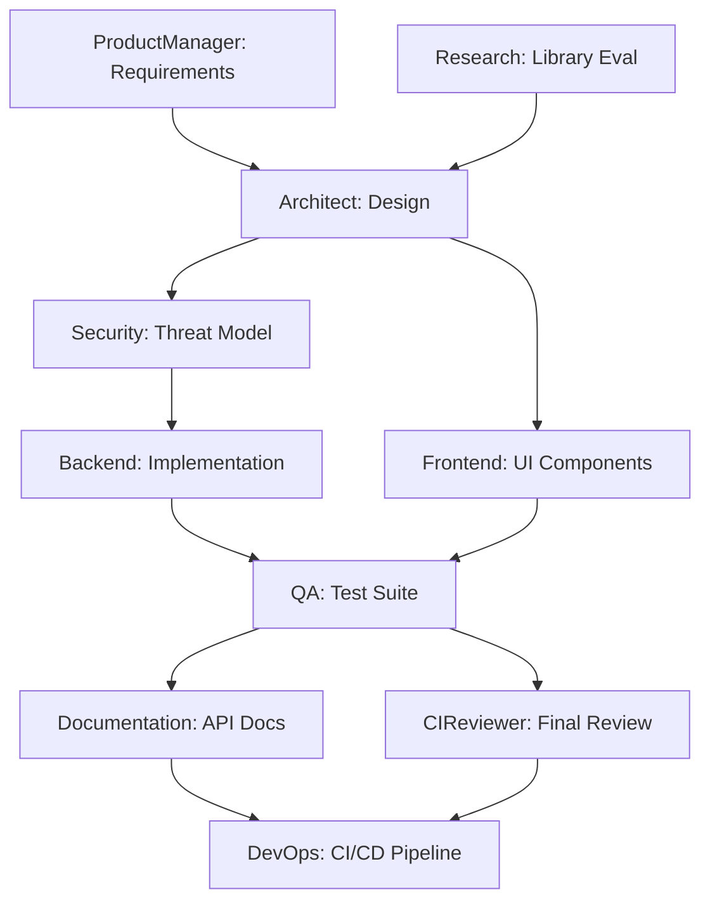
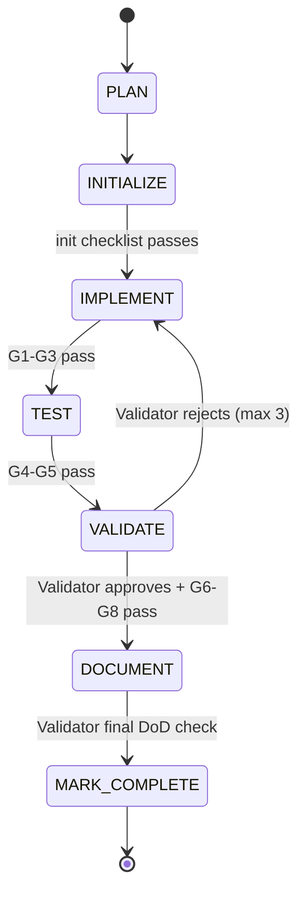
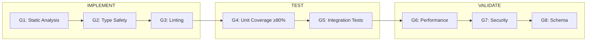
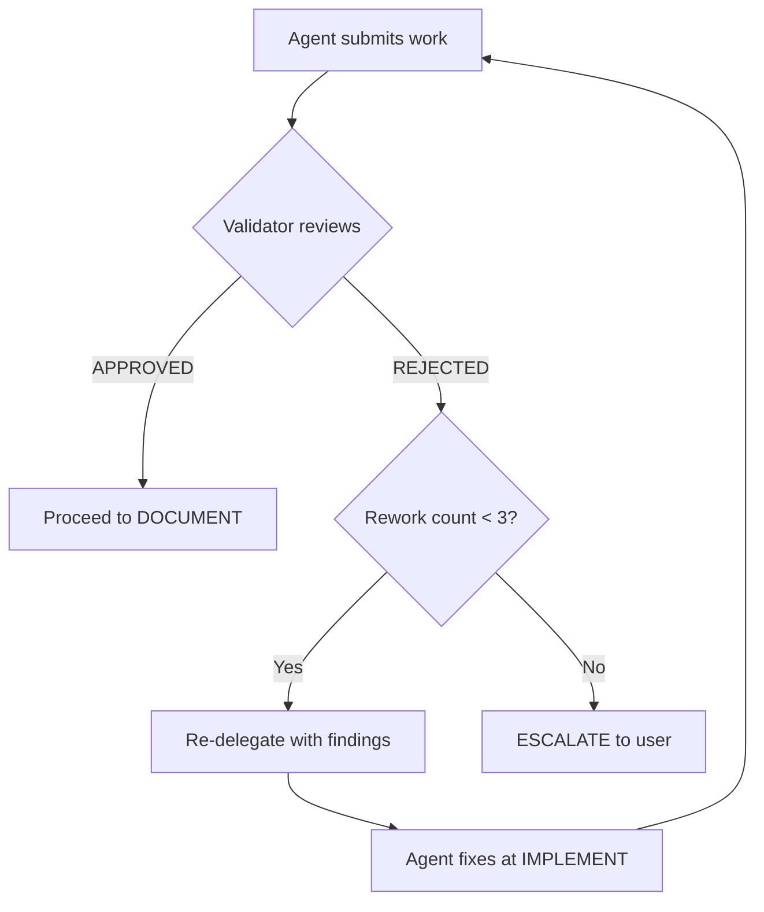

# Vibecoding Multi-Agent System Architecture

> **Version:** 6.0.0
> **Owner:** ReaperOAK (CTO / Supervisor Orchestrator)
> **Last Updated:** 2026-02-27
>
> **Changelog:** v6.0.0 — Progressive Refinement TODO Architecture: 5-layer
> decomposition, 3-mode refinement engine, performance safeguards, smart
> granularity

---

## 1. System Overview

This architecture implements a **Supervisor Pattern** multi-agent vibecoding
system with ReaperOAK as the singular CTO and orchestrator. All subagents
operate within bounded scopes, follow Plan-Act-Reflect loops with RUG
discipline, and route destructive operations through human approval gates.

### Design Principles

1. **Determinism over cleverness** — explicit state transitions, bounded loops
2. **Separation of concerns** — each agent owns one domain
3. **Least privilege** — minimal tool access per agent
4. **Zero hallucinated authority** — agents cannot claim capabilities they lack
5. **Immutable truth sources** — `systemPatterns.md` and `decisionLog.md` are
   controlled by ReaperOAK only
6. **Human-in-the-loop for destructive ops** — always
7. **Confidence-gated progression** — no phase transition without assessed confidence
8. **DAG-first decomposition** — all multi-task work starts with dependency graph
9. **Evidence over assertion** — every claim requires tool output or file reference
10. **Governance by default** — hooks and guardrails active in every session

---

## 2. Agent Topology

```
ReaperOAK (Supervisor / CTO)
│
├── Cross-Cutting Protocols ─── _cross-cutting-protocols.md (inherited by ALL)
│
├── ProductManager    — EARS requirements, INVEST stories, DDD context mapping
├── Architect         — Well-Architected design, DAG decomposition, ADRs
├── Backend           — TDD, Object Calisthenics, RFC 7807, spec-driven dev
├── Frontend          — WCAG 2.2 AA, Core Web Vitals, Component Calisthenics
├── QA                — Test pyramid, mutation testing, property-based testing
├── Security          — STRIDE, OWASP Top 10, SARIF, SBOM, policy-as-config
├── DevOps            — GitOps, SLO/SLI, chaos engineering, policy-as-code
├── Documentation     — Diátaxis, Flesch-Kincaid scoring, doc-as-code CI
├── Research          — Bayesian confidence, evidence hierarchy, PoC standards
├── CIReviewer        — Cognitive complexity, fitness functions, SARIF reports
├── UIDesigner        — Google Stitch designs, component specs, design tokens
├── TODO              — Task decomposition, lifecycle tracking, TODO file management
└── Validator         — Independent SDLC compliance, DoD enforcement, quality gate verification
```

### Agent Authority Matrix

| Agent | Domain Expertise | Can Read | Can Write | Can Execute | Cannot Do |
|-------|-----------------|----------|-----------|-------------|-----------|
| **ReaperOAK** | Orchestration, DAG construction, QA integration | Everything | systemPatterns, decisionLog, activeContext, progress | Delegate, validate, approve | Direct file edits in multi-agent mode |
| **ProductManager** | EARS notation, INVEST stories, DDD context mapping | All memory bank | activeContext, progress | GitHub issues | Edit code, deploy, modify architecture |
| **Architect** | Well-Architected Pillars, API contracts, DAG task graphs | All memory bank, codebase | activeContext, progress | Analysis tools | Edit production code, deploy |
| **Backend** | TDD, Object Calisthenics, RFC 7807, N+1 detection | Assigned files, systemPatterns | Source code (scoped dirs) | Terminal, tests | Frontend files, infra, security config |
| **Frontend** | WCAG 2.2 AA, Core Web Vitals, Component Calisthenics | Assigned files, systemPatterns | UI source (scoped dirs) | Terminal, browser | Backend files, infra, DB schemas |
| **QA** | Test pyramid, mutation testing, SFDPOT/HICCUPS, Playwright | All source, test dirs | Test files only | Terminal, browser | Production code, infra, deploy |
| **Security** | OWASP Top 10, STRIDE, SARIF, SBOM, policy-as-config | Everything (read-only audit) | riskRegister, activeContext | Scanners | Production code, deploy, merge |
| **DevOps** | GitOps, SLO/SLI, Docker multi-stage, chaos engineering | Infra files, CI/CD configs | CI/CD, Dockerfiles, IaC | Terminal, deploy (staging) | Application code, merge to main |
| **Documentation** | Diátaxis, Flesch-Kincaid, doc-as-code CI pipeline | All source, all docs | Documentation files only | Analysis tools | Code, infra, deploy |
| **Research** | Bayesian confidence, evidence hierarchy, license analysis | External sources, codebase | activeContext, progress | Web fetch, search | Code, infra, deploy, merge |
| **CIReviewer** | Cognitive complexity, fitness functions, SARIF | PR diffs, codebase | PR comments only | Analysis tools | Merge, deploy, edit source |
| **UIDesigner** | Stitch design generation, component specs, design tokens | User request, PRD, architecture docs | Design specs (docs/design-specs/) | Stitch, Playwright (screenshot/snapshot), Memory | Implement components, modify backend, deploy |
| **TODO** | Task decomposition, lifecycle tracking, dependency DAGs | All memory bank, codebase, existing TODO files | TODO files (TODO/**/*.md), activeContext, progress | Terminal (todo_visual.py only) | Implement code, modify agents, deploy, write outside TODO/ |
| **Validator** | DoD compliance, SDLC gates, pattern conformance | Everything (full read-only audit) | Validation reports (`docs/reviews/`), `feedback-log.md` (append) | Linters, type checkers, test runners (read-only) | Modify code, mark tasks, deploy, merge, override rejections |

### Structured Autonomy Levels

Each agent operates at a defined autonomy level. ReaperOAK can adjust
levels based on task criticality.

| Level | Name | Behavior | Approval Required |
|-------|------|----------|-------------------|
| **L1** | Supervised | Agent proposes actions, waits for approval before each step | Every action |
| **L2** | Guided | Agent executes within pre-approved scope, reports after completion | Scope changes only |
| **L3** | Autonomous | Agent executes independently within delegation packet boundaries | Destructive ops only |

**Default Autonomy Assignments:**

| Agent | Default Level | Rationale |
|-------|:------------:|-----------|
| Backend | L2 | Scoped writes, needs freedom within boundaries |
| Frontend | L2 | Same as Backend |
| QA | L3 | Test-only writes, low risk |
| Security | L2 | Read-only audit but findings affect decisions |
| DevOps | L1 | Infrastructure changes require careful oversight |
| Documentation | L3 | Doc-only writes, low risk |
| Research | L3 | Read-only, no write risk |
| CIReviewer | L3 | Read-only, comment-only output |
| ProductManager | L2 | Defines scope, needs validation |
| Architect | L2 | Designs affect everything downstream |
| UIDesigner | L2 | Design outputs affect downstream Frontend work |
| TODO | L2 | Task files have downstream impact on delegation, needs oversight |
| Validator | L2 | Rejection authority over task completion requires ReaperOAK oversight |

---

## 3. Context Engineering Framework

### 3.1 Context Loading Strategy

At session start, ReaperOAK loads context using a 4-priority system:

| Priority | Category | Action | Budget |
|----------|----------|--------|--------|
| **P0** | Critical | Load fully — delegation packet, active errors, systemPatterns | 30% |
| **P1** | High | Load fully — activeContext.md, relevant source files | 25% |
| **P2** | Medium | Summarize — decisionLog.md, progress.md, prior session notes | 25% |
| **P3** | Low | Skip / load on demand — historical logs, completed task archives | 20% |

### 3.2 Context Budget Declaration

Every delegation packet includes a context budget:

```yaml
contextBudget:
  totalTokens: 20000
  allocation:
    delegationPacket: 2000
    sourceFiles: 10000
    memoryBank: 3000
    crossCuttingProtocols: 3000
    reserve: 2000
  filesLoaded:
    - path: "src/api/auth.ts"
      priority: P0
      tokens: 1500
    - path: ".github/agents/_cross-cutting-protocols.md"
      priority: P0
      tokens: 2500
```

### 3.3 Context Freshness Rules

| Source | Max Age | Refresh Trigger |
|--------|---------|-----------------|
| Active errors | Real-time | Every tool call |
| Source files | Current session | File modification detected |
| Memory bank | Current session | Memory bank write detected |
| External docs | 24 hours | Research agent re-fetches |
| Decision log | Permanent | Never expires |

---

## 4. Delegation Packet Format

Every task delegated from ReaperOAK to a subagent uses this canonical format:

```yaml
packet:
  taskId: "TASK-{timestamp}-{seq}"
  delegatedBy: "ReaperOAK"
  assignedTo: "{subagent-name}"
  autonomyLevel: "L1 | L2 | L3"
  objective: "Clear, measurable description of what must be accomplished"
  successCriteria:
    - "Criterion 1: specific, verifiable"
    - "Criterion 2: specific, verifiable"
  scopeBoundaries:
    included:
      - "files/dirs that CAN be touched"
    excluded:
      - "files/dirs that MUST NOT be touched"
  forbiddenActions:
    - "Action that is explicitly prohibited"
  requiredOutputFormat: "Description of expected deliverable shape"
  evidenceExpectations:
    - "Test results, screenshots, logs, etc."
  contextBudget:
    totalTokens: 20000
    priorityFiles: ["file1.ts", "file2.ts"]
  confidenceThreshold: 70
  priority: "P0 | P1 | P2 | P3"
  dependencies:
    - "TASK-ID of prerequisite tasks"
  timeoutBudget: "max iterations or token budget"
  crossCuttingProtocols: ".github/agents/_cross-cutting-protocols.md"
```

---

## 5. DAG-First Task Decomposition

The multi-agent SDLC proceeds through these phases:

```
DECOMPOSE → SPEC → BUILD → VALIDATE → GATE → DOCUMENT → RETROSPECTIVE
```

**Phase 0 — DECOMPOSE** is handled by the TODO Agent, which decomposes
feature-level requests into granular, dependency-ordered tasks before any
other agent is invoked. See `docs/architecture/todo-execution-governance.md`
for the full DECOMPOSE protocol.

### 5.1 DAG Construction

Every multi-agent objective is decomposed into a DAG before execution:



### 5.2 Parallel Batch Execution

Tasks with no inter-dependencies execute in parallel batches:

```
Batch 0: [TODO Agent]                   ← decomposes feature into tasks
Batch 1: [ProductManager, Research, UIDesigner]  ← no dependencies
Batch 2: [Architect]                    ← depends on Batch 1
Batch 3: [Security, Frontend]          ← can parallelize
Batch 4: [Backend]                     ← depends on Security
Batch 5: [QA]                          ← depends on Backend + Frontend
Batch 6: [Documentation, CIReviewer]   ← depends on QA
Batch 7: [DevOps]                      ← depends on Docs + Review
```

See `orchestration.rules.md` §2 for full DAG protocol.

### 5.3 Task-Level SDLC Inner Loop (v5.0.0)

Within the BUILD phase, each individual task follows a **7-stage inner loop**
with hard gates between every transition. This creates a two-level SDLC model:

**Pipeline SDLC (Project-Level)** — managed by ReaperOAK:

```
DECOMPOSE → SPEC → BUILD → VALIDATE → GATE → DOCUMENT → RETROSPECTIVE
```

**Task SDLC (Inner Loop within BUILD)** — per task:

```
PLAN → INITIALIZE → IMPLEMENT → TEST → VALIDATE → DOCUMENT → MARK COMPLETE
```

| Aspect | Pipeline Level | Task Level |
|--------|---------------|------------|
| Scope | Entire project/feature | Single TODO task |
| Manager | ReaperOAK | Delegated agent + Validator |
| Phases | 7 phases (DECOMPOSE–RETRO) | 7 stages (PLAN–COMPLETE) |
| State tracked in | `workflow-state.json` | Task file + DoD report |
| Gates | Phase transition gates | Stage transition gates (G1–G8) |



No stage may be skipped. If the Validator rejects at VALIDATE, the task
re-enters IMPLEMENT for rework (maximum 3 iterations before user escalation).

> **Full specification:** See `docs/architecture/sdlc-enforcement-design.md`
> §2 for stage definitions, gate details, rework protocol, and state schema.

---

## 6. Task State Machine

Every task follows this deterministic state flow:

```
┌─────────┐    ┌──────────────┐    ┌────────┐    ┌─────────┐
│ PENDING │───▶│ IN_PROGRESS  │───▶│ REVIEW │───▶│ MERGED  │
└─────────┘    └──────────────┘    └────────┘    └─────────┘
                     │                   │
                     ▼                   ▼
                ┌──────────┐      ┌───────────┐
                │ BLOCKED  │      │ REJECTED  │
                └──────────┘      └───────────┘
                     │                   │
                     ▼                   ▼
                ┌──────────┐      ┌──────────────┐
                │ ESCALATED│      │ IN_PROGRESS  │ (retry ≤ 3)
                └──────────┘      └──────────────┘
```

See `orchestration.rules.md` §1 for full state definitions and transitions.

---

## 7. Merge Protocol

1. Subagent completes work → signals REVIEW state
2. ReaperOAK's Reviewer lane validates:
   - Requirements coverage check
   - Correctness/syntax validation
   - No forbidden file modifications
   - Evidence expectations met
   - Self-reflection quality score ≥ 7/10
   - Token consumption within budget
3. If validation passes → MERGED state
4. If validation fails → REJECTED state with fix delta → back to IN_PROGRESS
5. File conflict detection:
   - Before merge, diff analysis on all modified files
   - If parallel branches modified same file → sequential resolution
   - Conflicting changes escalated to ReaperOAK for manual merge

---

## 8. Parallel Execution Rules

See `orchestration.rules.md` §5 for full parallelism model.

Key constraints:
- Each parallel batch requires pre-declared file ownership
- No two subagents may claim the same file in a parallel batch
- Integration validation gate runs after every batch

---

## 9. Conflict Resolution Policy

1. **Intra-agent conflict:** Re-run with explicit context of the contradiction
2. **Inter-agent conflict:** ReaperOAK resolves using `systemPatterns.md`
3. **Agent vs. instruction conflict:** Instruction file wins always
4. **Confidence disagreement:** Higher-evidence position wins
5. **Precedence hierarchy:**

   ```
   Human directive > ReaperOAK decision > systemPatterns.md >
   domain instruction > cross-cutting protocols > general instruction >
   agent default behavior
   ```

---

## 10. Human Approval Gate Triggers

The following operations **ALWAYS** halt and require explicit human approval:

| Trigger | Category |
|---------|----------|
| Database drops, mass deletions | Destructive |
| Force pushes, branch deletions | Destructive |
| Production deployments | Deployment |
| Firewall/network policy changes | Security |
| New external dependency introduction | Supply chain |
| Architecture pattern changes | Design |
| Security exception requests | Security |
| Privilege escalation for any agent | Governance |
| Merge to main/production branch | Release |
| Secret/credential rotation | Security |
| Autonomy level elevation | Governance |

### 10.1 UI/UX Enforcement Gate

A mandatory check between the DECOMPOSE and SPEC phases that ensures
UIDesigner is invoked for all UI-touching work.

**Gate Protocol:**

1. After DECOMPOSE, ReaperOAK reads the TODO file
2. Identifies tasks with `**UI Touching:** yes`
3. If ANY exist:
   - UIDesigner MUST have assigned tasks in the TODO file
   - Every Frontend task with `UI Touching: yes` MUST depend on a UIDesigner task
   - If missing → re-delegate to TODO Agent to add UIDesigner tasks
4. If NONE → proceed without UIDesigner
5. Override requires explicit user approval (logged in decisionLog.md)

**UI-Touching Detection Keywords:**
screen, page, view, modal, dialog, panel, component, widget, form, chart,
layout, design, style, theme, responsive, dashboard, settings page, navigation,
user flow, onboarding, landing page.

**Enforcement:** No Frontend task with `UI Touching: yes` may enter BUILD
until its UIDesigner dependency is `completed` and design specs exist on disk.

See `docs/architecture/todo-execution-governance.md` §7 for the full gate
logic, pseudocode, and escape hatch protocol.

---

## 11. Plan-Act-Reflect Loop (All Subagents)

Every subagent follows this cognitive loop with RUG discipline:

```
┌──────────────────────────────────┐
│           PLAN (RUG)              │
│  1. READ: Load delegation packet  │
│  2. UNDERSTAND: State objective   │
│     in own words, list assumptions│
│  3. Identify required tool calls  │
│  4. List file modifications       │
│  5. Declare confidence level      │
└──────────────┬───────────────────┘
               ▼
┌──────────────────────────────────┐
│            ACT                    │
│  1. Execute plan step-by-step     │
│  2. Constrain to declared scope   │
│  3. Make smallest valid changes   │
│  4. Collect evidence at each step │
└──────────────┬───────────────────┘
               ▼
┌──────────────────────────────────┐
│       REFLECT (Self-Score)        │
│  1. Review stdout/stderr          │
│  2. Score quality (5 dimensions)  │
│     - Correctness: ?/10           │
│     - Completeness: ?/10          │
│     - Convention: ?/10            │
│     - Clarity: ?/10               │
│     - Impact: ?/10                │
│  3. Gate: average ≥ 7 to submit   │
│  4. If < 7: iterate (max 3x)     │
│  5. Update activeContext.md       │
└──────────────────────────────────┘
```

---

## 12. Memory Bank Integration

Located at `.github/memory-bank/`:

| File | Owner | Write Access | Purpose |
|------|-------|-------------|---------|
| `productContext.md` | ReaperOAK | ReaperOAK, ProductManager | Project vision, goals, constraints |
| `systemPatterns.md` | ReaperOAK | ReaperOAK ONLY | Architecture decisions, code conventions |
| `activeContext.md` | Shared | All subagents (append) | Current focus, recent changes |
| `progress.md` | Shared | All subagents (append) | Completed milestones, pending work |
| `decisionLog.md` | ReaperOAK | ReaperOAK ONLY | Trade-off records, rationale |
| `riskRegister.md` | Security | Security, ReaperOAK | Identified risks, mitigations |

**Immutability Rules:**

- `systemPatterns.md` and `decisionLog.md` are append-only by ReaperOAK
- No subagent may delete or overwrite entries in these files
- Subagents may only append timestamped entries to `activeContext.md` and `progress.md`

### 12.1 Shared Context Layer

Additional state files for pipeline management:

| File | Owner | Write Access | Purpose |
|------|-------|-------------|----------|
| `workflow-state.json` | ReaperOAK | ReaperOAK ONLY | Pipeline state machine — tracks current phase, agent statuses, fix loops |
| `artifacts-manifest.json` | ReaperOAK | ReaperOAK ONLY | Versioned build artifact tracking with SHA-256 hashes |
| `feedback-log.md` | Shared | All subagents (append) | Inter-agent quality signals and cross-agent feedback |

These files enable session resumption and provide structured state for the iterative SDLC loop.

> **TODO State:** As of v4.1.0, `workflow-state.json` includes a `todo_state`
> object that tracks the active project, task file path, completion percentages,
> per-agent delegation counts, and UI/UX gate status. This enables ReaperOAK
> to resume task-driven delegation across sessions. See
> `docs/architecture/todo-execution-governance.md` §10.2 for the full schema.

---

## 13. Governance & Observability

### 13.1 Governance Hooks

Active hooks in `.github/hooks/`:

| Hook | Events | Purpose |
|------|--------|---------|
| `governance-audit` | sessionStart, sessionEnd, userPromptSubmitted | Threat detection, STRIDE-aligned scanning |
| `session-logger` | sessionStart, sessionEnd, userPromptSubmitted | Session activity tracking |
| `session-auto-commit` | sessionEnd | Auto-commit changes at session end |

### 13.2 Audit Trail Format

Every governance event produces a JSON log entry:

```json
{
  "timestamp": "2025-01-15T10:30:00Z",
  "event": "prompt_scanned",
  "governance_level": "standard",
  "status": "clean"
}
```

Threat events include detailed evidence:

```json
{
  "timestamp": "2025-01-15T10:31:00Z",
  "event": "threat_detected",
  "governance_level": "standard",
  "threat_count": 1,
  "max_severity": 0.9,
  "threats": [
    {
      "category": "prompt_injection",
      "severity": 0.9,
      "description": "Instruction override",
      "evidence": "ignore previous instructions"
    }
  ]
}
```

### 13.3 Observability Metrics

| Metric | Source | Purpose |
|--------|--------|---------|
| Tasks completed / session | Orchestration state machine | Throughput |
| Average retries / task | Task retry counter | Quality signal |
| Token consumption / agent | Token budget tracker | Cost control |
| Confidence trend | Confidence gate assessments | Risk detection |
| Threat detection rate | Governance audit logs | Security posture |
| DAG completion % | Checkpoint protocol | Progress visibility |

---

## 14. Security Guardrails

See `.github/security.agentic-guardrails.md` for full specification.

Key constraints:

- All subagents operate with least-privilege tool access
- External content is sanitized before processing
- Prompt injection patterns are detected and rejected
- Memory bank entries are validated before persistence
- Token runaway detection halts infinite loops
- MCP servers are treated as untrusted by default
- SARIF output format for machine-parseable security findings
- SBOM generation for supply chain transparency
- Policy-as-config for governance rules (YAML, not hardcoded)

---

## 15. CI/CD AI Integration

See `.github/workflows/ai-*.yml` for workflow definitions.

| Workflow | Trigger | Purpose |
|----------|---------|---------|
| `ai-code-review.yml` | pull_request | Automated code review with findings as comments |
| `ai-test-validator.yml` | pull_request | Validate test coverage and quality |
| `ai-security-scan.yml` | pull_request | Security vulnerability detection |
| `ai-doc-sync.yml` | pull_request | Documentation freshness check |

All workflows:

- Use least-privilege tokens (read-only default)
- Never auto-merge
- Comment findings on PRs
- Require human approval for write operations
- Fail safely (no recursion, bounded execution)

---

## 16. Instruction File Authority

The following instruction files are authoritative references for their
domains and are loaded from `docs/instructions/`:

| Domain | Instruction File |
|--------|-----------------|
| Accessibility | `a11y.instructions.md` |
| Agent Safety | `agent-safety.instructions.md` |
| AI Prompt Engineering | `ai-prompt-engineering-safety-best-practices.instructions.md` |
| Context Engineering | `context-engineering.instructions.md` |
| Docker/Containers | `containerization-docker-best-practices.instructions.md` |
| DevOps | `devops-core-principles.instructions.md` |
| CI/CD | `github-actions-ci-cd-best-practices.instructions.md` |
| Markdown | `markdown.instructions.md` |
| Memory Bank | `memory-bank.instructions.md` |
| Performance | `performance-optimization.instructions.md` |
| Playwright | `playwright-typescript.instructions.md` |
| Security/OWASP | `security-and-owasp.instructions.md` |
| Shell | `shell.instructions.md` |
| Spec-Driven Workflow | `spec-driven-workflow-v1.instructions.md` |
| Surgical Edits | `taming-copilot.instructions.md` |
| Task Implementation | `task-implementation.instructions.md` |
| Thought Logging | `copilot-thought-logging.instructions.md` |
| TypeScript | `typescript-5-es2022.instructions.md` |

---

## 17. Claude Code Integration

The vibecoding system supports **dual-agent operation** with both GitHub Copilot
and Claude Code. Both agents share the same memory bank, instruction files, and
governance principles.

### Claude Code Configuration

| Component | Location | Purpose |
|-----------|----------|---------|
| `CLAUDE.md` | Repository root | Primary instruction file (equivalent to `ReaperOAK.agent.md`) |
| `.claude/settings.json` | `.claude/` | Hooks configuration for governance and logging |
| `.claude/hooks/` | `.claude/hooks/` | Governance audit, prompt logging, session logging |
| `.claude/commands/` | `.claude/commands/` | Slash commands (memory-bank-read, memory-bank-update, review, plan, security-audit, debug) |

### Shared Resources (Agent-Agnostic)

| Resource | Location | Used By |
|----------|----------|---------|
| Memory Bank | `.github/memory-bank/` | Both Copilot and Claude Code |
| Instruction Files | `docs/instructions/` | Both Copilot and Claude Code |
| Architecture Docs | `.github/ARCHITECTURE.md` | Both |
| Security Guardrails | `.github/security.agentic-guardrails.md` | Both |
| Cross-Cutting Protocols | `.github/agents/_cross-cutting-protocols.md` | Both |

### Agent-Specific Resources

| Resource | Copilot | Claude Code |
|----------|---------|-------------|
| Agent Definitions | `.github/agents/*.agent.md` | `CLAUDE.md` |
| Hooks Config | `.github/hooks/*/hooks.json` | `.claude/settings.json` |
| Hook Scripts | `.github/hooks/*/` | `.claude/hooks/` |
| Log Directory | `logs/copilot/` | `logs/claude-code/` |
| Slash Commands | N/A (built-in) | `.claude/commands/` |
| Multi-Agent | `agent/runSubagent` tool | `Task` tool with subagent types |

---

## 18. Self-Improvement System

Agents can propose improvements to the infrastructure during the RETROSPECTIVE
phase. This is controlled evolution — not autonomous self-modification.

### 18.1 Proposal Lifecycle

```
Agent identifies improvement → Writes proposal → ReaperOAK validates →
User approves → Agent implements → Verify → Merge
```

Proposals live in `.github/proposals/` with naming convention
`PROP-YYYYMMDD-{agent}-{seq}.md`.

### 18.2 Scope Constraints

**Can be proposed:** Chunk improvements, agent config tweaks, new templates,
workflow additions, catalog updates, tool ACL requests.

**Cannot be proposed:** Changes to systemPatterns/decisionLog, STOP_ALL
modifications, removal of forbidden actions, autonomy elevation.

### 18.3 RETROSPECTIVE Phase

Phase 6 in the iterative SDLC. After DOCUMENT:
- Agents review their own performance and identify improvement opportunities
- Proposals written to `.github/proposals/`
- ReaperOAK validates and presents to user
- Approved proposals delegated for implementation in next session

---

## 19. Validator Agent (v5.0.0)

The **Validator** is an independent compliance reviewer that verifies task
outputs satisfy the Definition of Done, adhere to the SDLC inner loop stages,
pass quality gates, and conform to patterns in `systemPatterns.md`. The
Validator does NOT implement code — it only reads artifacts and writes
validation reports.

**Definition:** `.github/agents/Validator.agent.md`

| Property | Value |
|----------|-------|
| **Autonomy** | L2 (Guided) |
| **Invocation** | At VALIDATE and MARK COMPLETE stages of every task |
| **Verdict** | `APPROVED` or `REJECTED` |
| **Write scope** | `docs/reviews/validation/`, `docs/reviews/dod/`, `feedback-log.md` (append) |
| **Execute scope** | Linters, type checkers, test runners (read-only verification) |
| **Cannot** | Modify source code, mark tasks complete, deploy, merge, override own rejections |

**Interaction flow:**

```
BUILD Agent → submits work → ReaperOAK → delegates review → Validator
Validator → returns verdict → ReaperOAK → routes to agent (rework) or TODO (complete)
```

All communication between Validator and BUILD agents flows through ReaperOAK.
No agent may self-validate — DOD-07 (Reviewed by Validator) can only be set
by the Validator.

> **Full specification:** See `docs/architecture/sdlc-enforcement-design.md` §7.

---

## 20. Definition of Done Framework (v5.0.0)

Every task must satisfy **10 DoD items** before it can be marked complete.
The checklist is machine-parseable and enforced by the Validator agent.

| DoD ID | Item | Verified By |
|--------|------|-------------|
| DOD-01 | Code Implemented — all acceptance criteria addressed | Agent (self) + Validator |
| DOD-02 | Tests Written — unit tests, ≥80% coverage for new code | Agent + Validator |
| DOD-03 | Lint Passes — zero errors and warnings | Agent + Validator |
| DOD-04 | Type Checks Pass — `tsc --noEmit` clean, no `any` | Agent + Validator |
| DOD-05 | CI Passes — all workflow checks green | Agent + Validator |
| DOD-06 | Docs Updated — JSDoc/TSDoc, README if interface changed | Agent + Validator |
| DOD-07 | Reviewed by Validator — independent compliance check | **Validator only** |
| DOD-08 | No Console Errors — structured logger only | Agent + Validator |
| DOD-09 | No Unhandled Promises — no floating promises | Agent + Validator |
| DOD-10 | No TODO Comments — no TODO/FIXME/HACK/XXX in code | Agent + Validator |

**Enforcement rules:**

- `allPassed == false` → task CANNOT enter DOCUMENT stage
- `verdict != APPROVED` → task CANNOT enter MARK COMPLETE
- Agent submits DOD-07 as `false` — only Validator may set it to `true`
- 3 consecutive Validator rejections → escalate to user

**Template:** `.github/tasks/definition-of-done-template.md`

> **Full specification:** See `docs/architecture/sdlc-enforcement-design.md` §3.

---

## 21. Initialization Enforcement (v5.0.0)

Before any task enters the IMPLEMENT stage, the target module must pass a
**9-item initialization checklist**. The check runs once per module — subsequent
tasks reuse the cached result if `all_passed: true` exists on disk.

| Init ID | Item | Applies To |
|---------|------|------------|
| INIT-01 | Directory Structure Validated | ALL |
| INIT-02 | ESLint / Prettier Configured | ALL |
| INIT-03 | tsconfig.json Present and Consistent | ALL |
| INIT-04 | Test Framework Configured | ALL |
| INIT-05 | Environment Variables Documented | ALL |
| INIT-06 | Health Check Endpoint Present | Backend |
| INIT-07 | Logging Configured | ALL |
| INIT-08 | Error Boundaries Present | Frontend |
| INIT-09 | Sentry / Error Tracking Instrumented | Backend |

**Enforcement rules:**

- Any required item with `status: false` → **BLOCKS IMPLEMENT**
- Non-applicable items auto-pass based on `module_type`
- Initialization fails after 2 attempts → BLOCK and escalate to user

**Template:** `.github/tasks/initialization-checklist-template.md`

> **Full specification:** See `docs/architecture/sdlc-enforcement-design.md` §5.

---

## 22. Bug-Catching Strategy (v5.0.0)

Bug catching is distributed across **8 layered gates** that run at different
stages of the task-level SDLC. Each gate has explicit pass/fail criteria and
blocking behavior.

| Gate | Name | Runs At | Tool | Pass Criteria | Who Runs |
|------|------|---------|------|---------------|----------|
| G1 | Static Analysis | IMPLEMENT | `tsc --noEmit` | Zero compiler errors | Agent |
| G2 | Type Safety | IMPLEMENT | TypeScript strict mode | No `any` types in new code | Agent |
| G3 | Linting | IMPLEMENT | ESLint | Zero errors, zero warnings | Agent |
| G4 | Unit Test Coverage | TEST | Vitest/Jest | ≥80% line coverage, all pass | Agent |
| G5 | Integration Tests | TEST | Supertest/Playwright | Happy path + error path per endpoint | Agent |
| G6 | Performance Checks | VALIDATE | Lighthouse/k6 | LCP <2.5s, p95 <500ms | Validator |
| G7 | Security Checklist | VALIDATE | Manual checklist | Auth, input validation, CORS, secrets | Validator |
| G8 | Schema Validation | VALIDATE | Zod/Joi, OpenAPI | Runtime schemas match contracts | Validator |



Gates G1–G5 are run by the delegated agent (self-check). Gates G6–G8 are run
by the Validator (independent check). The Validator also independently re-runs
G1–G5 to prevent false claims.

> **Full specification:** See `docs/architecture/sdlc-enforcement-design.md` §6.

---

## 23. Governance Architecture (v5.0.0)

### 23.1 Blocking Rules

Every transition in the task-level SDLC has an explicit blocking condition.
These are hard stops, not advisory.

| Transition | Blocking Condition | Enforced By |
|-----------|-------------------|-------------|
| PLAN → INITIALIZE | Confidence < 70%; plan not documented | Agent |
| INITIALIZE → IMPLEMENT | Any required init checklist item fails | Agent |
| IMPLEMENT → TEST | Compiler errors (G1), type errors (G2), lint errors (G3) | Agent |
| TEST → VALIDATE | Test failures (G4); missing integration tests (G5) | Agent |
| VALIDATE → DOCUMENT | Validator verdict is `REJECTED` | Validator |
| DOCUMENT → MARK COMPLETE | Public API undocumented | Agent |
| Frontend IMPLEMENT entry | UI/UX design artifacts missing | ReaperOAK |

### 23.2 Rework Loop

When the Validator rejects at VALIDATE:

1. Validator writes rejection report with specific DOD-XX failures
2. ReaperOAK re-delegates to the original agent with rejection findings
3. Agent re-enters at IMPLEMENT (Stage 3) with rework counter incremented
4. **Maximum 3 rework iterations** per task
5. After 3 rejections → escalate to user (override, cancel, or reassign)



### 23.3 Loop Detection Updates

Five new signals added to `.github/guardian/loop-detection-rules.md` for
SDLC enforcement:

| Signal | Detects |
|--------|---------|
| SDLC Stage Skip | Agent attempts to bypass a required stage |
| DoD Non-Compliance | Agent submits with failing DoD items |
| Initialization Skip | Agent enters IMPLEMENT without passing init checklist |
| UI/UX Gate Bypass | Frontend task enters IMPLEMENT without design artifacts |
| Validator Rejection Loop | Same task rejected 3+ times by Validator |

Each signal has DETECT, ACTION, and ESCALATE stages defined in the
loop detection rules file.

> **Full specification:** See `docs/architecture/sdlc-enforcement-design.md`
> §8 for the complete governance state machine and failure handling protocol.

---

## 24. SDLC Enforcement File Inventory (v5.0.0)

Files introduced by the SDLC Enforcement Upgrade:

| File | Purpose |
|------|---------|
| `.github/agents/Validator.agent.md` | Validator agent definition |
| `.github/vibecoding/chunks/Validator.agent/chunk-01.yaml` | Validator core validation protocols |
| `.github/vibecoding/chunks/Validator.agent/chunk-02.yaml` | Validator init/DoD/gate procedures |
| `.github/tasks/definition-of-done-template.md` | Machine-parseable DoD checklist (10 items) |
| `.github/tasks/initialization-checklist-template.md` | Project initialization checklist (9 items) |
| `docs/architecture/sdlc-enforcement-design.md` | Full SDLC enforcement design specification |
| `docs/reviews/qa-report.md` | QA review report for the upgrade |
| `docs/reviews/security-report.md` | Security review report for the upgrade |

Runtime artifacts (created per task/module during execution):

| Path Pattern | Purpose |
|-------------|---------|
| `docs/reviews/dod/{TASK_ID}-dod.yaml` | Per-task DoD report |
| `docs/reviews/validation/{TASK_ID}-validation.yaml` | Per-task Validator report |
| `docs/reviews/init/{MODULE_NAME}-init.yaml` | Per-module initialization checklist |

---

## 25. Progressive Refinement TODO Architecture (v6.0.0)

The TODO Agent operates as a **progressive refinement decomposition engine**
with 3 operating modes and a 5-layer decomposition model. It replaces the
previous flat task-list approach with a structured, layer-by-layer expansion
protocol that prevents premature detail and enforces controlled scope growth.

### 25.1 Multi-Layer Decomposition Model

All work flows through five decomposition layers. Each layer refines its
parent one step at a time — the system **MUST NEVER jump directly from
L0 to L4**.

| Layer | Name | Scope | Effort Range | Output File |
|-------|------|-------|-------------|-------------|
| **L0** | Vision | Project objective | N/A | `TODO/vision.md` |
| **L1** | Capability | Major feature | 1–2 weeks | `TODO/vision.md` + `TODO/capabilities.md` |
| **L2** | Execution Block | Coherent work chunk | 1–3 days | `TODO/blocks/{slug}.md` |
| **L3** | Actionable Task | Delegatable unit | 2–4 hours | `TODO/tasks/{slug}.md` |
| **L4** | Micro Task (opt-in) | Junior-explicit step | 30–60 min | `TODO/micro/{slug}.md` |

**Critical invariant:** Layer expansion is strictly sequential:
L0 → L1 → L2 → L3 (→ L4 only when triggered). A child layer file cannot
be created unless the parent layer file already exists and contains the
parent item.

### 25.2 Three Operating Modes

Each TODO Agent invocation operates in exactly **one** mode, selected by
ReaperOAK via the delegation packet's `mode` field. Mode selection is
**file-existence driven** — ReaperOAK checks which layer files exist to
determine the appropriate next mode.

| Mode | Direction | Input | Output | Role |
|------|-----------|-------|--------|------|
| **Strategic Mode** | L0 → L1 | Project vision or user objective | Capability list (3–7 items) with names, descriptions, and rough effort | Strategist |
| **Planning Mode** | L1 → L2 | One capability from `vision.md` or `capabilities.md` | Execution blocks (3–5 per capability) with effort estimates and inter-block dependencies | Planner |
| **Execution Planning Mode** | L2 → L3 | One block from `blocks/{slug}.md` | Full Format A task specs with acceptance criteria, file paths, and step-by-step instructions | Executor Controller |

**Mode constraints:**

- **Strategic Mode** produces NO task IDs, NO acceptance criteria, NO
  step-by-step instructions.
- **Planning Mode** produces blocks with effort estimates and dependencies
  but NO acceptance criteria or file-level details.
- **Execution Planning Mode** produces full Format A specs but NO L4
  micro-tasks (unless explicitly triggered by ReaperOAK).

### 25.3 File Structure

All decomposition artifacts live under `TODO/`:

| File | Layer | Purpose |
|------|-------|---------|
| `TODO/vision.md` | L0 + L1 | Vision statement + capabilities list |
| `TODO/capabilities.md` | L1 | Capability details with status tracking |
| `TODO/blocks/{capability-slug}.md` | L2 | Execution blocks for one capability |
| `TODO/tasks/{block-slug}.md` | L3 | Actionable tasks for one block |
| `TODO/micro/{task-slug}.md` | L4 | Micro-tasks (optional, trigger-based only) |

Legacy project-level files (`{PROJECT}_TODO.md`, `SYSTEM_TODO.md`) remain
supported for backward compatibility. The `todo_visual.py` globs
(`*_TODO.md` and `TODO/**/*.md`) discover all active task files.

### 25.4 Controlled Expansion Protocol

Expansion is intentionally throttled to prevent scope explosion:

| Rule | Limit | Enforcement |
|------|-------|-------------|
| Expand one at a time | ONE capability (L1→L2) or ONE block (L2→L3) per invocation | TODO Agent forbidden actions |
| Max items per call | 15 tasks maximum per TODO Agent invocation | Hard stop + confirm with ReaperOAK |
| Parent-first | Parent layer must exist before expanding children | File-existence check before write |
| No layer skipping | L0→L1→L2→L3 mandatory sequence | Forbidden action #12 |
| Overflow confirmation | If expansion would create > 15 items, pause and confirm | ReaperOAK approval gate |

### 25.5 Performance Safeguards

Hard limits prevent token bloat and context window exhaustion:

| Safeguard | Limit | Action on Violation |
|-----------|-------|--------------------|
| File size | No TODO file > 800 lines | Auto-split into sub-files (`-part2.md`, `-part3.md`) |
| Output size | No single TODO Agent call output > 10KB | Truncate, continue in follow-up call |
| Task count | Total per project tracked | Warning emitted at 100+ tasks |
| Feature effort | > 80 hours total estimated effort | Split into milestones with distinct task files |
| Pre-write check | Line count verified before writing | If current + new > 800, create sub-file |

### 25.6 Smart Granularity Heuristic

The default decomposition depth is **L3** (2–4 hour actionable tasks).
L4 micro-tasks are opt-in, not automatic. They are generated **only** when
one or more of these triggers apply:

| # | Trigger | Condition |
|---|---------|-----------|
| 1 | **High complexity** | Multi-file changes, cross-module dependencies, new patterns |
| 2 | **Junior executor** | Explicitly stated by user or ReaperOAK |
| 3 | **Validator rejection** | Task rejected for insufficient clarity |
| 4 | **High bug risk** | Security-critical, data-handling, or financial logic |

If no trigger applies, L4 micro-tasks are **not** generated.
Over-decomposition wastes tokens and obscures task structure.

### 25.7 Governance Roles

Each mode maps to a governance role with distinct output expectations
and forbidden actions:

| Role | Mode | Produces | Forbidden |
|------|------|----------|-----------|
| **Strategist** | Strategic (L0→L1) | Capability list with names, descriptions, effort ranges | Task IDs, acceptance criteria, step-by-step instructions |
| **Planner** | Planning (L1→L2) | Execution blocks with effort, inter-block dependencies | Acceptance criteria, specific file paths in task specs |
| **Executor Controller** | Execution Planning (L2→L3) | Full Format A specs with acceptance criteria (≥3 per task), explicit file paths | L4 micro-tasks (unless explicitly triggered) |

**Validation rules:**

- Strategist: 3–7 capabilities, each with name + description + effort range
- Planner: 3–5 blocks per capability, each with name + effort + dependencies
- Executor Controller: each task ≤ 4h effort, has explicit file paths,
  has ≥ 3 acceptance criteria, follows Format A structure

### 25.8 Integration with Existing Systems

The progressive refinement model is backward-compatible with all existing
governance mechanisms:

| System | Integration |
|--------|-------------|
| **Format A tasks** | L3 and L4 tasks use Format A bold-text metadata, parseable by `todo_visual.py` |
| **8-state execution machine** | Applies to L3 tasks (BACKLOG → READY → LOCKED → IMPLEMENTING → VALIDATING → DOCUMENTING → DONE, with REWORK) |
| **Post-task chain** | Validator → Documentation → TODO completion flow unchanged |
| **One-task-per-agent-per-cycle** | Enforced at L3 task delegation — no agent receives > 1 task per cycle |
| **UI/UX Gate** | L3 tasks marked `UI Touching: yes` must have UIDesigner dependency |
| **Two-party completion** | No agent self-marks tasks complete — ReaperOAK + TODO Agent verify |
| **Priority escalation** | P3→P2→P1→P0 auto-escalation on blocked tasks still applies |
| **Stall detection** | Progress stall, blocked chain, zero-progress cycle signals unchanged |

### 25.9 Source Files

| File | Purpose |
|------|---------|
| `.github/agents/TODO.agent.md` | TODO Agent definition with 3 operating modes |
| `.github/vibecoding/chunks/TODO.agent/chunk-01.yaml` | Multi-layer decomposition protocol, file structure, task format |
| `.github/vibecoding/chunks/TODO.agent/chunk-02.yaml` | Governance roles, performance safeguards, smart granularity heuristic |
| `.github/agents/ReaperOAK.agent.md` | Mode-aware orchestration, file-existence-driven mode selection |
