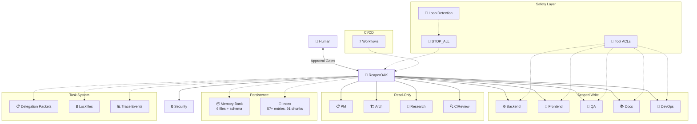

# Multi-Agent Vibecoding System — Validation Report

> **Generated:** 2025-07-19
> **Status:** HARDENING COMPLETE
> **Version:** 2.0.0 (Phases A–K)
> **Hash Algorithm:** SHA-256
> **Primary Model:** Claude Opus 4.6

---

## 1. System Inventory

### 1.1 Files Created (Hardening Phases A–K)

| # | File | Phase | Purpose |
|---|------|-------|---------|
| 1 | `.github/vibecoding/index.json` | A | Master context index (57+ entries) |
| 2 | `.github/vibecoding/catalog.yml` | A | Tag taxonomy (14 domain tags) |
| 3 | `.github/vibecoding/chunks/` (91 files) | A | Token-budgeted YAML chunks |
| 4 | `.github/vibecoding/summarization-spec.md` | H | Session summarization protocol |
| 5 | `.github/memory-bank/schema.md` | C | JSON Schema for all memory bank files |
| 6 | `.github/tasks/delegation-packet-schema.json` | D | Delegation packet JSON Schema |
| 7 | `.github/tasks/claim-schema.json` | D | Agent claim JSON Schema |
| 8 | `.github/tasks/merge-protocol.md` | E | Full merge lifecycle protocol |
| 9 | `.github/locks/lockfile-schema.json` | E | Lock format JSON Schema |
| 10 | `.github/workflows/ai-task-runner.yml` | F | Queue-driven task execution CI |
| 11 | `.github/workflows/ai-sandbox-merge.yml` | F | Sandbox patch application CI |
| 12 | `.github/workflows/memory-verify.yml` | F | Memory bank integrity CI |
| 13 | `.github/observability/agent-trace-schema.json` | G | Trace schema (17 event types) |
| 14 | `.github/guardian/STOP_ALL` | G | Global circuit breaker |
| 15 | `.github/guardian/loop-detection-rules.md` | G | Loop detection (6 signals) |
| 16 | `.github/sandbox/tool-acl.yaml` | I | Per-agent tool ACLs |
| 17 | `.github/orchestration.mmd` | J | Mermaid system topology diagram |

### 1.2 Files Modified (Hardening Phases A–K)

| File | Phase | Changes |
|------|-------|---------|
| 11 agent files (`*.agent.md`) | B | Canonical YAML schema: id, role, owner, read/write paths, forbidden actions, tools, evidence |
| 26 instruction files (`*.instructions.md`) | B | Micropolicy headers: id, domain_tags, precedence, owner_agent, immutable, token_cost_target |
| 6 memory bank files | C | YAML frontmatter: id, type, owner, schema_version |
| `VALIDATION-REPORT.md` | J | Comprehensive rewrite for Phases A–K |

### 1.3 Pre-Existing Files (Unchanged by Hardening)

| File | Purpose |
|------|---------|
| `.github/ARCHITECTURE.md` | System topology, authority matrix |
| `.github/orchestration.rules.md` | Parallel execution, DAG protocol |
| `.github/security.agentic-guardrails.md` | Security controls |
| `.github/agents/_cross-cutting-protocols.md` | Universal quality protocols |
| `.github/workflows/ai-code-review.yml` | PR code review CI |
| `.github/workflows/ai-test-validator.yml` | Test coverage CI |
| `.github/workflows/ai-security-scan.yml` | Security scanning CI |
| `.github/workflows/ai-doc-sync.yml` | Documentation freshness CI |
| `.github/hooks/` (9 files) | Governance audit, session logger, auto-commit |

---

## 2. Schema & Contract Index

| Schema | Location | Format | Purpose |
|--------|----------|--------|---------|
| Delegation Packet | `.github/tasks/delegation-packet-schema.json` | JSON Schema | Defines subagent task assignment structure |
| Agent Claim | `.github/tasks/claim-schema.json` | JSON Schema | Defines agent work claims |
| Lockfile | `.github/locks/lockfile-schema.json` | JSON Schema | File-level exclusive locks |
| Agent Trace | `.github/observability/agent-trace-schema.json` | JSON Schema | 17 event types for audit trail |
| Memory Bank | `.github/memory-bank/schema.md` | Embedded JSON Schema | Validates all 6 memory bank files |
| Context Index | `.github/vibecoding/index.json` | JSON | 57+ file entries with metadata |
| Tag Catalog | `.github/vibecoding/catalog.yml` | YAML | 14 domain tags with descriptions |
| Tool ACL | `.github/sandbox/tool-acl.yaml` | YAML | Per-agent tool allow/deny lists |
| Merge Protocol | `.github/tasks/merge-protocol.md` | Markdown | Claim→lock→validate→merge lifecycle |

---

## 3. Agent → Owner Mapping

### 3.1 Agent Canonical Schema (Phase B)

All 11 agent files now use this canonical YAML frontmatter:

```yaml
id: <unique-id>
name: <display-name>
role: <orchestrator|architect|backend|frontend|qa|security|devops|documentation|research|cireviewer|product>
owner: <ReaperOAK|human>
description: <one-line purpose>
allowed_read_paths: [<glob patterns>]
allowed_write_paths: [<glob patterns>]
forbidden_actions: [<list>]
max_parallel_tasks: <number>
allowed_tools: [<tool list>]
evidence_required: <true|false>
```

### 3.2 Agent Authority Matrix

| Agent | ID | Write Scope | Forbidden Actions |
|-------|-----|------------|-------------------|
| ReaperOAK | orchestrator | `**/*` | — |
| Architect | architect | `.github/**`, `docs/**` | deploy, force-push, database-ddl |
| Backend | backend | `src/**`, `tests/**` | deploy, force-push, database-ddl |
| Frontend | frontend | `src/components/**`, `src/pages/**`, `src/styles/**`, `tests/**` | deploy, force-push, database-ddl |
| QA | qa | `tests/**`, `**/*.spec.*`, `**/*.test.*` | deploy, force-push, database-ddl |
| Security | security | `riskRegister.md`, `docs/security/**` | deploy, force-push, database-ddl |
| DevOps | devops | `.github/workflows/**`, `infra/**` | terraform-apply, kubectl-apply-prod, force-push |
| Documentation | documentation | `docs/**`, `**/*.md` | deploy, force-push, database-ddl |
| ProductManager | product | `docs/**`, `productContext.md` | deploy, force-push, database-ddl |
| Research | research | `docs/research/**` | deploy, force-push, database-ddl |
| CIReviewer | cireviewer | _(read-only)_ | deploy, force-push, database-ddl, file-write |

### 3.3 Instruction Micropolicy Summary (Phase B)

All 26 instruction files now include canonical YAML headers:

| Instruction ID | Precedence | Owner Agent | Domain Tags |
|---------------|-----------|-------------|-------------|
| a11y | 90 | frontend | accessibility, wcag, aria |
| agent-safety | 95 | security | security, agents, governance |
| ai-prompt-safety | 85 | security | ai, prompt-engineering, safety |
| docker-best-practices | 75 | devops | docker, containers, iac |
| context-engineering | 70 | orchestrator | copilot, context, dx |
| copilot-thought-logging | 60 | orchestrator | copilot, logging, tracking |
| devops-core-principles | 80 | devops | devops, calms, dora |
| gilfoyle-review | 30 | cireviewer | review, persona, code-quality |
| github-actions-ci-cd | 80 | devops | ci-cd, github-actions |
| markdown | 65 | documentation | markdown, documentation |
| memory-bank | 95 | orchestrator | memory, persistence, agents |
| mermaid | 50 | documentation | mermaid, diagrams |
| nestjs | 75 | backend | nestjs, node, api |
| nextjs | 75 | frontend | nextjs, react, ssr |
| performance-optimization | 80 | orchestrator | performance, optimization |
| playwright | 70 | qa | testing, playwright, e2e |
| react-native | 75 | frontend | react-native, mobile |
| security-owasp | 95 | security | security, owasp, injection |
| shell | 60 | devops | shell, bash, scripting |
| spec-driven-workflow | 85 | orchestrator | workflow, requirements, sdlc |
| taming-copilot | 70 | orchestrator | copilot, safety, guardrails |
| task-implementation | 80 | orchestrator | tasks, tracking, implementation |
| terraform-sap-btp | 75 | devops | terraform, sap, infrastructure |
| todo | 50 | orchestrator | todo, planning, workflow |
| typescript-es2022 | 75 | backend | typescript, es2022 |
| update-docs | 70 | documentation | documentation, automation |

---

## 4. Validation Checklist

### 4.1 Authority Validation

| Check | Status | Evidence |
|-------|--------|----------|
| Single supervisor (ReaperOAK) | ✅ PASS | All 10 subagents have `owner: ReaperOAK` |
| No peer-to-peer delegation | ✅ PASS | No subagent has delegation tools |
| Immutable systemPatterns | ✅ PASS | Only orchestrator role has write access |
| Immutable decisionLog | ✅ PASS | Only orchestrator role has write access |
| Circuit breaker exists | ✅ PASS | `STOP_ALL` file at `.github/guardian/` |
| Loop detection rules defined | ✅ PASS | 6 signal types in `loop-detection-rules.md` |

### 4.2 Write Scope Validation

| Agent | Write Scope | Forbidden Areas | Status |
|-------|-------------|-----------------|--------|
| ProductManager | `docs/**`, `productContext.md` | Source code, systemPatterns | ✅ |
| Architect | `.github/**`, `docs/**` | deploy, force-push, direct source edit | ✅ |
| Backend | `src/**`, `tests/**` | Frontend, infra, systemPatterns, decisionLog | ✅ |
| Frontend | `src/components/**`, `src/pages/**`, `tests/**` | Backend, infra, systemPatterns | ✅ |
| QA | `tests/**`, `*.spec.*`, `*.test.*` | Source logic, deploy, force-push | ✅ |
| Security | `riskRegister.md`, `docs/security/**` | Source code, deploy | ✅ |
| DevOps | `.github/workflows/**`, `infra/**` | terraform-apply-prod, source code | ✅ |
| Documentation | `docs/**`, `**/*.md` | Source code, deploy | ✅ |
| Research | `docs/research/**` | Source code, deploy | ✅ |
| CIReviewer | _(read-only — no write access)_ | All file writes | ✅ |

### 4.3 Destructive Path Validation

| Destructive Operation | Approval Required | Enforcement Source |
|----------------------|-------------------|-------------------|
| Database drops | ✅ Human approval | ReaperOAK §1.3, guardrails §6.1 |
| Force pushes | ✅ Human approval | ReaperOAK §1.3, agent forbidden_actions |
| Infrastructure destroy | ✅ Human approval | guardrails §6.1 |
| Production deployments | ✅ Human approval | guardrails §6.1, tool-acl.yaml |
| Privilege changes | ✅ Human approval | ReaperOAK §1.3 |
| Mass deletions | ✅ Human approval | ReaperOAK §1.3 |
| Schema migrations | ✅ Human approval | ReaperOAK §1.3 |
| API breaking changes | ✅ Human approval | ReaperOAK §1.3 |

### 4.4 Safety & Observability Validation

| Check | Status | Evidence |
|-------|--------|----------|
| STOP_ALL circuit breaker | ✅ PASS | File exists, set to CLEAR |
| Loop detection (6 signals) | ✅ PASS | Rules defined with auto-halt |
| Agent trace schema | ✅ PASS | 17 event types, JSON Schema |
| Tool ACL per agent | ✅ PASS | tool-acl.yaml covers all 11 agents |
| Delegation packet schema | ✅ PASS | JSON Schema with autonomy levels |
| Lockfile schema | ✅ PASS | JSON Schema with TTL and conflict detection |
| Merge protocol | ✅ PASS | Full lifecycle: claim→lock→validate→merge |
| Summarization spec | ✅ PASS | Session summarization protocol defined |

### 4.5 Memory Bank Validation

| File | Immutable To | YAML Frontmatter | Schema Defined | Status |
|------|-------------|------------------|----------------|--------|
| productContext.md | Subagents (except PM) | ✅ | ✅ | ✅ |
| systemPatterns.md | All subagents | ✅ | ✅ | ✅ |
| activeContext.md | _(shared append)_ | ✅ | ✅ | ✅ |
| progress.md | _(shared append)_ | ✅ | ✅ | ✅ |
| decisionLog.md | All subagents | ✅ | ✅ | ✅ |
| riskRegister.md | All except Security | ✅ | ✅ | ✅ |


---

## 5. Architecture Diagram

See [orchestration.md](orchestration.md) for the full Mermaid source.



---

## 6. Quickstart Guide

### For Developers (Using the System)

1. **Open the workspace** in VS Code with GitHub Copilot enabled
2. **Invoke ReaperOAK** — the root orchestrator. It decomposes, delegates, and validates.
3. **Approval gates** pause for your input on destructive operations. Say `APPROVED` or `DENIED`.
4. **Memory persists** across sessions via `.github/memory-bank/`. Read `activeContext.md` for current state.
5. **Context loading** uses `.github/vibecoding/index.json` for token-efficient chunk retrieval.

### For Contributors (Extending the System)

1. **Add a subagent:** Create `<Name>.agent.md` in `.github/agents/` using the canonical YAML schema
2. **Add an instruction:** Create `<name>.instructions.md` in `.github/instructions/` with micropolicy header
3. **Update index:** Re-run discovery to add entries to `index.json` and `catalog.yml`
4. **Update ACL:** Add agent tool permissions to `.github/sandbox/tool-acl.yaml`
5. **Validate:** Ensure no tool/scope overlaps with existing agents

---

## 7. Phase Completion Summary

| Phase | Description | Status | Artifacts |
|-------|------------|--------|-----------|
| A | Discovery & Indexing | ✅ COMPLETE | index.json, catalog.yml, 91 chunks |
| B | Agent Frontmatter + Instruction Micropolicies | ✅ COMPLETE | 11 agent files + 26 instruction files |
| C | Memory Bank Schema | ✅ COMPLETE | schema.md + 6 YAML frontmatters |
| D | Delegation & Claim Schemas | ✅ COMPLETE | delegation-packet-schema.json, claim-schema.json |
| E | Lockfile & Merge Protocol | ✅ COMPLETE | lockfile-schema.json, merge-protocol.md |
| F | CI Workflows | ✅ COMPLETE | ai-task-runner.yml, ai-sandbox-merge.yml, memory-verify.yml |
| G | Observability & Safety | ✅ COMPLETE | agent-trace-schema.json, STOP_ALL, loop-detection-rules.md |
| H | Summarization Spec | ✅ COMPLETE | summarization-spec.md |
| I | Sandbox ACLs | ✅ COMPLETE | tool-acl.yaml |
| J | Validation Report + Diagram | ✅ COMPLETE | VALIDATION-REPORT.md, orchestration.mmd |
| K | Archive Redundant Files | ✅ COMPLETE | 15 files → `.github/archives/` |

---

## 8. Known Risks

| ID | Risk | Severity | Mitigation | Status |
|----|------|----------|------------|--------|
| RISK-001 | Memory poisoning via malicious appends | HIGH | Append-only policy, attribution, git audit trail | MITIGATED |
| RISK-002 | Prompt injection via external content | HIGH | Content boundary markers, injection pattern detection | MITIGATED |
| RISK-003 | Token runaway / infinite loops | MEDIUM | Budget limits, loop detection, auto-halt | MITIGATED |
| RISK-004 | Subagent privilege escalation | HIGH | Scoped tools, forbidden actions, delegation packets | MITIGATED |
| RISK-005 | CI workflow recursion | MEDIUM | Concurrency groups, cancel-in-progress, branch filters | MITIGATED |
| RISK-006 | Stale memory bank data | LOW | Session-start read protocol, timestamped entries | ACCEPTED |
| RISK-007 | Subagent impersonation | MEDIUM | Immutable identity, attribution requirements | MITIGATED |
| RISK-008 | Data exfiltration via MCP | MEDIUM | Trust levels, write isolation, credential controls | MITIGATED |
| RISK-009 | Context window overflow from large chunks | MEDIUM | 4000-token cap per chunk, summarization spec | MITIGATED |
| RISK-010 | Stale chunk content after file edits | LOW | Re-run discovery; catalog.yml tracks sources | ACCEPTED |
| RISK-011 | Schema drift between JSON schemas and agents | LOW | VALIDATION-REPORT cross-references all schemas | ACCEPTED |

---

## 9. Directory Structure

```
.github/
├── ARCHITECTURE.md
├── orchestration.rules.md
├── security.agentic-guardrails.md
├── orchestration.mmd
├── VALIDATION-REPORT.md
├── agents/
│   ├── _cross-cutting-protocols.md
│   ├── Architect.agent.md
│   ├── Backend.agent.md
│   ├── CIReviewer.agent.md
│   ├── DevOps.agent.md
│   ├── Documentation.agent.md
│   ├── Frontend.agent.md
│   ├── ProductManager.agent.md
│   ├── QA.agent.md
│   ├── ReaperOAK.agent.md
│   ├── Research.agent.md
│   └── Security.agent.md
├── guardian/
│   ├── STOP_ALL
│   └── loop-detection-rules.md
├── instructions/  (26 micropolicy files)
├── locks/
│   └── lockfile-schema.json
├── memory-bank/
│   ├── schema.md
│   ├── activeContext.md
│   ├── decisionLog.md
│   ├── productContext.md
│   ├── progress.md
│   ├── riskRegister.md
│   └── systemPatterns.md
├── observability/
│   └── agent-trace-schema.json
├── sandbox/
│   └── tool-acl.yaml
├── tasks/
│   ├── delegation-packet-schema.json
│   ├── claim-schema.json
│   └── merge-protocol.md
├── vibecoding/
│   ├── index.json
│   ├── catalog.yml
│   ├── summarization-spec.md
│   └── chunks/ (91 .chunk.yml files)
└── workflows/
    ├── ai-code-review.yml
    ├── ai-doc-sync.yml
    ├── ai-security-scan.yml
    ├── ai-test-validator.yml
    ├── ai-task-runner.yml
    ├── ai-sandbox-merge.yml
    └── memory-verify.yml
```

---

*Report v2.0.0 — Phase J (Hardening Phases A–K)*
*Generated 2025-07-19 by ReaperOAK*
