# Multi-Agent Vibecoding System — Validation Report

> **Generated:** 2026-02-21
> **Status:** SYSTEM OPERATIONAL
> **Version:** 1.0.0

---

## 1. System Inventory

### 1.1 Files Created

| # | File | Phase | Purpose |
|---|------|-------|---------|
| 1 | `.github/ARCHITECTURE.md` | 2 | System topology, authority matrix, state machine |
| 2 | `.github/memory-bank/productContext.md` | 3 | Project vision, goals, constraints |
| 3 | `.github/memory-bank/systemPatterns.md` | 3 | Architecture decisions (immutable) |
| 4 | `.github/memory-bank/activeContext.md` | 3 | Current focus, session notes |
| 5 | `.github/memory-bank/progress.md` | 3 | Milestones, backlog |
| 6 | `.github/memory-bank/decisionLog.md` | 3 | Trade-off records (immutable) |
| 7 | `.github/memory-bank/riskRegister.md` | 3 | Security risks and mitigations |
| 8 | `.github/agents/ProductManager.agent.md` | 4 | Requirements agent |
| 9 | `.github/agents/Architect.agent.md` | 4 | Design agent |
| 10 | `.github/agents/Backend.agent.md` | 4 | Server-side code agent |
| 11 | `.github/agents/Frontend.agent.md` | 4 | UI/UX agent |
| 12 | `.github/agents/QA.agent.md` | 4 | Testing agent |
| 13 | `.github/agents/Security.agent.md` | 4 | Red team agent |
| 14 | `.github/agents/DevOps.agent.md` | 4 | Infrastructure agent |
| 15 | `.github/agents/Documentation.agent.md` | 4 | Documentation agent |
| 16 | `.github/agents/Research.agent.md` | 4 | Research agent |
| 17 | `.github/agents/CIReviewer.agent.md` | 4 | PR review agent |
| 18 | `.github/orchestration.rules.md` | 5 | Parallel execution framework |
| 19 | `.github/workflows/ai-code-review.yml` | 6 | Automated code review CI |
| 20 | `.github/workflows/ai-test-validator.yml` | 6 | Test coverage validation CI |
| 21 | `.github/workflows/ai-security-scan.yml` | 6 | Security scanning CI |
| 22 | `.github/workflows/ai-doc-sync.yml` | 6 | Documentation freshness CI |
| 23 | `.github/security.agentic-guardrails.md` | 7 | Security guardrails |

### 1.2 Files Modified

| File | Phase | Changes |
|------|-------|---------|
| `ReaperOAK.agent.md` | 8 | Upgraded to CTO/Orchestrator with Section 11 |

---

## 2. Validation Checklist

### 2.1 Authority Validation

| Check | Status | Evidence |
|-------|--------|----------|
| Single supervisor (ReaperOAK) | ✅ PASS | All 10 subagents declare `reportsTo: ReaperOAK` |
| No peer-to-peer delegation | ✅ PASS | No subagent has `agent/runSubagent` in allowed tools |
| No subagent has `github/*` tools | ✅ PASS | All subagents forbid `github/*` actions |
| Only ReaperOAK writes systemPatterns | ✅ PASS | All subagents declare systemPatterns as read-only |
| Only ReaperOAK writes decisionLog | ✅ PASS | All subagents declare decisionLog as read-only |

### 2.2 Write Scope Validation

| Agent | Write Scope | Forbidden Areas | Status |
|-------|-------------|-----------------|--------|
| ProductManager | None (read-only) | edit/*, execute/* | ✅ |
| Architect | None (read-only) | edit/*, execute/* | ✅ |
| Backend | `src/`, `lib/`, `api/` | Frontend, infra, .github | ✅ |
| Frontend | `components/`, `pages/`, `styles/` | Backend, infra, .github | ✅ |
| QA | Test files only | Production code modification | ✅ |
| Security | riskRegister append only | edit/* (except register) | ✅ |
| DevOps | Infra and CI files | Application source code | ✅ |
| Documentation | Doc files only | execute/*, github/* | ✅ |
| Research | None (read-only) | edit/*, execute/* | ✅ |
| CIReviewer | None (read-only) | edit/*, execute/* | ✅ |

### 2.3 Destructive Path Validation

| Destructive Operation | Approval Required | Source |
|----------------------|-------------------|--------|
| Database drops | ✅ Human approval | ReaperOAK §1.3, Security Guardrails §6.1 |
| Force pushes | ✅ Human approval | ReaperOAK §1.3, Security Guardrails §6.1 |
| Infrastructure destroy | ✅ Human approval | Security Guardrails §6.1 |
| Production deployments | ✅ Human approval | Security Guardrails §6.1 |
| Privilege changes | ✅ Human approval | Security Guardrails §6.1 |
| Mass deletions | ✅ Human approval | ReaperOAK §1.3 |

### 2.4 Memory Immutability Validation

| File | Immutable To | Enforcement | Status |
|------|-------------|-------------|--------|
| `systemPatterns.md` | All subagents | Owner field + forbidden actions | ✅ |
| `decisionLog.md` | All subagents | Owner field + forbidden actions | ✅ |
| All memory files | Retroactive edits | Append-only policy + git tracking | ✅ |

### 2.5 Bounded Scope Validation

| Constraint | Limit | Enforcement |
|------------|-------|-------------|
| Parallel agents | Max 4 | orchestration.rules.md §2.1 |
| Retry limit | Max 3 | orchestration.rules.md §5 |
| Delegation depth | Max 2 | orchestration.rules.md §6 |
| Token budget | 50,000 per task | Security guardrails §5.1 |
| Task timeout | 15 minutes | Security guardrails §5.1 |
| Fetch limit | 10 per agent per task | Security guardrails §3.1 |

---

## 3. Architecture Diagram

```mermaid
graph TB
    Human["👤 Human (Final Authority)"]
    
    subgraph Orchestrator
        ROA["🎯 ReaperOAK<br/>CTO / Supervisor"]
    end
    
    subgraph "Read-Only Agents"
        PM["📋 ProductManager"]
        ARCH["🏗️ Architect"]
        RES["🔬 Research"]
        CIR["🔍 CIReviewer"]
    end
    
    subgraph "Scoped Write Agents"
        BE["⚙️ Backend"]
        FE["🎨 Frontend"]
        QA["🧪 QA"]
        DOC["📚 Documentation"]
        DO["🚀 DevOps"]
    end
    
    subgraph "Security Agent"
        SEC["🔒 Security"]
    end
    
    subgraph "Memory Bank"
        MB_PC["productContext.md"]
        MB_SP["systemPatterns.md 🔒"]
        MB_AC["activeContext.md"]
        MB_PR["progress.md"]
        MB_DL["decisionLog.md 🔒"]
        MB_RR["riskRegister.md"]
    end
    
    subgraph "CI/CD Workflows"
        WF1["ai-code-review.yml"]
        WF2["ai-test-validator.yml"]
        WF3["ai-security-scan.yml"]
        WF4["ai-doc-sync.yml"]
    end
    
    Human <-->|"Approval Gates"| ROA
    ROA -->|"Delegates"| PM
    ROA -->|"Delegates"| ARCH
    ROA -->|"Delegates"| BE
    ROA -->|"Delegates"| FE
    ROA -->|"Delegates"| QA
    ROA -->|"Delegates"| SEC
    ROA -->|"Delegates"| DO
    ROA -->|"Delegates"| DOC
    ROA -->|"Delegates"| RES
    ROA -->|"Delegates"| CIR
    
    PM -.->|"Reads"| MB_PC
    ROA ==>|"Writes"| MB_SP
    ROA ==>|"Writes"| MB_DL
    SEC -.->|"Appends"| MB_RR
    
    WF1 -.->|"PR Events"| ROA
    WF2 -.->|"PR Events"| ROA
    WF3 -.->|"PR Events"| ROA
    WF4 -.->|"PR Events"| ROA
```



---

## 4. Operational Flow Summary

### Task Lifecycle

```
PENDING → IN_PROGRESS → REVIEW → MERGED
              ↓            ↓
          BLOCKED      REJECTED → IN_PROGRESS (retry)
              ↓            ↓
          ESCALATED     FAILED → ESCALATED
```

### Delegation Flow

```
1. ReaperOAK receives task from Human
2. ReaperOAK decomposes into subtasks
3. ReaperOAK creates delegation packets with:
   - Scoped objectives
   - Tool/file restrictions
   - Output format requirements
   - Evidence expectations
4. Subagents execute within their boundaries
5. Subagents return outputs to ReaperOAK
6. ReaperOAK runs integration QA:
   - Format check
   - Scope boundary check
   - Syntax/lint validation
   - Forbidden action audit
7. On pass: merge into codebase
8. On fail: retry (up to 3) or escalate
9. Update memory bank with outcomes
```

---

## 5. Quickstart Guide

### For Developers (Using the System)

1. **Open the workspace** in VS Code with GitHub Copilot enabled

2. **Invoke ReaperOAK** — it's the root orchestrator. Ask it to:
   - Plan complex features (it will decompose and delegate)
   - Review architecture (it will invoke Architect + CIReviewer)
   - Implement features (it will coordinate Backend + Frontend + QA)
   - Run security audits (it will invoke Security agent)

3. **ReaperOAK handles everything.** You don't interact with subagents
   directly. Tell ReaperOAK what you want; it figures out who does what.

4. **Approval gates** will pause for your input on destructive operations.
   Say `APPROVED` or `DENIED` when asked.

5. **Memory persists** across sessions via `.github/memory-bank/`. Read
   `activeContext.md` to see where you left off.

### For Contributors (Extending the System)

1. **Add a subagent:** Create a new `.agent.md` in `.github/agents/`
   following the established template (scope, tools, forbidden actions)

2. **Update architecture:** Add the new agent to `.github/ARCHITECTURE.md`
   authority matrix

3. **Update ReaperOAK:** Add the agent to the subagent table in Section 11

4. **Validate:** Ensure no tool/scope overlaps with existing agents

### Key Commands

| Goal | Action |
|------|--------|
| Plan a feature | Ask ReaperOAK in PLAN mode |
| Implement changes | Ask ReaperOAK in ACT mode |
| Review code | Ask ReaperOAK in REVIEW mode |
| Research a topic | Ask ReaperOAK — it delegates to Research agent |
| Check system health | Read `.github/memory-bank/progress.md` |

---

## 6. How Vibecoding Works Now

### Before (Old System)

- 150+ isolated agents with no coordination
- No shared memory between sessions
- No authority hierarchy — any agent could do anything
- No guardrails against prompt injection or token runaway
- No CI/CD integration for AI review
- File ownership conflicts between competing instructions

### After (New System)

- **1 orchestrator** (ReaperOAK) + **10 specialized subagents**
- **Persistent memory bank** (6 files, git-tracked, append-only)
- **Strict authority hierarchy** — supervisor pattern, no peer-to-peer
- **Scoped tools** — each agent only accesses what it needs
- **Deterministic state machine** — 8 states with explicit transitions
- **Parallel-safe execution** — max 4 agents, file ownership protocol
- **Security guardrails** — prompt injection mitigation, MCP isolation,
  data exfiltration prevention, destructive operation gates
- **CI/CD AI review** — 4 automated workflows on every PR
- **Infinite loop detection** — 6 signals, auto-halt, recovery protocol
- **Rollback strategy** — task/batch/system level recovery

The community-contributed agents (150+) remain untouched as a library.
The new orchestration system is a **separate coordination layer** in
`.github/` that can leverage those agents as capabilities when appropriate.

---

## 7. Known Risks

| ID | Risk | Severity | Mitigation | Status |
|----|------|----------|------------|--------|
| RISK-001 | Memory poisoning via malicious appends | HIGH | Append-only policy, attribution, git audit trail | MITIGATED |
| RISK-002 | Prompt injection via external content | HIGH | Content boundary markers, injection pattern detection | MITIGATED |
| RISK-003 | Token runaway / infinite loops | MEDIUM | Budget limits, loop detection, auto-halt | MITIGATED |
| RISK-004 | Subagent privilege escalation | HIGH | Scoped tools, forbidden actions, delegation packets | MITIGATED |
| RISK-005 | CI workflow recursion | MEDIUM | Concurrency groups, cancel-in-progress, branch filters | MITIGATED |
| RISK-006 | Stale memory bank data | LOW | Session-start read protocol, timestamped entries | ACCEPTED |
| RISK-007 | Subagent impersonation | MEDIUM | Immutable identity, attribution requirements | MITIGATED |
| RISK-008 | Data exfiltration via MCP | MEDIUM | Trust levels, write isolation, credential controls | MITIGATED |

---

## 8. Directory Structure

```
.github/
├── ARCHITECTURE.md                    # System topology and authority matrix
├── orchestration.rules.md             # Parallel execution and conflict resolution
├── security.agentic-guardrails.md     # Security controls and guardrails
├── agents/
│   ├── Architect.agent.md             # System design agent
│   ├── Backend.agent.md               # Server-side code agent
│   ├── CIReviewer.agent.md            # PR review agent
│   ├── DevOps.agent.md                # Infrastructure agent
│   ├── Documentation.agent.md         # Documentation agent
│   ├── Frontend.agent.md              # UI/UX agent
│   ├── ProductManager.agent.md        # Requirements agent
│   ├── QA.agent.md                    # Testing agent
│   ├── Research.agent.md              # Research agent
│   └── Security.agent.md              # Red team agent
├── memory-bank/
│   ├── activeContext.md               # Current focus (shared append)
│   ├── decisionLog.md                 # Trade-offs (ReaperOAK only)
│   ├── productContext.md              # Project vision (ReaperOAK + PM)
│   ├── progress.md                    # Milestones (shared append)
│   ├── riskRegister.md                # Risks (Security + ReaperOAK)
│   └── systemPatterns.md              # Architecture (ReaperOAK only, immutable)
└── workflows/
    ├── ai-code-review.yml             # Frontmatter + security checks on PR
    ├── ai-doc-sync.yml                # Documentation freshness on PR
    ├── ai-security-scan.yml           # Secret + anti-pattern detection on PR
    └── ai-test-validator.yml          # Test coverage validation on PR
```

Root: `ReaperOAK.agent.md` — The CTO/Orchestrator (upgraded in Phase 8)

---

*This report was generated as part of the Phase 9 Final Validation.*
*All 9 phases of the multi-agent vibecoding system transformation are complete.*
