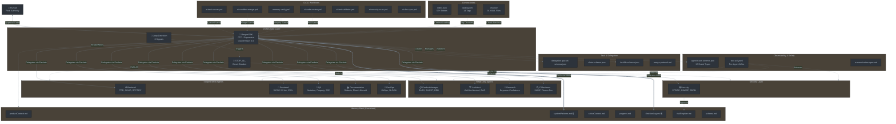

```mermaid
%%{ init: { 'theme': 'base', 'themeVariables': { 'primaryColor': '#2d333b', 'primaryTextColor': '#adbac7', 'lineColor': '#768390' } } }%%
graph TB
    Human["👤 Human<br/>Final Authority"]

    subgraph Orchestrator ["Orchestrator Layer"]
        ROA["🎯 ReaperOAK<br/>CTO / Supervisor<br/>Claude Opus 4.6"]
        STOP["🛑 STOP_ALL<br/>Circuit Breaker"]
        LOOP["🔄 Loop Detection<br/>6 Signals"]
    end

    subgraph ReadOnly ["Read-Only Agents"]
        PM["📋 ProductManager<br/>EARS, INVEST, DDD"]
        ARCH["🏗️ Architect<br/>Well-Architected, DAG"]
        RES["🔬 Research<br/>Bayesian Confidence"]
        CIR["🔍 CIReviewer<br/>SARIF, Fitness Fns"]
    end

    subgraph ScopedWrite ["Scoped Write Agents"]
        BE["⚙️ Backend<br/>TDD, SOLID, RFC7807"]
        FE["🎨 Frontend<br/>WCAG 2.2 AA, CWV"]
        QA["🧪 QA<br/>Mutation, Property, E2E"]
        DOC["📚 Documentation<br/>Diátaxis, Flesch-Kincaid"]
        DO["🚀 DevOps<br/>GitOps, SLO/SLI"]
    end

    subgraph SecurityAgent ["Security Layer"]
        SEC["🔒 Security<br/>STRIDE, OWASP, SBOM"]
    end

    subgraph MemoryBank ["Memory Bank (Persistent)"]
        MB_PC["productContext.md"]
        MB_SP["systemPatterns.md 🔒"]
        MB_AC["activeContext.md"]
        MB_PR["progress.md"]
        MB_DL["decisionLog.md 🔒"]
        MB_RR["riskRegister.md"]
        MB_SC["schema.md"]
    end

    subgraph TaskSystem ["Task & Delegation"]
        DP["delegation-packet-schema.json"]
        CL["claim-schema.json"]
        LK["lockfile-schema.json"]
        MP["merge-protocol.md"]
    end

    subgraph Observability ["Observability & Safety"]
        TR["agent-trace-schema.json<br/>17 Event Types"]
        ACL["tool-acl.yaml<br/>Per-Agent ACLs"]
        SUM["summarization-spec.md"]
    end

    subgraph CI ["CI/CD Workflows"]
        WF_TR["ai-task-runner.yml"]
        WF_SM["ai-sandbox-merge.yml"]
        WF_MV["memory-verify.yml"]
        WF_CR["ai-code-review.yml"]
        WF_TV["ai-test-validator.yml"]
        WF_SS["ai-security-scan.yml"]
        WF_DS["ai-doc-sync.yml"]
    end

    subgraph Index ["Context Index"]
        IDX["index.json<br/>57+ Entries"]
        CAT["catalog.yml<br/>14 Tags"]
        CHK["chunks/<br/>91 YAML Files"]
    end

    Human <-->|"Approval Gates"| ROA
    ROA -->|"Delegates via Packets"| PM
    ROA -->|"Delegates via Packets"| ARCH
    ROA -->|"Delegates via Packets"| BE
    ROA -->|"Delegates via Packets"| FE
    ROA -->|"Delegates via Packets"| QA
    ROA -->|"Delegates via Packets"| SEC
    ROA -->|"Delegates via Packets"| DO
    ROA -->|"Delegates via Packets"| DOC
    ROA -->|"Delegates via Packets"| RES
    ROA -->|"Delegates via Packets"| CIR

    ROA -.->|"Reads/Writes"| MemoryBank
    ROA ==>|"Exclusive Write"| MB_SP
    ROA ==>|"Exclusive Write"| MB_DL
    SEC -.->|"Appends"| MB_RR

    ROA -.->|"Creates"| DP
    ROA -.->|"Manages"| LK
    ROA -.->|"Validates"| TR

    STOP -.->|"Halts All"| ReadOnly
    STOP -.->|"Halts All"| ScopedWrite
    STOP -.->|"Halts All"| SecurityAgent
    LOOP -.->|"Triggers"| STOP

    ACL -.->|"Enforces"| ReadOnly
    ACL -.->|"Enforces"| ScopedWrite
    ACL -.->|"Enforces"| SecurityAgent

    WF_TR -.->|"Queue Events"| ROA
    WF_SM -.->|"Merge Events"| ROA
    WF_MV -.->|"Integrity Events"| ROA
    WF_CR -.->|"PR Events"| ROA

    IDX -.->|"Context Loading"| ROA
    CAT -.->|"Tag Discovery"| ROA
    CHK -.->|"Chunk Retrieval"| ROA
```