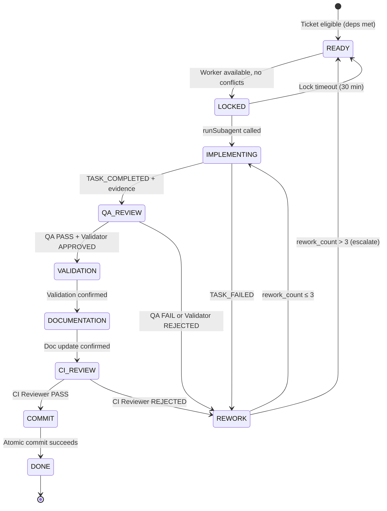
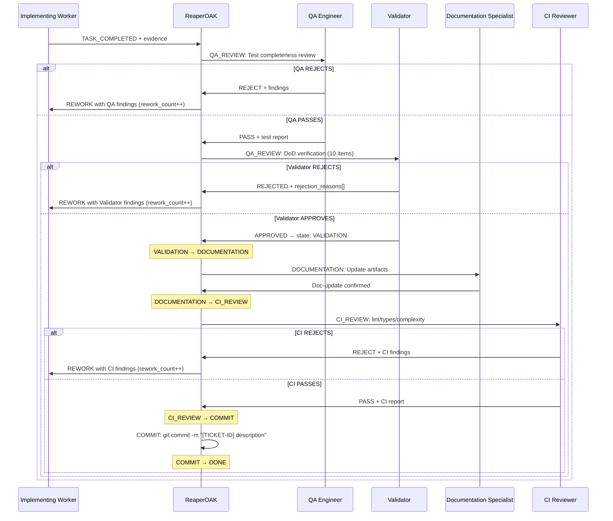

<!-- GOVERNANCE_VERSION: 9.0.0 -->

# SDLC Lifecycle Policy

> **Governance Version:** 9.0.0
> **Source:** Extracted from ReaperOAK.agent.md §2, §3, §4, §6, §17, §18
> **Scope:** Defines the mandatory 9-state ticket lifecycle, transition guards,
> REWORK semantics, Definition of Done, and the post-execution chain.

---

## 1. 9-State Machine

Every ticket traverses these 9 states in strict order. No state may be
skipped. Tickets enter the machine at READY — there is no pre-READY
queue state. Pre-READY filtering (dependency checks, priority evaluation)
is handled implicitly by the continuous scheduler.

| State | Description | Owner |
|-------|-------------|-------|
| **READY** | All dependencies DONE, eligible for assignment | System (auto via dep check) |
| **LOCKED** | Worker assigned from pool, lock acquired | ReaperOAK |
| **IMPLEMENTING** | Delegated to worker, work in progress | Assigned Worker |
| **QA_REVIEW** | Implementation done, QA + Validator reviewing | QA Engineer + Validator |
| **VALIDATION** | QA and Validator both passed | Validator (confirmation) |
| **DOCUMENTATION** | Docs being updated by Documentation Specialist | Documentation Specialist |
| **CI_REVIEW** | Documentation done, CI Reviewer checking lint/types/complexity | CI Reviewer |
| **COMMIT** | CI passed, atomic commit being created | ReaperOAK |
| **DONE** | Full lifecycle complete, worker released | System (final) |

**REWORK** is a side-state (failure path), not part of the main progression.
See §3 for REWORK semantics.

---

## 2. Transition Table

| From | To | Trigger | Guard Condition |
|------|----|---------|-----------------|
| READY | LOCKED | Worker available in pool | No file conflicts with in-flight tickets, dependencies met |
| LOCKED | IMPLEMENTING | `runSubagent` called | Lock is active, worker assignment confirmed |
| LOCKED | READY | Lock timeout (30 min) | Timer expired — auto-release, worker returned to pool |
| IMPLEMENTING | QA_REVIEW | Worker emits TASK_COMPLETED | Evidence provided (artifact paths, test results) |
| IMPLEMENTING | REWORK | Worker emits TASK_FAILED | Error evidence provided |
| QA_REVIEW | VALIDATION | QA PASS + Validator APPROVED | QA test review PASS, Validator DoD verdict = APPROVED |
| QA_REVIEW | REWORK | QA or Validator rejects | QA FAIL or verdict = REJECTED, rework_count < 3 |
| VALIDATION | DOCUMENTATION | Validation confirmed | Validator confirmation recorded |
| DOCUMENTATION | CI_REVIEW | Doc update confirmed | Documentation Specialist confirms artifact updates |
| CI_REVIEW | COMMIT | CI Reviewer PASS | Lint, types, complexity all pass **AND** memoryGate(ticket) == PASS |
| CI_REVIEW | REWORK | CI Reviewer rejects | Lint/type/complexity failures, rework_count < 3 |
| COMMIT | DONE | Atomic commit succeeds | `git commit` succeeds, all lifecycle verified |
| REWORK | IMPLEMENTING | Re-delegation | rework_count++, rework_count ≤ 3 |
| REWORK | READY | Escalation | rework_count > 3, user notified, ticket re-enters READY |

---

## 3. REWORK Side-State

REWORK is entered when QA, Validator, or CI Reviewer rejects a ticket's
output. It is NOT part of the main 9-state progression — it is a failure
recovery path.

### Shared Rework Counter

A single `rework_count` counter tracks ALL combined rejections:
- QA Engineer rejection at QA_REVIEW → rework_count++
- Validator rejection at QA_REVIEW → rework_count++
- CI Reviewer rejection at CI_REVIEW → rework_count++

All three sources share the SAME counter. Maximum: **3 combined attempts**.

### REWORK Flow

```
Rejection at QA_REVIEW or CI_REVIEW
  → REWORK state entered
  → rework_count checked:
    ≤ 3: Re-delegate to implementing worker with rejection report
          → IMPLEMENTING (worker receives rejection findings as upstream artifact)
    > 3: Escalate to user
          → READY (ticket re-enters pool, user notified for override or cancellation)
          → rework_count resets to 0
```

### Re-Delegation Requirements

When re-delegating after REWORK:
- The rejection report from QA/Validator/CI MUST be included as `rework_context`
  in the delegation packet
- The same worker pool role handles the rework (not necessarily the same
  worker instance)
- Original acceptance criteria and upstream artifacts remain unchanged

### Task Metadata Extension

Each ticket carries two operational metadata fields:

```markdown
**Rework Count:** 0
**Blocker:** (none)
```

- `Rework Count` starts at 0, increments on each REWORK → IMPLEMENTING.
  Resets to 0 on escalation (REWORK → READY).
- `Blocker` is free-text, present only when the ticket is externally blocked.

---

## 4. State Diagram



---

## 5. Definition of Done (DoD)

Every ticket must satisfy ALL 10 items. No exceptions without user override.
The Validator checks these independently at QA_REVIEW.

| ID | Item | Verified By | State Reference |
|----|------|-------------|-----------------|
| DOD-01 | Code Implemented (all acceptance criteria met) | Worker + Validator | IMPLEMENTING |
| DOD-02 | Tests Written (≥80% coverage for new code) | Worker + Validator | IMPLEMENTING |
| DOD-03 | Lint Passes (zero errors, zero warnings) | Worker + Validator | CI_REVIEW |
| DOD-04 | Type Checks Pass (tsc --noEmit clean) | Worker + Validator | CI_REVIEW |
| DOD-05 | CI Passes (all workflow checks green) | Worker + Validator | CI_REVIEW |
| DOD-06 | Docs Updated (JSDoc/TSDoc, README if needed) | Worker + Validator | DOCUMENTATION |
| DOD-07 | Reviewed by Validator (independent review) | Validator only | VALIDATION |
| DOD-08 | No Console Errors (use structured logger) | Worker + Validator | QA_REVIEW |
| DOD-09 | No Unhandled Promises (no floating async) | Worker + Validator | QA_REVIEW |
| DOD-10 | No TODO Comments in Code | Worker + Validator | QA_REVIEW |

### Enforcement Rules

- `allPassed == false` → ticket CANNOT leave QA_REVIEW
- `verdict != APPROVED` → ticket CANNOT reach VALIDATION
- Worker cannot self-verify DOD-07 — only Validator can set it true
- 3 consecutive rejections → escalate to user

---

## 6. Mandatory Post-Execution Chain

This chain runs for EVERY ticket after IMPLEMENTING. No exceptions.
No shortcuts. No skipping.

```
IMPLEMENTING → (worker emits TASK_COMPLETED)
  → QA_REVIEW: QA Engineer reviews (coverage ≥ 80%) → PASS/REJECT
  → VALIDATION: Validator checks DoD (10 items) → APPROVED/REJECTED
  → DOCUMENTATION: Documentation Specialist updates artifacts → confirms
  → CI_REVIEW: CI Reviewer checks lint/types/complexity → PASS/REJECT
  → COMMIT: ReaperOAK enforces `git commit -m "[TICKET-ID] desc"` → success/fail
  → DONE
```

If ANY step rejects → REWORK → back to IMPLEMENTING with rejection report.

### Chain Steps

| Step | State | Agent | Action | Failure Path |
|------|-------|-------|--------|-------------|
| 1 | QA_REVIEW | QA Engineer | Test completeness review, coverage check (≥80%) | REJECT → REWORK |
| 2 | QA_REVIEW | Validator | DoD enforcement (all 10 items independently verified) | REJECT → REWORK |
| 3 | DOCUMENTATION | Documentation Specialist | Artifact update (README, CHANGELOG, API docs) | BLOCK → report to ReaperOAK |
| 4 | CI_REVIEW | CI Reviewer | Simulate CI checks (lint, types, complexity) | REJECT → REWORK |
| 5 | COMMIT | ReaperOAK | Commit enforcement (`git commit` with ticket ID) | FAIL → retry once → escalate |

### Post-Execution Chain Sequence Diagram



### Enforcement Rule

> **No ticket may reach DONE without ALL five chain steps completing
> successfully.** Bypassing any step is a protocol violation. Only explicit
> user override can skip a chain step.

### Retry Budget

The total retry budget across ALL chain steps is **3 combined**:
- QA rejections (Step 1), Validator rejections (Step 2), and CI Reviewer
  rejections (Step 4) share a single `rework_count` counter.
- When `rework_count` reaches 3 → escalate to user for override or
  cancellation.
- Counter resets to 0 on escalation (ticket returns to READY).
