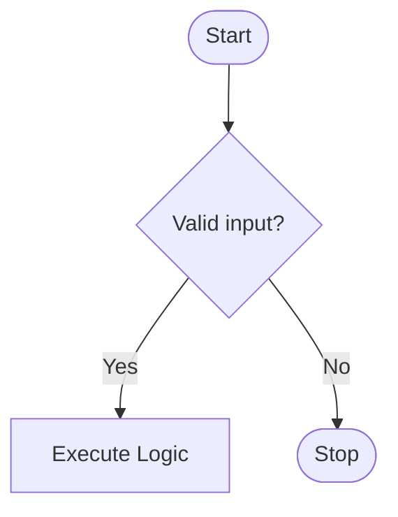

## Mermaid Diagram Standards (Execution-Grade)

Use Mermaid only when it improves clarity. If a diagram does not increase
understanding, delete it.

Diagrams must be:

- Small
- Intentional
- Directly mapped to written explanation
- Architecturally accurate

No decorative diagrams. No filler visuals.

## Code Block Syntax (Mandatory Format)

Use fenced code blocks with explicit language declaration:

Never mix Mermaid with other languages inside the same block.

## Diagram Selection Rules

Use the correct diagram type based on intent:

- `flowchart TD` → decision flows, state transitions, pipelines
- `sequenceDiagram` → API calls, async flows, service interactions
- `stateDiagram-v2` → lifecycle modeling
- `erDiagram` → data modeling
- `graph LR` → high-level architecture overview

If the diagram type doesn’t match the problem, fix the diagram — not the
narrative.

## Structural Discipline

- One diagram per section unless the system complexity justifies more.
- Maximum 12 nodes per diagram unless explicitly documenting architecture.
- Node labels must be short, descriptive, and unambiguous.
- No unexplained abbreviations.
- No excessive nesting.
- Keep lines under 120 characters.
- Do not introduce new steps in the diagram that are not described in text.
- Do not omit critical steps that the text depends on.

Narrative and diagram must be isomorphic.

## Naming Conventions

- Processes → Verb-first (e.g., `Validate Input`, `Create Order`)
- Decisions → Question form (e.g., `Authorized?`)
- States → Noun-based (e.g., `Pending`, `Completed`)
- External systems → Bracketed (e.g., `[Stripe API]`)

Be consistent within a document.

## Visual Hygiene Rules

- Avoid crossing arrows where possible.
- Prefer top-down (`TD`) for logic flows.
- Group related steps logically.
- Keep edge labels short (`Yes`, `No`, `Error`, `Timeout`).
- Do not color nodes unless explicitly required.

Clarity > decoration.

## Validation Checklist (Before Finalizing)

- Diagram renders without errors.
- No orphan nodes.
- All branches resolve.
- Arrow directions match written flow.
- Decision nodes have ≥2 outputs.
- Terminal states are clearly marked.
- No circular loops unless intentional and documented.
- Diagram does not contradict architecture or PRD.

If any item fails → revise before submission.
