# Master Instruction: Todo Creation & Maintenance

You are responsible for creating and maintaining Todos in Markdown files (`.md`)
with strict consistency.

---

## Todo File Location

- Each file should be located in the dedicated `TODO/` directory.
- File names should be descriptive of the feature or module (e.g.,
  `AUTH_IMPLEMENTATION_TODO.md`).
- Each file should have a clear title and follow the format outlined below.

---

## Todo ID Prefixes (Standard)

| Prefix | Domain                  | Example                |
| ------ | ----------------------- | ---------------------- |
| `B`    | Backend                 | `TODO-B001`            |
| `F`    | Frontend                | `TODO-F001`            |
| `D`    | DevOps / Infrastructure | `TODO-D001`            |
| `A`    | Admin Panel             | `TODO-A001`            |
| `L`    | Landing Site            | `TODO-L001`            |
| `X`    | Cross-cutting / General | `TODO-X001`            |
| Custom | Feature-specific        | `IDFC-001`, `AUTH-001` |

---

## Todo Format (Mandatory)

Every todo **must** follow this exact structure:

### Incomplete Todo

```markdown
#### TODO-<PREFIX><ID>: <Short, Clear Title>

- [ ] **Priority:** P0 | P1 | P2
- [ ] **Owner:** <Team / Person>
- [ ] **File:** `<relative/file/path>`
- [ ] **Dependencies:** <Todo-ID(s)> | None

**What to do:**

1. Step-by-step implementation instructions
2. Include code snippets if helpful
3. Define clear acceptance criteria
```

### Completed Todo

```markdown
#### TODO-<PREFIX><ID>: <Short, Clear Title> ✅ COMPLETED

- ✅ **Priority:** P0
- ✅ **Owner:** Backend (Sujal)
- ✅ **File:** `backend/src/example/`
- ✅ **Dependencies:** TODO-B001
- ✅ **Completion Date:** 2026-01-27

**Verification Evidence:**

- Tests passed, endpoint working, etc.
```

---

## Rules

| Rule             | Description                                                                     |
| ---------------- | ------------------------------------------------------------------------------- |
| **Unique ID**    | `TODO-<PREFIX><ID>` must be unique within the file and follow existing sequence |
| **Title**        | Concise, action-oriented (verb + noun)                                          |
| **Priority**     | P0 = Blocking/Critical, P1 = High, P2 = Normal/Polish                           |
| **Owner**        | Clearly accountable person or team                                              |
| **File**         | Primary implementation location (file or directory)                             |
| **Dependencies** | Reference existing Todo IDs or mark `None`                                      |
| **Completion**   | Add `✅ COMPLETED` to title, change `[ ]` to `✅`, add completion date          |

---

## Completion Checklist

When marking a todo as complete:

1. Add `✅ COMPLETED` to the end of the title line
2. Change all `- [ ]` to `- ✅`
3. Add `- ✅ **Completion Date:** YYYY-MM-DD`
4. Add **Verification Evidence** section with proof (test results, logs, etc.)

---

## Visualization Commands

After **any** addition, modification, or completion of a todo:

```bash
# Update a specific TODO file
npm run todo -- <filename>

# Examples:
npm run todo -- AUTH_IMPLEMENTATION_TODO.md
npm run todo -- MASTER_TODO.md
npm run todo -- mvp-todo.md

# Update ALL TODO files at once
npm run todo:all
```

This regenerates the `

## 📊 Dependency Graph

### 📈 Progress Summary

| Metric       | Count |
| ------------ | ----- |
| ✅ Completed | 0     |
| 🔵 Ready     | 0     |
| 🔴 Blocked   | 1     |
| **Total**    | **1** |

**Progress:** 0.0% complete

⚠️ **Pending Critical:** 1 P0, 0 P1

```mermaid
graph TD
    TODO-B005["🔴 TODO-B005<br/>Implement Refund Webhook Handler"]:::blocked

    TODO_B003["TODO-B003?"]:::external -.-> TODO-B005
    TODO_B004["TODO-B004?"]:::external -.-> TODO-B005

    classDef done fill:#dcfce7,stroke:#166534,stroke-width:2px,color:#14532d;
    classDef blocked fill:#fee2e2,stroke:#991b1b,stroke-width:2px,color:#7f1d1d;
    classDef ready fill:#dbeafe,stroke:#1e40af,stroke-width:2px,color:#1e3a8a;
    classDef external fill:#f3f4f6,stroke:#6b7280,stroke-width:1px,stroke-dasharray:5,color:#374151;
```


