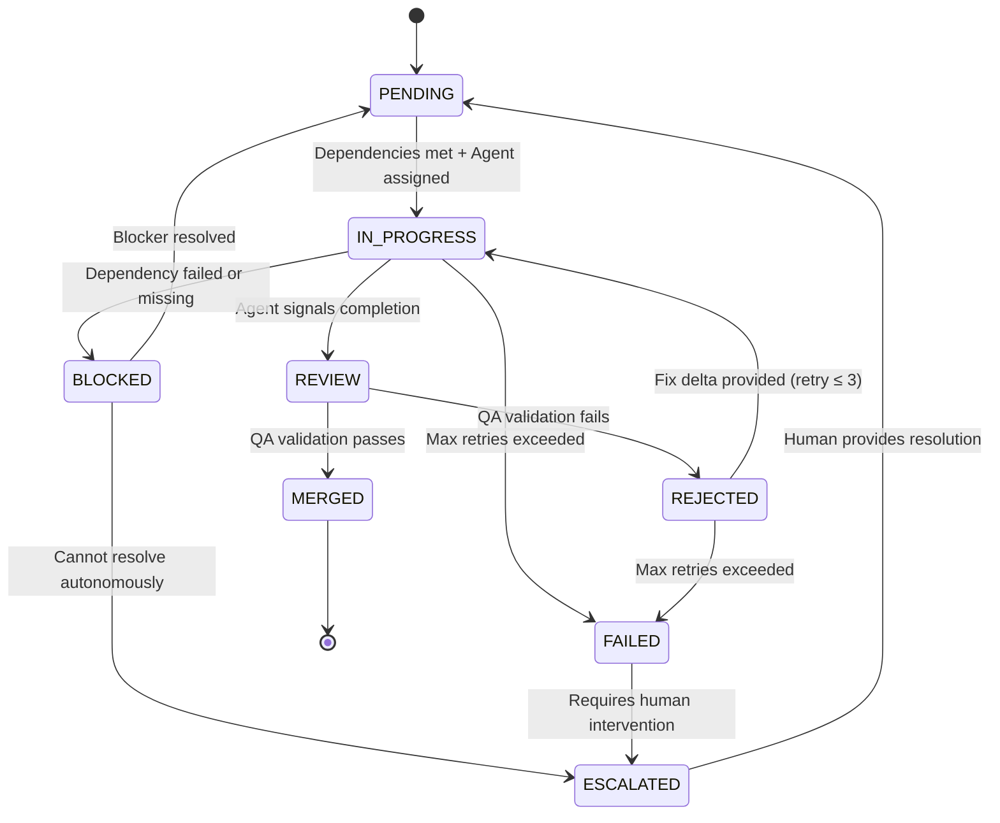

# Orchestration Rules

> **Version:** 1.0.0
> **Owner:** ReaperOAK (CTO / Supervisor Orchestrator)
> **Authority:** This file defines the canonical rules for task execution,
> concurrency, and integration validation. All agents MUST comply.

---

## 1. Task State Machine

Every task in the system follows this deterministic state machine. No state
transitions may be skipped.



### State Definitions

| State | Owner | Entry Condition | Exit Condition |
|-------|-------|-----------------|----------------|
| PENDING | ReaperOAK | Task created, dependencies not yet met | All dependencies MERGED |
| IN_PROGRESS | Assigned Agent | Agent begins execution | Agent signals completion or failure |
| REVIEW | ReaperOAK + QA | Agent output ready for validation | Validation pass or fail |
| MERGED | ReaperOAK | Validated and integrated | Terminal state |
| BLOCKED | ReaperOAK | Cannot proceed due to external factor | Blocker resolved |
| REJECTED | ReaperOAK | QA validation failed | Retry with fix delta |
| FAILED | ReaperOAK | Max retries (3) exceeded | Escalate to human |
| ESCALATED | Human | Autonomous resolution impossible | Human provides resolution |

### Transition Rules

1. **PENDING → IN_PROGRESS:** Only when ALL dependency tasks are MERGED
2. **IN_PROGRESS → REVIEW:** Agent must provide evidence (test output, files
   changed, validation results)
3. **REVIEW → MERGED:** ReaperOAK's Reviewer lane confirms:
   - Success criteria from delegation packet are met
   - No forbidden files were modified
   - Evidence expectations satisfied
   - No regressions introduced
4. **REVIEW → REJECTED:** Reviewer identifies defects. Fix delta is generated
   and attached to the task for retry.
5. **REJECTED → IN_PROGRESS:** Maximum 3 retries per task. Each retry
   includes the prior rejection reason and fix guidance.
6. **REJECTED → FAILED:** After 3 retries without passing review.
7. **Any → ESCALATED:** When autonomous resolution is impossible.

---

## 2. Concurrency Model

### Parallel Execution Categories

| Category | Parallel-Safe | Rationale |
|----------|:------------:|-----------|
| Read-only analysis by different agents | ✅ | No state mutation |
| Write to different files by different agents | ✅ | No file conflicts |
| Write to same file by different agents | ❌ | Race condition risk |
| Independent test suites | ✅ | Isolated execution |
| Shared database operations | ❌ | Transaction conflicts |
| Infrastructure mutations | ❌ | State dependencies |
| Memory bank append operations | ✅ | Append-only, timestamped |

### Concurrency Limits

- **Maximum parallel subagents:** 4 per batch
- **Maximum parallel batches:** 1 (batches execute sequentially)
- **Maximum total active tasks:** 8 (4 in-progress + 4 in-review)

### File Ownership Protocol

Before launching a parallel batch, ReaperOAK MUST:

1. **Declare file ownership** for each subagent in the batch:

   ```yaml
   parallelBatch:
     batchId: "BATCH-{timestamp}"
     agents:
       - agent: "Backend"
         ownedFiles: ["src/api/**", "src/services/**"]
       - agent: "Frontend"
         ownedFiles: ["src/components/**", "src/pages/**"]
       - agent: "QA"
         ownedFiles: ["tests/**"]
   ```

2. **Validate no overlap** in owned file sets
3. **Reject batch** if any file appears in multiple agents' ownership

### File Lock Simulation

Since we operate in a file-system environment without true locks:

1. **Pre-batch:** ReaperOAK records owned files per agent in
   `activeContext.md`
2. **During execution:** Each agent checks its delegation packet for scope
   boundaries before any write operation
3. **Post-batch:** ReaperOAK diffs all modified files against ownership
   declarations. Any out-of-scope modification triggers REJECTED state.

---

## 3. Integration Validation Gate

After every parallel batch completes, ReaperOAK runs an integration
validation gate before proceeding:

### Gate Checklist

1. **File conflict scan:** No file was modified by more than one agent
2. **Cross-reference validation:** Frontend API calls match Backend endpoints
3. **Test execution:** Run relevant test suites across all modified code
4. **Syntax validation:** All modified files parse without errors
5. **Convention check:** All changes follow `systemPatterns.md` conventions
6. **Dependency check:** No circular or broken imports introduced

### Gate Outcomes

| Result | Action |
|--------|--------|
| All checks pass | Proceed to next batch |
| File conflict detected | Sequential re-execution for conflicting agents |
| Test failure | Route failing module to QA for investigation |
| Syntax error | Route to originating agent for fix |
| Convention violation | Route to originating agent with specific rule reference |

---

## 4. Rollback Strategy

### Task-Level Rollback

If a task fails after partial completion:

1. **Identify modified files** from the agent's deliverable report
2. **Git-based rollback:** If changes are committed, `git revert` the
   specific commit
3. **File-based rollback:** If uncommitted, restore from the pre-task
   snapshot
4. **Dependency cascade:** Identify downstream tasks that depend on the
   failed task and move them to BLOCKED state

### Batch-Level Rollback

If an entire parallel batch fails integration validation:

1. Revert all changes from all agents in the batch
2. Re-analyze the batch for dependency issues
3. Convert parallel batch to sequential execution
4. Re-execute agents one at a time with integration checks between each

### System-Level Rollback

If the system enters an irrecoverable state:

1. Halt all active agents
2. Snapshot current state to `activeContext.md`
3. Escalate to human with:
   - Current system state
   - List of completed tasks
   - List of failed/pending tasks
   - Recommended recovery actions

---

## 5. Infinite Loop Detection Heuristic

### Detection Criteria

A task is suspected of infinite looping if ANY of the following are true:

| Signal | Threshold | Action |
|--------|-----------|--------|
| Retry count | > 3 | Force FAILED state |
| Same error repeated | 3 consecutive identical errors | Force FAILED + escalate |
| Token consumption | > 50,000 tokens per task | Warn at 35K, halt at 50K |
| Execution time | > 15 minutes per task | Warn at 10min, halt at 15min |
| File unchanged after edit | Agent claims edit but diff shows no change | Increment retry, warn |
| Circular delegation | Agent A delegates to B, B delegates back to A | Immediate halt |

### Prevention Mechanisms

1. **Retry counter:** Each task tracks retry count. Hard cap at 3.
2. **Error fingerprint:** Hash of error messages. If same hash appears 3x
   consecutively, break the loop.
3. **Progress assertion:** After each Plan-Act-Reflect cycle, agent must
   demonstrate measurable progress (new files, passing tests, etc.). If no
   progress after 2 cycles, escalate.
4. **Delegation depth limit:** Maximum delegation chain depth of 2 (ReaperOAK
   → Subagent → Sub-subagent). No deeper nesting.

### Recovery from Detected Loop

1. Halt the looping agent
2. Capture current state and error context
3. Move task to FAILED state
4. Log loop detection to `activeContext.md` with diagnostics
5. Escalate to ReaperOAK for alternative approach or human intervention

---

## 6. Delegation Protocol

### Pre-Delegation Checklist (ReaperOAK)

Before delegating any task:

- [ ] Task objective is clear and measurable
- [ ] Success criteria are specific and verifiable
- [ ] Scope boundaries are defined (included + excluded)
- [ ] Forbidden actions are listed
- [ ] Required output format is specified
- [ ] Evidence expectations are defined
- [ ] Dependencies are resolved (all prerequisite tasks MERGED)
- [ ] File ownership declared (for parallel batches)
- [ ] Timeout budget assigned

### Post-Delegation Checklist (ReaperOAK)

After receiving subagent output:

- [ ] Output format matches expected format
- [ ] All success criteria are addressed
- [ ] Evidence is present and verifiable
- [ ] No forbidden files were modified
- [ ] No forbidden actions were taken
- [ ] Memory bank entries are properly formatted and timestamped
- [ ] No hallucinated capabilities claimed

---

## 7. Communication Protocol

### Agent-to-Orchestrator Communication

Subagents communicate with ReaperOAK ONLY through:

1. **Delegation output:** Structured YAML response matching the contract
2. **Memory bank append:** Timestamped entries in `activeContext.md` or
   `progress.md`
3. **Escalation signal:** Structured escalation with attempted paths and
   blockers

### Inter-Agent Communication

Agents do NOT communicate directly with each other. All coordination flows
through ReaperOAK. This ensures:

- Single source of truth for task state
- No circular dependencies between agents
- Clear audit trail of all decisions
- Prevents authority fragmentation

### Error Reporting Format

```yaml
error:
  taskId: string
  agent: string
  errorType: "compile" | "test" | "runtime" | "scope_violation" | "blocked"
  message: string
  stackTrace: string  # if applicable
  attemptedFix: string  # what the agent tried
  retryCount: number
  recommendation: string  # what should happen next
```
