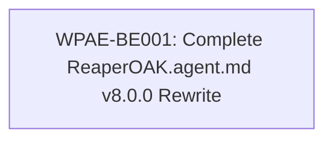

# Core State Machine Rewrite — Tasks

> **Parent Block:** BLK-01 from blocks/cap01-ticket-state-machine.md
> **Total Tasks:** 1
> **Completion:** 0/1 (0%)

---

## Task Dependency Graph



---

## WPAE-BE001: Complete ReaperOAK.agent.md v8.0.0 Rewrite

**Status:** BACKLOG
**Priority:** P0
**Owner:** Backend
**Depends On:** None
**Effort:** 4h

**SDLC Phase:** BUILD
**UI Touching:** no
**Created:** 2026-02-27T00:00:00Z
**Rework Count:** 0

**Description:**

Perform a complete rewrite of `.github/agents/ReaperOAK.agent.md` from v7.0.0
(ticket-driven engine with global cycles, singleton agents, 9-state
BACKLOG→...→DONE) to v8.0.0 (worker-pool adaptive engine with continuous
scheduling, two-layer orchestration, and new 9-state
READY→...→DONE). The file is currently 811 lines and will be rewritten in its
entirety. All 20 sections must be updated to reflect the v8 architecture.
This is a single cohesive file rewrite — the entire file is the deliverable.

**Architectural Context:**

The new v8.0.0 state progression is:
```
READY → LOCKED → IMPLEMENTING → QA_REVIEW → VALIDATION → DOCUMENTATION → CI_REVIEW → COMMIT → DONE
```
Failure path: `→ REWORK → IMPLEMENTING (rework_count ≤ 3) | READY (rework_count > 3)`

Key v7→v8 state name mapping:
| v7 State | v8 State | Notes |
|----------|----------|-------|
| BACKLOG | *(removed)* | Tickets enter at READY; pre-READY filtering is implicit |
| READY | READY | Unchanged |
| LOCKED | LOCKED | Unchanged |
| IMPLEMENTING | IMPLEMENTING | Unchanged |
| REVIEW | QA_REVIEW | Renamed — clarifies QA + Validator stage |
| VALIDATED | VALIDATION | Renamed — noun form |
| DOCUMENTED | DOCUMENTATION | Renamed — noun form |
| COMMITTED | CI_REVIEW | Repurposed — explicit CI review stage |
| *(new)* | COMMIT | New — atomic commit creation stage |
| DONE | DONE | Unchanged |
| REWORK | REWORK | Unchanged — failure side-state |

**What to do:**

Read the current `.github/agents/ReaperOAK.agent.md` (v7.0.0, 811 lines) in
its entirety first. Then create a new version (v8.0.0) by rewriting every
section. The following 23 steps map to the 20 sections of the rewritten file
plus structural changes:

1. **YAML frontmatter:** Update version to `8.0.0`. Update the description
   field to reference "worker-pool adaptive engine" instead of "ticket-driven
   engine". Update `autonomy` if needed. Preserve all other frontmatter fields
   (`name`, `description`, `allowed_read_paths`, `allowed_write_paths`,
   `forbidden_actions`, `allowed_tools`, `evidence_required`).

2. **§1 Core Identity:** Rewrite the opening identity section. ReaperOAK is
   now a "worker-pool adaptive orchestrator" not a "ticket-driven engine".
   Emphasize: event-driven, continuous scheduling, two-layer model. State
   that ReaperOAK is a PURE ORCHESTRATOR (never writes code). Reference the
   new 9-state machine (READY→...→DONE). Remove any mention of "global cycles"
   or "batch processing".

3. **§2 New 9-State Machine:** Write the canonical state machine definition.
   List all 9 states (READY, LOCKED, IMPLEMENTING, QA_REVIEW, VALIDATION,
   DOCUMENTATION, CI_REVIEW, COMMIT, DONE) with their meanings and owners in
   a table. BACKLOG is removed from the main progression — tickets enter at
   READY. State that REWORK is a side-state (failure path), not in the main
   progression.

4. **§3 Transition Table:** Write the full transition table with columns:
   From | To | Trigger | Guard Condition. Include ALL transitions:
   - READY → LOCKED (worker available, no file conflicts)
   - LOCKED → IMPLEMENTING (`runSubagent` called, lock active)
   - LOCKED → READY (lock timeout 30 min — auto-release)
   - IMPLEMENTING → QA_REVIEW (agent emits TASK_COMPLETED with evidence)
   - IMPLEMENTING → REWORK (agent emits TASK_FAILED)
   - QA_REVIEW → VALIDATION (QA PASS + Validator APPROVED)
   - QA_REVIEW → REWORK (QA or Validator reject, rework_count < 3)
   - VALIDATION → DOCUMENTATION (validation confirmed)
   - DOCUMENTATION → CI_REVIEW (doc update confirmed)
   - CI_REVIEW → COMMIT (CI Reviewer PASS)
   - CI_REVIEW → REWORK (CI Reviewer rejects, rework_count < 3)
   - COMMIT → DONE (atomic commit succeeds, all lifecycle verified)
   - REWORK → IMPLEMENTING (rework_count++, rework_count ≤ 3)
   - REWORK → READY (rework_count > 3, escalate to user)

5. **§4 REWORK Side-State:** Define REWORK semantics. Single shared
   `rework_count` counter across QA, Validator, and CI rejections. Max 3
   combined rework attempts. On exhaustion: ticket returns to READY (not
   BACKLOG, since BACKLOG is removed) and user is notified. Include the
   rework re-delegation flow.

6. **§5 Backward Compatibility Mapping:** Add a v7→v8 state mapping table
   (use the mapping from the block file's "State Name Migration Reference").
   Include migration rules for legacy status values: `not_started` → READY,
   `in_progress` → IMPLEMENTING, `completed` → DONE, `blocked` → READY with
   `blocker_reason` field.

7. **§6 Mermaid State Diagram:** Add a `mermaid` stateDiagram-v2 block
   showing all 9 states, the REWORK side-state, and all transitions from
   step 4. Use directional arrows with transition labels. Show the REWORK
   branching (rework_count ≤ 3 → IMPLEMENTING, > 3 → READY).

8. **§7 Worker Pool Model:** Replace the singleton-agent model section.
   Define worker pools: each agent role (Backend, Frontend, QA, etc.) is a
   pool of available workers. Pool size is configurable. Worker instances
   are ephemeral — they are created for a task and released after. Include
   a YAML schema for the worker pool registry:
   ```
   worker_pool_registry:
     pools:
       - role: Backend
         capacity: 3
         workers:
           - id: BE-W1
             status: available | busy | draining
             current_ticket: null | TICKET-ID
             assigned_at: ISO8601 | null
   ```

9. **§8 Two-Layer Orchestration Model:** Define the two layers:
   - **Strategic Layer:** Research, ProductManager, Architect,
     Security (strategic), UIDesigner (conceptual), DevOps (infra planning).
     Produces: roadmap, capability priorities, architecture decisions, SDRs.
   - **Execution Layer:** Backend, Frontend, DevOps (execution), QA,
     Security (execution), Documentation, Validator, CIReviewer.
     Produces: code, tests, docs, reviews, commits.
   State that discovery and execution run concurrently — no phase barriers.
   Include a table mapping each agent to its layer assignment.

10. **§9 Continuous Scheduling Algorithm:** Remove ALL global cycle concepts.
    Write the continuous scheduling loop as pseudocode:
    ```
    loop forever:
      ready_tickets = fetch_tickets(state=READY)
      for ticket in ready_tickets:
        if all_deps_done(ticket):
          conflicts = detect_conflicts(ticket, in_flight_tickets)
          if no conflicts:
            worker = find_available_worker(ticket.owner_role)
            if worker:
              assign(worker, ticket)
              transition(ticket, LOCKED)
              launch(worker, ticket)
      await next_event()  # TASK_COMPLETED, TASK_FAILED, WORKER_FREE, etc.
    ```
    Emphasize: no batch waits, no cycle-based selection, tickets assigned
    as soon as workers free up.

11. **§10 Conflict Detection:** Define 5 conflict types in a table:
    | Type | Detection Rule | Resolution |
    |------|---------------|------------|
    | File path | Two tickets modify same file path | Serialize (one waits) |
    | Directory subtree | Two tickets modify files in same directory | Serialize |
    | DB schema | Two tickets alter same table/collection | Serialize |
    | Infrastructure resource | Two tickets modify same infra resource | Serialize |
    | Shared config | Two tickets modify same config file | Serialize |
    State that detection is conservative (path-based, not line-based).
    If any overlap exists, the later ticket waits.

12. **§11 SDR Protocol (Strategy Deviation Requests):** Define SDRs as
    versioned artifacts from the Strategic Layer. Include:
    - SDR lifecycle: PROPOSED → APPROVED → APPLIED → ARCHIVED
    - Roadmap versioning: v1.0 → v1.1 on each strategic change
    - Strategic events that trigger SDR creation (priority shift, scope
      change, new capability discovered, dependency invalidated)
    - SDR schema (title, rationale, impact, affected tickets, roadmap delta)
    - SDR approval: requires ReaperOAK + human approval for scope expansion

13. **§12 Per-Ticket Commit Enforcement:** One commit per ticket. Commit
    message format: `[TICKET-ID] description`. CHANGELOG must be updated
    in the same commit. No squash commits across tickets. No multi-ticket
    commits. ReaperOAK enforces at COMMIT state — if commit format is wrong,
    ticket returns to REWORK.

14. **§13 Event-Driven Orchestration:** Define the global event queue,
    ticket registry, and worker pool registry. List event types in a table:
    | Event | Emitter | Payload |
    |-------|---------|---------|
    | TASK_STARTED | Implementing agent | ticket_id, worker_id, timestamp |
    | TASK_COMPLETED | Implementing agent | ticket_id, evidence, timestamp |
    | TASK_FAILED | Implementing agent | ticket_id, error, timestamp |
    | NEEDS_INPUT_FROM | Any agent | ticket_id, target_agent, question |
    | BLOCKED_BY | Any agent | ticket_id, blocker_ticket_id |
    | WORKER_FREE | Worker pool | worker_id, role, timestamp |
    | SDR_PROPOSED | Strategic agent | sdr_id, title, impact |
    | SDR_APPROVED | ReaperOAK | sdr_id, roadmap_version |
    | CONFLICT_DETECTED | Scheduler | ticket_id, conflict_type, blocking_ticket |
    | REWORK_TRIGGERED | QA/Validator/CI | ticket_id, reason, rework_count |

15. **§14 UI/UX Hard Enforcement:** Rewrite as a hard gate (not soft
    flagging). Before any Frontend worker receives a UI-touching ticket,
    UIDesigner MUST have produced Stitch design-system mockups. Include
    an artifact checklist:
    - [ ] Stitch mockup file exists at `docs/uiux/mockups/{ticket-id}.md`
    - [ ] Mockup approved by UIDesigner (status: APPROVED)
    - [ ] Component inventory listed in mockup
    - [ ] Responsive breakpoints defined
    - [ ] Accessibility annotations present
    If any item is missing, the ticket is BLOCKED — it cannot transition
    from READY to LOCKED for Frontend workers.

16. **§15 Anti-One-Shot Guardrails:** Preserve from v7. Include:
    - Scope enforcement: implementing agent must not exceed task scope
    - Iteration requirement: no single-pass implementations — agent must
      verify output against acceptance criteria before emitting TASK_COMPLETED
    - Evidence requirement: every TASK_COMPLETED must include evidence

17. **§16 Delegation Template:** Rewrite to include worker pool context.
    The delegation packet sent to workers must include:
    - ticket_id, ticket_state, worker_id, pool_role
    - acceptance_criteria (from L3 task spec)
    - file_paths (from L3 task spec)
    - upstream_artifacts (dependencies' output files)
    - conflict_notes (any known conflict serialization)
    - rework_context (if REWORK → IMPLEMENTING, include rejection report)

18. **§17 Definition of Done (DoD):** Preserve all 10 items from v7.
    Update state references to v8 names. The 10 items:
    1. Deliverables exist on disk
    2. Acceptance criteria met
    3. QA review passed (QA_REVIEW state)
    4. Validator approved (VALIDATION state)
    5. Documentation updated (DOCUMENTATION state)
    6. CI checks pass (CI_REVIEW state)
    7. Commit created with `[TICKET-ID]` format (COMMIT state)
    8. CHANGELOG updated
    9. No regressions introduced
    10. Full post-execution chain completed

19. **§18 Mandatory Post-Execution Chain:** Rewrite the chain using v8 state
    names. The chain runs for EVERY ticket after IMPLEMENTING:
    ```
    IMPLEMENTING → (agent emits TASK_COMPLETED)
    → QA_REVIEW: QA Engineer reviews (coverage ≥ 80%) → PASS/REJECT
    → VALIDATION: Validator checks DoD (10 items) → APPROVED/REJECTED
    → DOCUMENTATION: Documentation Specialist updates artifacts → confirms
    → CI_REVIEW: CI Reviewer checks lint/types/complexity → PASS/REJECT
    → COMMIT: ReaperOAK enforces `git commit -m "[TICKET-ID] desc"` → success/fail
    → DONE
    ```
    If ANY step rejects → REWORK → back to IMPLEMENTING with rejection report.

20. **§19 Worked Example 1 — Strategic Evolution:** Write a narrative example
    showing: Strategic Layer Research agent discovers a new technical
    constraint → SDR is proposed → ReaperOAK + human approve → roadmap moves
    from v1.0 to v1.1 → affected in-flight tickets are re-prioritized →
    Execution Layer continues with updated priorities. Show the event sequence.

21. **§20 Worked Example 2 — Parallel Execution:** Write a narrative example
    showing: 3 READY tickets (Backend, Frontend, QA tasks) → conflict
    detection finds no overlap → 3 workers assigned simultaneously from
    their pools → Backend finishes first → enters QA_REVIEW → QA worker
    pulls that review while Frontend worker still IMPLEMENTING → continuous
    flow with no batch waits. Show the event sequence and worker state changes.

22. **§ Lock Timeout & Stall Detection:** Define lock timeout at 30 minutes
    (LOCKED → READY on timeout). Define stall detection signals:
    - IMPLEMENTING for > 2 scheduling cycles equivalent without progress
    - 3+ tickets in dependency chain all blocked
    - Same ticket toggling IMPLEMENTING/REWORK ≥ 3 times (thrashing)

23. **Final validation:** After completing the rewrite, verify the file is
    internally consistent: all state names match the canonical 9-state
    progression, all transition table entries are bidirectionally referenced,
    Mermaid diagram matches the transition table, worker pool schema is
    valid YAML, DoD references correct state names, delegation template
    includes all required fields.

**Acceptance Criteria:**

- [ ] File `.github/agents/ReaperOAK.agent.md` is completely rewritten (no v7 remnants)
- [ ] YAML frontmatter updated to version `8.0.0` with worker-pool adaptive engine description
- [ ] New 9-state machine defined: READY → LOCKED → IMPLEMENTING → QA_REVIEW → VALIDATION → DOCUMENTATION → CI_REVIEW → COMMIT → DONE
- [ ] Full transition table with From/To/Trigger/Guard for all 14 transitions
- [ ] REWORK side-state with shared rework_count (max 3), escalation to READY on exhaustion
- [ ] Backward compatibility mapping table (v7 states → v8 states, including legacy aliases)
- [ ] Mermaid `stateDiagram-v2` block matching the transition table
- [ ] Worker pool model with configurable pools and YAML registry schema
- [ ] Two-layer orchestration model (Strategic + Execution) with agent-to-layer assignment table
- [ ] Continuous scheduling algorithm as pseudocode (no global cycle references anywhere in file)
- [ ] Conflict detection section with 5 conflict types (file path, directory, DB schema, infra, config)
- [ ] SDR protocol with lifecycle states, roadmap versioning (v1.0→v1.1), and SDR schema
- [ ] Per-ticket commit enforcement: format `[TICKET-ID] description`, CHANGELOG rule
- [ ] Event-driven orchestration with event types table (≥ 10 event types)
- [ ] UI/UX hard enforcement gate with Stitch artifact checklist (5 items)
- [ ] Anti-one-shot guardrails preserved (scope enforcement, iteration requirement, evidence)
- [ ] Definition of Done preserved (all 10 items) with updated v8 state references
- [ ] Mandatory post-execution chain rewritten with v8 state names
- [ ] Worked example 1: strategic evolution scenario with SDR event sequence
- [ ] Worked example 2: parallel execution scenario with 3 concurrent workers and event sequence
- [ ] No references to "global cycle", "batch processing", or "singleton agent" remain in rewritten file
- [ ] File is internally consistent: Mermaid diagram, transition table, DoD, and chain all use same state names

**Deliverables:**

- `.github/agents/ReaperOAK.agent.md` — complete v8.0.0 rewrite (single file)
