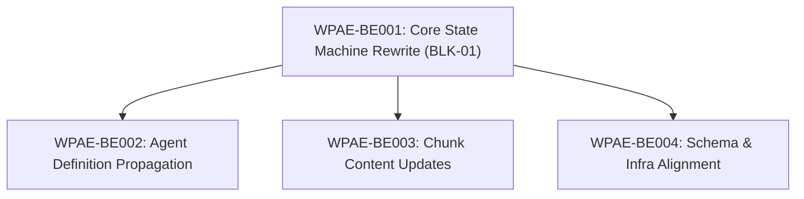

# CAP-01 State Propagation — Tasks (BLK-02, BLK-03, BLK-04)

> **Parent Blocks:** BLK-02, BLK-03, BLK-04 from blocks/cap01-ticket-state-machine.md
> **Total Tasks:** 3
> **Completion:** 0/3 (0%)

---

## Task Dependency Graph



---

## WPAE-BE002: Agent Definition Propagation

**Status:** BACKLOG
**Priority:** P1
**Owner:** Backend
**Depends On:** WPAE-BE001
**Effort:** 3h

**SDLC Phase:** BUILD
**UI Touching:** no
**Created:** 2026-02-27T00:00:00Z

**What to do:**

Propagate the v8 state vocabulary across all agent definition files and the boot protocol. Every occurrence of a v7 state name must be replaced with the corresponding v8 name. The state migration reference is:

| v7 Name | v8 Name |
|---------|---------|
| BACKLOG | *(removed from main progression)* |
| REVIEW | QA_REVIEW |
| VALIDATED | VALIDATION |
| DOCUMENTED | DOCUMENTATION |
| COMMITTED | CI_REVIEW |
| *(new)* | COMMIT |

Steps:

1. Open `agents.md` (root-level boot protocol file).
   - Locate the "Task-Level SDLC Compliance (Ticket Lifecycle)" section.
   - Replace the 9-state ASCII diagram `BACKLOG → READY → LOCKED → IMPLEMENTING → REVIEW → VALIDATED → DOCUMENTED → COMMITTED → DONE` with the new canonical progression: `READY → LOCKED → IMPLEMENTING → QA_REVIEW → VALIDATION → DOCUMENTATION → CI_REVIEW → COMMIT → DONE`.
   - Update the bullet list under "Rules:" that describes each state transition (e.g., "At REVIEW, the mandatory post-execution chain runs" → "At QA_REVIEW, …").
   - Update the "Status Values (9-State Model)" table in the TODO Agent section — replace all v7 state names with v8 equivalents. Remove the BACKLOG row from the main progression table and add CI_REVIEW + COMMIT rows.
   - Update the "Backward Compatibility Mapping" table — replace target state names with v8 equivalents (e.g., `not_started` → READY instead of BACKLOG, `completed` → DONE unchanged, etc.).
   - Verify all prose references to state names throughout the file are updated (search for each v7 name).

2. Open `.github/agents/TODO.agent.md`.
   - Locate the status enum definition (the line listing valid status values like `BACKLOG | READY | LOCKED | …`).
   - Replace with the v8 enum: `READY | LOCKED | IMPLEMENTING | QA_REVIEW | VALIDATION | DOCUMENTATION | CI_REVIEW | COMMIT | DONE | REWORK`.
   - Update the "Backward Compatibility Mapping" section — change target values to v8 names.
   - Update any 9-state diagram or ASCII progression to use v8 names.
   - Update any prose that references old state names (e.g., "enters BACKLOG" → "enters READY", "at REVIEW" → "at QA_REVIEW").

3. Open `.github/agents/_cross-cutting-protocols.md`.
   - Locate the event emission protocol section (§8 or equivalent).
   - Update all state references in event descriptions: `TASK_COMPLETED` event should reference QA_REVIEW (not REVIEW), post-execution chain states should use v8 names.
   - Update any state machine diagram or ASCII art with v8 names.
   - Update transition descriptions in prose.

4. Open `.github/agents/Validator.agent.md`.
   - Locate the validation matrix / review protocol section.
   - Replace all state references: REVIEW → QA_REVIEW, VALIDATED → VALIDATION, DOCUMENTED → DOCUMENTATION, COMMITTED → CI_REVIEW.
   - Update any prose describing when the Validator runs (e.g., "runs at REVIEW" → "runs at QA_REVIEW").

5. Final verification: Run `grep -rn 'BACKLOG\|REVIEW\|VALIDATED\|DOCUMENTED\|COMMITTED' agents.md .github/agents/TODO.agent.md .github/agents/_cross-cutting-protocols.md .github/agents/Validator.agent.md` and confirm:
   - No standalone `REVIEW` (must be `QA_REVIEW` or `CI_REVIEW`).
   - No `VALIDATED` (must be `VALIDATION`).
   - No `DOCUMENTED` (must be `DOCUMENTATION`).
   - No `COMMITTED` (must be `CI_REVIEW` or `COMMIT`).
   - `BACKLOG` may appear only in backward compatibility mapping tables or REWORK escalation paths, never in the main 9-state progression.

**Acceptance Criteria:**

- [ ] The canonical 9-state progression in `agents.md` reads `READY → LOCKED → IMPLEMENTING → QA_REVIEW → VALIDATION → DOCUMENTATION → CI_REVIEW → COMMIT → DONE` with no v7 state names in the main progression.
- [ ] `.github/agents/TODO.agent.md` status enum lists exactly: `READY | LOCKED | IMPLEMENTING | QA_REVIEW | VALIDATION | DOCUMENTATION | CI_REVIEW | COMMIT | DONE | REWORK` — no v7 names except in backward compatibility mapping.
- [ ] `.github/agents/_cross-cutting-protocols.md` event emission protocol and post-execution chain descriptions use only v8 state names.
- [ ] `.github/agents/Validator.agent.md` validation matrix and review protocol reference only v8 state names (QA_REVIEW, VALIDATION, DOCUMENTATION, CI_REVIEW, COMMIT).
- [ ] `grep -rn` verification across all 4 files confirms zero stale v7 state names outside backward compatibility sections.
- [ ] All backward compatibility mapping tables in modified files map old aliases to v8 names (not v7 names).

---

## WPAE-BE003: Chunk Content Updates

**Status:** BACKLOG
**Priority:** P1
**Owner:** Backend
**Depends On:** WPAE-BE001
**Effort:** 2h

**SDLC Phase:** BUILD
**UI Touching:** no
**Created:** 2026-02-27T00:00:00Z

**What to do:**

Update all YAML chunk files that contain state machine definitions, state value enums, transition tables, status validation rules, or backward compatibility mappings to use v8 state names. Chunks are the sole source of truth for agent runtime guidance — they must exactly mirror the canonical definitions from BLK-01.

The state migration reference is:

| v7 Name | v8 Name |
|---------|---------|
| BACKLOG | *(removed from main progression)* |
| REVIEW | QA_REVIEW |
| VALIDATED | VALIDATION |
| DOCUMENTED | DOCUMENTATION |
| COMMITTED | CI_REVIEW |
| *(new)* | COMMIT |

Steps:

1. Open `.github/vibecoding/chunks/TODO.agent/chunk-01.yaml`.
   - Locate the Format A status values line (Section 3, "Task File Format"): `BACKLOG | READY | LOCKED | IMPLEMENTING | REVIEW | VALIDATED | DOCUMENTED | COMMITTED | DONE`.
   - Replace with v8 enum: `READY | LOCKED | IMPLEMENTING | QA_REVIEW | VALIDATION | DOCUMENTATION | CI_REVIEW | COMMIT | DONE`.
   - Locate the status validation list in Section 10 ("todo_visual.py Validation"): the line listing accepted status values `BACKLOG`, `READY`, `LOCKED`, `IMPLEMENTING`, `REVIEW`, `VALIDATED`, `DOCUMENTED`, `COMMITTED`, `DONE`, `REWORK`.
   - Replace with v8 values: `READY`, `LOCKED`, `IMPLEMENTING`, `QA_REVIEW`, `VALIDATION`, `DOCUMENTATION`, `CI_REVIEW`, `COMMIT`, `DONE`, `REWORK`.
   - Update any prose referencing "enters BACKLOG" → "enters READY" in the ticket model notes.
   - Update the Execution Planning Mode Protocol step 4: "All generated tasks enter **BACKLOG** state" → "All generated tasks enter **READY** state" (since BACKLOG is removed from main progression).
   - Update controlled expansion protocol step 6: "Each expanded L3 task is a ticket entering BACKLOG" → "entering READY".

2. Open `.github/vibecoding/chunks/TODO.agent/chunk-02.yaml`.
   - Locate the 9-state ASCII diagram in Section 1 ("Status Transitions"):
     ```
     BACKLOG → READY → LOCKED → IMPLEMENTING → REVIEW → VALIDATED → DOCUMENTED → COMMITTED → DONE
     ```
   - Replace with v8 diagram:
     ```
     READY → LOCKED → IMPLEMENTING → QA_REVIEW → VALIDATION → DOCUMENTATION → CI_REVIEW → COMMIT → DONE
     ```
   - Update the failure path annotations on the diagram (REWORK side-paths) to reference v8 state names.
   - Update the "9 States" table — rename states: REVIEW → QA_REVIEW, VALIDATED → VALIDATION, DOCUMENTED → DOCUMENTATION, COMMITTED → CI_REVIEW. Add new COMMIT row. Remove or demote BACKLOG row.
   - Update the "Transition Rules" table — replace all v7 state names in From/To/Trigger/Guard columns with v8 equivalents.
   - Update the "Backward Compatibility" mapping section — change target values to v8 names (e.g., `not_started` → `READY`, `VALIDATING` → `QA_REVIEW`, `DOCUMENTING` → `DOCUMENTATION`).
   - Update the "Mandatory Post-Execution Chain" section (Section 2) — replace state names in the chain description.
   - Update the "Completion Gates" table (Section 3) — replace Stage column values with v8 names (e.g., `REVIEW` → `QA_REVIEW`, `VALIDATED → DOCUMENTED` → `VALIDATION → DOCUMENTATION`, `DOCUMENTED → COMMITTED` → `DOCUMENTATION → CI_REVIEW`).
   - Update prose references throughout the file.

3. Open `.github/vibecoding/chunks/Validator.agent/chunk-01.yaml`.
   - Locate all state references in the validation matrix, review protocol, and stage descriptions.
   - Replace: REVIEW → QA_REVIEW, VALIDATED → VALIDATION, DOCUMENTED → DOCUMENTATION, COMMITTED → CI_REVIEW.
   - Add COMMIT state where appropriate in the validation lifecycle.
   - Verify no stale v7 state names remain.

4. Final verification: Run `grep -rn 'BACKLOG\|REVIEW\|VALIDATED\|DOCUMENTED\|COMMITTED' .github/vibecoding/chunks/TODO.agent/chunk-01.yaml .github/vibecoding/chunks/TODO.agent/chunk-02.yaml .github/vibecoding/chunks/Validator.agent/chunk-01.yaml` and confirm:
   - No standalone `REVIEW` (must be `QA_REVIEW` or `CI_REVIEW`).
   - No `VALIDATED` (must be `VALIDATION`).
   - No `DOCUMENTED` (must be `DOCUMENTATION`).
   - No `COMMITTED` (must be `CI_REVIEW` or `COMMIT`).
   - `BACKLOG` may appear only in backward compatibility mapping tables, never in the main 9-state progression.

**Acceptance Criteria:**

- [ ] `.github/vibecoding/chunks/TODO.agent/chunk-01.yaml` Format A status enum lists v8 values only (`READY | LOCKED | IMPLEMENTING | QA_REVIEW | VALIDATION | DOCUMENTATION | CI_REVIEW | COMMIT | DONE`); no v7 names except in backward-compat notes.
- [ ] `.github/vibecoding/chunks/TODO.agent/chunk-02.yaml` 9-state diagram, state table, transition rules, backward compatibility mapping, post-execution chain, and completion gates all use v8 state names exclusively.
- [ ] `.github/vibecoding/chunks/Validator.agent/chunk-01.yaml` validation matrix and stage references use only v8 state names (QA_REVIEW, VALIDATION, DOCUMENTATION, CI_REVIEW, COMMIT).
- [ ] `grep -rn` verification across all 3 chunk files confirms zero stale v7 state names outside backward compatibility sections.
- [ ] Legacy alias list in chunk-01.yaml todo_visual.py validation section includes both old aliases (`not_started`, `in_progress`, `completed`, `blocked`) and v7 state name aliases where applicable.

---

## WPAE-BE004: Schema and Infrastructure Alignment

**Status:** BACKLOG
**Priority:** P1
**Owner:** Backend
**Depends On:** WPAE-BE001
**Effort:** 2h

**SDLC Phase:** BUILD
**UI Touching:** no
**Created:** 2026-02-27T00:00:00Z

**What to do:**

Update all supporting infrastructure files — JSON schemas, guardian loop-detection rules, sandbox ACLs, and definition-of-done templates — to reflect the v8 state vocabulary. These files are consumed by CI workflows, governance hooks, and agent tooling, so state enum values must be consistent with the canonical definition from BLK-01.

The state migration reference is:

| v7 Name | v8 Name |
|---------|---------|
| BACKLOG | *(removed from main progression)* |
| REVIEW | QA_REVIEW |
| VALIDATED | VALIDATION |
| DOCUMENTED | DOCUMENTATION |
| COMMITTED | CI_REVIEW |
| *(new)* | COMMIT |

Steps:

1. Open `.github/tasks/delegation-packet-schema.json`.
   - Locate the `status` or `state` enum definition (JSON Schema `enum` array).
   - Replace the v7 state list with v8 values: `["READY", "LOCKED", "IMPLEMENTING", "QA_REVIEW", "VALIDATION", "DOCUMENTATION", "CI_REVIEW", "COMMIT", "DONE", "REWORK"]`.
   - If there is a `valid_transitions` or `transition_rules` object, update all From/To state references to v8 names.
   - If there is a `backward_compatibility` mapping, update target values to v8 names.
   - Verify the JSON is still valid after edits (no trailing commas, proper quoting).

2. Open `.github/guardian/loop-detection-rules.md`.
   - Search for all state name references in stall detection rules, thrashing detection, and loop detection conditions.
   - Replace v7 names: REVIEW → QA_REVIEW, VALIDATED → VALIDATION, DOCUMENTED → DOCUMENTATION, COMMITTED → CI_REVIEW.
   - If rules reference "task in IMPLEMENTING for > N cycles", keep as-is (IMPLEMENTING is unchanged).
   - If rules reference BACKLOG in the context of escalation paths (e.g., "REWORK → BACKLOG"), update to reflect v8 semantics (BACKLOG removed from main progression; REWORK escalation → READY).
   - Add any new detection rules for the COMMIT state if applicable (e.g., "task in CI_REVIEW for > N minutes without advancing to COMMIT").

3. Open `.github/sandbox/tool-acl.yaml`.
   - Search for state name references in ACL annotations or comments.
   - Replace v7 names with v8 equivalents in any state-gated permissions.
   - If ACL entries reference specific states for tool access (e.g., "tool X available at REVIEW stage"), update to v8 names.

4. Open `.github/tasks/definition-of-done-template.md`.
   - Locate the lifecycle checklist or state progression references.
   - Replace v7 state names with v8 equivalents throughout the document.
   - Update any checklist items that reference specific states (e.g., "Passed REVIEW phase" → "Passed QA_REVIEW phase").
   - Ensure the template reflects the full v8 lifecycle: READY → LOCKED → IMPLEMENTING → QA_REVIEW → VALIDATION → DOCUMENTATION → CI_REVIEW → COMMIT → DONE.

5. Final verification: Run `grep -rn 'BACKLOG\|REVIEW\|VALIDATED\|DOCUMENTED\|COMMITTED' .github/tasks/delegation-packet-schema.json .github/guardian/loop-detection-rules.md .github/sandbox/tool-acl.yaml .github/tasks/definition-of-done-template.md` and confirm:
   - No standalone `REVIEW` (must be `QA_REVIEW` or `CI_REVIEW`).
   - No `VALIDATED` (must be `VALIDATION`).
   - No `DOCUMENTED` (must be `DOCUMENTATION`).
   - No `COMMITTED` (must be `CI_REVIEW` or `COMMIT`).
   - `BACKLOG` only appears in backward-compat sections or REWORK escalation notes.
   - JSON schema is syntactically valid (`python3 -c "import json; json.load(open('.github/tasks/delegation-packet-schema.json'))"` exits 0).

**Acceptance Criteria:**

- [ ] `.github/tasks/delegation-packet-schema.json` state enum contains exactly: `READY`, `LOCKED`, `IMPLEMENTING`, `QA_REVIEW`, `VALIDATION`, `DOCUMENTATION`, `CI_REVIEW`, `COMMIT`, `DONE`, `REWORK` — no v7 state names. JSON is syntactically valid.
- [ ] `.github/guardian/loop-detection-rules.md` uses only v8 state names in all detection rules and escalation paths. REWORK escalation targets READY (not BACKLOG).
- [ ] `.github/sandbox/tool-acl.yaml` contains no v7 state names in any ACL annotations or state-gated permissions.
- [ ] `.github/tasks/definition-of-done-template.md` lifecycle checklist reflects the full v8 progression (READY through COMMIT → DONE) with no v7 state names.
- [ ] `grep -rn` verification across all 4 infrastructure files confirms zero stale v7 state names outside backward compatibility sections.
- [ ] JSON schema validation passes: `python3 -c "import json; json.load(open('.github/tasks/delegation-packet-schema.json'))"` exits with code 0.
