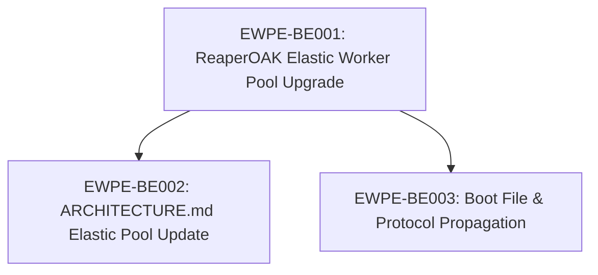

# Full Elastic Worker Pool Implementation — Tasks

> **Parent Block:** Elastic Multi-Worker Parallel Execution Engine / Full elastic worker pool implementation
> **Total Tasks:** 3
> **Completion:** 0/3 (0%)

---

## Task Dependency Graph



---

## EWPE-BE001: ReaperOAK Elastic Worker Pool Upgrade

**Status:** READY
**Priority:** P0
**Owner:** Backend
**Depends On:** None
**Effort:** 4h

**SDLC Phase:** BUILD
**UI Touching:** no
**Created:** 2026-02-28T00:00:00Z

**What to do:**

Upgrade `.github/agents/ReaperOAK.agent.md` from fixed-capacity worker pools (v8.0.0) to a fully elastic model (v8.1.0). This touches 7 existing sections and adds 2 new worked examples. Each step below modifies one section — apply them sequentially to avoid merge conflicts with yourself.

1. **Bump version in YAML frontmatter** (line 4): Change `version: '8.0.0'` to `version: '8.1.0'`.

2. **Rewrite §7 Worker Pool Model** (starts at line 209):
   - Replace the opening paragraph: change "Pool capacity is configurable per role" to describe elastic pools with `minSize`, `maxSize`, and `scalingPolicy` fields.
   - Replace the `Worker Pool Registry Schema` YAML block:
     - Remove the `capacity` field from each pool entry.
     - Add `minSize: <int>`, `maxSize: <int>`, and `scalingPolicy: backlog_ratio | fixed` to each pool entry.
     - Replace all static worker ID entries (`BE-W1`, `BE-W2`, `FE-W1`, etc.) with the dynamic format `{Role}Worker-{uuid4_short}` (e.g., `BackendWorker-a1b2c3d4`). Workers are no longer pre-listed — the `workers` array starts empty `[]` and is populated at runtime by the scheduler.
     - Add an `activeWorkerCount: 0` field to each pool to track current runtime count.
   - After the schema, add a subsection `### Auto-Scaling Algorithm` describing:
     - Scale-up trigger: when `count(READY tickets for role) > activeWorkerCount` and `activeWorkerCount < maxSize`, spawn new workers up to `min(backlog, maxSize)`.
     - Scale-down trigger: when a worker has been idle (status `available`) for > 5 minutes and `activeWorkerCount > minSize`, terminate the worker.
     - Emit `WORKER_SPAWNED` on spawn, `WORKER_TERMINATED` on teardown, `POOL_SCALED_UP` / `POOL_SCALED_DOWN` on pool size changes, `POOL_EXHAUSTED` when backlog exceeds `maxSize`.
   - Update `### Worker Lifecycle` to add a 4th state: `terminated` — worker has been removed from the pool after idle expiry or explicit teardown.
   - In `### Lock Semantics`, ensure the dynamic worker ID format `{Role}Worker-{uuid}` is referenced instead of static IDs.

3. **Upgrade §9 Continuous Scheduling Algorithm** (starts at line 423):
   - In the `### Scheduling Loop` pseudocode block, add an **auto-scaling step** before the ticket assignment loop:
     ```
     # Auto-scale step
     for role in all_roles:
       backlog = count(ready_tickets where owner_role == role)
       active = pool_registry[role].activeWorkerCount
       if backlog > active and active < pool_registry[role].maxSize:
         to_spawn = min(backlog - active, pool_registry[role].maxSize - active)
         for i in 1..to_spawn:
           worker = spawn_worker(role)  # generates {Role}Worker-{uuid}
           emit(WORKER_SPAWNED, worker)
           emit(POOL_SCALED_UP, role, active + i)
     ```
   - Add an **idle scale-down step** after the `await next_event()` line:
     ```
     # Scale-down step (on WORKER_FREE event)
     for pool in worker_pool_registry.pools:
       for worker in pool.workers where worker.status == "available":
         if worker.idle_since + 5min < now() and pool.activeWorkerCount > pool.minSize:
           terminate(worker)
           emit(WORKER_TERMINATED, worker)
           emit(POOL_SCALED_DOWN, pool.role, pool.activeWorkerCount)
     ```
   - Add a new subsection `### Parallel Dispatch` after `### Dependency Promotion` describing how ReaperOAK calls multiple `runSubagent` invocations simultaneously — one per conflict-free ticket — rather than sequentially. Each `runSubagent` call is independent and non-blocking. Example:
     ```
     # Parallel dispatch (within a single scheduling cycle)
     parallel_tasks = []
     for ticket in assignable_tickets:
       worker = find_available_worker(ticket.owner_role)
       parallel_tasks.append(runSubagent(worker, ticket))
     await all(parallel_tasks)  # all run concurrently
     ```

4. **Add 6th conflict type to §10 Conflict Detection** (starts at line 460):
   - In the `### 5 Conflict Types` table (rename heading to `### 6 Conflict Types`), add a 6th row:
     | **Mutual exclusion** | Two tickets are flagged with `mutually_exclusive: [OTHER-TICKET-ID]` in their L3 task spec | Serialize — later ticket waits in READY |
   - In `### Detection Rules`, add a bullet: "Mutual-exclusion flags are checked bidirectionally — if ticket A lists ticket B, B is also treated as conflicting with A even if B does not list A."

5. **Add scaling events to §13 Event Types** (table starts around line 604):
   - Add 5 new rows to the `### Event Types` table:
     | `WORKER_SPAWNED` | Worker pool | worker_id, pool_role, trigger_reason, timestamp |
     | `WORKER_TERMINATED` | Worker pool | worker_id, pool_role, reason (idle_expiry \| explicit), timestamp |
     | `POOL_SCALED_UP` | Scheduler | pool_role, old_count, new_count, trigger (backlog_ratio), timestamp |
     | `POOL_SCALED_DOWN` | Scheduler | pool_role, old_count, new_count, trigger (idle_expiry), timestamp |
     | `POOL_EXHAUSTED` | Scheduler | pool_role, backlog_count, max_size, timestamp |
   - In `### Event Routing`, add routing entries:
     11. **WORKER_SPAWNED** → Log new worker, update pool registry `activeWorkerCount`
     12. **WORKER_TERMINATED** → Remove worker from registry, decrement `activeWorkerCount`
     13. **POOL_SCALED_UP** → Log scaling event, audit trail
     14. **POOL_SCALED_DOWN** → Log scaling event, audit trail
     15. **POOL_EXHAUSTED** → Log warning, queue tickets, notify user if sustained

6. **Strengthen §15 Anti-One-Shot Guardrails** (starts at line 732):
   - In `### Scope Enforcement`, add a new bullet after the existing four bullets:
     - "If a worker references or attempts to implement work belonging to another ticket ID, the worker is **terminated immediately** (WORKER_TERMINATED event emitted with reason `scope_violation`). The ticket enters REWORK. Validator must explicitly reject any output containing references to ticket IDs other than the assigned one."
   - In `### Pre-Chain Scope Check`, add a 5th check:
     5. No references to other ticket IDs appear in the worker's output (grep for `[A-Z]+-[A-Z]+\d{3}` patterns excluding the assigned ticket ID)

7. **Replace §20 Worked Example 2 — Parallel Execution** (starts at line 1005):
   - Replace the current 3-worker scenario with a **5-worker elastic parallel scenario**:
     - 5 READY tickets: 2 Frontend, 2 Backend, 1 DevOps — all conflict-free.
     - Elastic pool spawns workers dynamically: Frontend pool scales from minSize=1 to 2, Backend pool from minSize=1 to 2, DevOps stays at 1.
     - Show `WORKER_SPAWNED` events for dynamically created workers.
     - Workers use dynamic IDs: `FrontendWorker-f1a2`, `FrontendWorker-f3b4`, `BackendWorker-b5c6`, `BackendWorker-b7d8`, `DevOpsWorker-d9e0`.
     - Each worker has an independent lifecycle through the 9-state machine.
     - Each ticket gets its own independent `git commit` — no batching.
     - Show `WORKER_TERMINATED` events after idle expiry when backlog drains.
   - Include a full event sequence timeline (like the existing one but with 5 workers).

8. **Add §21 Worked Example 3 — Backlog Growth Triggering Scale-Up**:
   - Scenario: Frontend pool starts at minSize=1 with 1 active worker. 6 new Frontend tickets enter READY simultaneously.
   - Scheduler detects backlog(6) > activeWorkerCount(1), spawns 5 additional workers (up to maxSize=6).
   - Show `POOL_SCALED_UP` event with old_count=1, new_count=6.
   - All 6 `runSubagent` calls dispatched in parallel.
   - Each worker proceeds independently through the 9-state machine.

9. **Add §22 Worked Example 4 — Idle Shrink Scale-Down**:
   - Scenario: After the 6 Frontend tickets from §21 complete, all 6 workers become idle.
   - After 5 minutes idle timeout, 5 workers are terminated (pool shrinks to minSize=1).
   - Show `WORKER_TERMINATED` events for each idle worker and `POOL_SCALED_DOWN` event with old_count=6, new_count=1.
   - The remaining worker stays available for future tickets.

10. **Final sweep**: Search the entire file for any remaining references to fixed-capacity patterns (`capacity: 3`, `BE-W1`, `FE-W2`, static worker listings) and remove or migrate them. The only acceptable references to old-style IDs are in a backward-compatibility note (if one exists).

**Acceptance Criteria:**

- [ ] YAML frontmatter `version` field reads `'8.1.0'`
- [ ] §7 Worker Pool Registry Schema uses `minSize`/`maxSize`/`scalingPolicy` instead of `capacity`; worker arrays are empty `[]` (runtime-populated); all example worker IDs use `{Role}Worker-{uuid}` format
- [ ] §7 contains `### Auto-Scaling Algorithm` subsection with scale-up trigger, scale-down trigger, and event emissions
- [ ] §7 Worker Lifecycle includes 4th state `terminated`
- [ ] §9 Scheduling Loop pseudocode contains auto-scaling step (before ticket loop) and idle scale-down step (after `await next_event()`)
- [ ] §9 contains `### Parallel Dispatch` subsection showing simultaneous `runSubagent` invocations
- [ ] §10 heading reads `### 6 Conflict Types` with mutual-exclusion row added; detection rules mention bidirectional checking
- [ ] §13 Event Types table contains all 5 new events: `WORKER_SPAWNED`, `WORKER_TERMINATED`, `POOL_SCALED_UP`, `POOL_SCALED_DOWN`, `POOL_EXHAUSTED`
- [ ] §13 Event Routing contains entries 11–15 for the 5 new events
- [ ] §15 Scope Enforcement contains worker termination rule for cross-ticket references; Pre-Chain Scope Check has 5th item (ticket ID grep)
- [ ] §20 replaced with 5-worker elastic parallel scenario using dynamic worker IDs, showing WORKER_SPAWNED events and independent commits
- [ ] §21 exists: Backlog Growth Triggering Scale-Up — Frontend pool scales from 1 to 6 workers
- [ ] §22 exists: Idle Shrink Scale-Down — pool shrinks from 6 back to minSize=1 after idle timeout
- [ ] `grep -cE 'capacity:\s*[0-9]' .github/agents/ReaperOAK.agent.md` returns 0 (no fixed-capacity references)
- [ ] `grep -cE '\b(BE|FE|QA|SEC|DO|DOC|VAL|CI)-W[0-9]' .github/agents/ReaperOAK.agent.md` returns 0 outside any backward-compat note (no static worker IDs)

---

## EWPE-BE002: ARCHITECTURE.md Elastic Pool Update

**Status:** READY
**Priority:** P1
**Owner:** Backend
**Depends On:** EWPE-BE001
**Effort:** 3h

**SDLC Phase:** BUILD
**UI Touching:** no
**Created:** 2026-02-28T00:00:00Z

**What to do:**

Update `.github/ARCHITECTURE.md` to reflect the elastic worker pool model introduced by EWPE-BE001. Read the completed EWPE-BE001 output (`.github/agents/ReaperOAK.agent.md` v8.1.0) as the upstream artifact before starting.

1. **Bump version** in the ARCHITECTURE.md header/frontmatter (if versioned) from `8.0.0` to `8.1.0`.

2. **Update Worker Pool sections**: Find all sections that describe the worker pool model. Replace references to fixed `capacity` with `minSize`/`maxSize`/`scalingPolicy`. Replace any static worker ID examples (`BE-W1`, `FE-W2`) with dynamic `{Role}Worker-{uuid}` format.

3. **Update Scheduling section**: If ARCHITECTURE.md describes the scheduling algorithm, add references to the auto-scaling step and parallel dispatch. Ensure the description matches the updated §9 in ReaperOAK.agent.md.

4. **Add references to new worked examples**: If ARCHITECTURE.md has a section listing worked examples or referencing ReaperOAK sections, add entries for §21 (Backlog Growth Scale-Up) and §22 (Idle Shrink Scale-Down).

5. **Update Conflict Detection references**: If ARCHITECTURE.md mentions the 5 conflict types, update to 6 (add mutual-exclusion).

6. **Update Event Types references**: If ARCHITECTURE.md lists event types, add the 5 new scaling events (`WORKER_SPAWNED`, `WORKER_TERMINATED`, `POOL_SCALED_UP`, `POOL_SCALED_DOWN`, `POOL_EXHAUSTED`).

7. **Final sweep**: Search the entire file for any remaining fixed-capacity references (`capacity: N`, `BE-W1`, static worker listings). Remove or migrate all except backward-compatibility notes.

**Acceptance Criteria:**

- [ ] Version reads `8.1.0` (in header, frontmatter, or version section)
- [ ] All Worker Pool descriptions use elastic model (`minSize`/`maxSize`/`scalingPolicy`), no fixed `capacity` field
- [ ] All worker ID examples use dynamic `{Role}Worker-{uuid}` format
- [ ] Scheduling description references auto-scaling and parallel dispatch
- [ ] §21 and §22 worked examples are referenced
- [ ] `grep -cE 'capacity:\s*[0-9]' .github/ARCHITECTURE.md` returns 0 (no fixed-capacity references outside backward compat)
- [ ] `grep -cE '\b(BE|FE|QA|SEC|DO|DOC|VAL|CI)-W[0-9]' .github/ARCHITECTURE.md` returns 0 outside backward-compat notes

---

## EWPE-BE003: Boot File & Protocol Propagation

**Status:** READY
**Priority:** P1
**Owner:** Backend
**Depends On:** EWPE-BE001
**Effort:** 2h

**SDLC Phase:** BUILD
**UI Touching:** no
**Created:** 2026-02-28T00:00:00Z

**What to do:**

Propagate the elastic worker pool model from EWPE-BE001 into the boot file (`agents.md`) and the cross-cutting protocols file (`.github/agents/_cross-cutting-protocols.md`). Read the completed EWPE-BE001 output (`.github/agents/ReaperOAK.agent.md` v8.1.0) as the upstream artifact before starting.

1. **Update `agents.md` — Worker Pool Model paragraph** (starts at line 60):
   - Replace the current paragraph that begins "**Worker Pool Model.** Each agent role is backed by a pool of N workers (configurable capacity per role)."
   - New paragraph must describe:
     - Elastic pools with `minSize` and `maxSize` per role (not fixed capacity).
     - Auto-scaling based on ticket backlog: pool grows when READY tickets exceed active workers, shrinks when workers idle.
     - Dynamic worker IDs using format `{Role}Worker-{uuid}` (e.g., `BackendWorker-a1b2c3d4`) instead of static `Backend-W1`.
     - Workers are ephemeral — spawned on demand, terminated after idle timeout.
     - `POOL_EXHAUSTED` emitted when backlog exceeds `maxSize`.
   - Remove all references to static worker IDs (`Backend-W1`, `QA-W2`, `Frontend-W1`) and the fixed `{AgentRole}-W{N}` identity format.

2. **Update `.github/agents/_cross-cutting-protocols.md` — §8.1 Worker Pool Events** (starts at line 125):
   - Add `WORKER_SPAWNED` to the event table:
     | `WORKER_SPAWNED` | New worker dynamically created for a pool | worker_id, pool_role, trigger_reason, timestamp |
   - Add `WORKER_TERMINATED` to the event table:
     | `WORKER_TERMINATED` | Worker removed from pool (idle expiry or explicit teardown) | worker_id, pool_role, reason (idle_expiry \| scope_violation \| explicit), timestamp |
   - Add `POOL_SCALED_UP` to the event table:
     | `POOL_SCALED_UP` | Pool size increased due to backlog | pool_role, old_count, new_count, trigger, timestamp |
   - Add `POOL_SCALED_DOWN` to the event table:
     | `POOL_SCALED_DOWN` | Pool size decreased after idle workers terminated | pool_role, old_count, new_count, trigger, timestamp |
   - Verify `POOL_EXHAUSTED` already exists (it does at line 134) — no action needed unless payload needs updating to include `max_size`.

3. **Final sweep of both files**: Search for any remaining static worker ID references (`BE-W1`, `FE-W1`, `{AgentRole}-W{N}`) and remove or replace with the dynamic format. The only acceptable references are in backward-compatibility notes.

**Acceptance Criteria:**

- [ ] `agents.md` Worker Pool Model paragraph describes elastic sizing with `minSize`/`maxSize`, auto-scaling policy, and dynamic worker IDs
- [ ] `agents.md` contains zero references to static worker ID format `{AgentRole}-W{N}` or examples like `Backend-W1` outside backward compat
- [ ] `_cross-cutting-protocols.md` §8.1 table contains `WORKER_SPAWNED` event with payload: worker_id, pool_role, trigger_reason, timestamp
- [ ] `_cross-cutting-protocols.md` §8.1 table contains `WORKER_TERMINATED` event with payload: worker_id, pool_role, reason, timestamp
- [ ] `_cross-cutting-protocols.md` §8.1 table contains `POOL_SCALED_UP` event with payload: pool_role, old_count, new_count, trigger, timestamp
- [ ] `_cross-cutting-protocols.md` §8.1 table contains `POOL_SCALED_DOWN` event with payload: pool_role, old_count, new_count, trigger, timestamp
- [ ] `grep -cE '\b(BE|FE|QA|SEC|DO|DOC|VAL|CI)-W[0-9]' agents.md` returns 0 outside backward-compat notes
